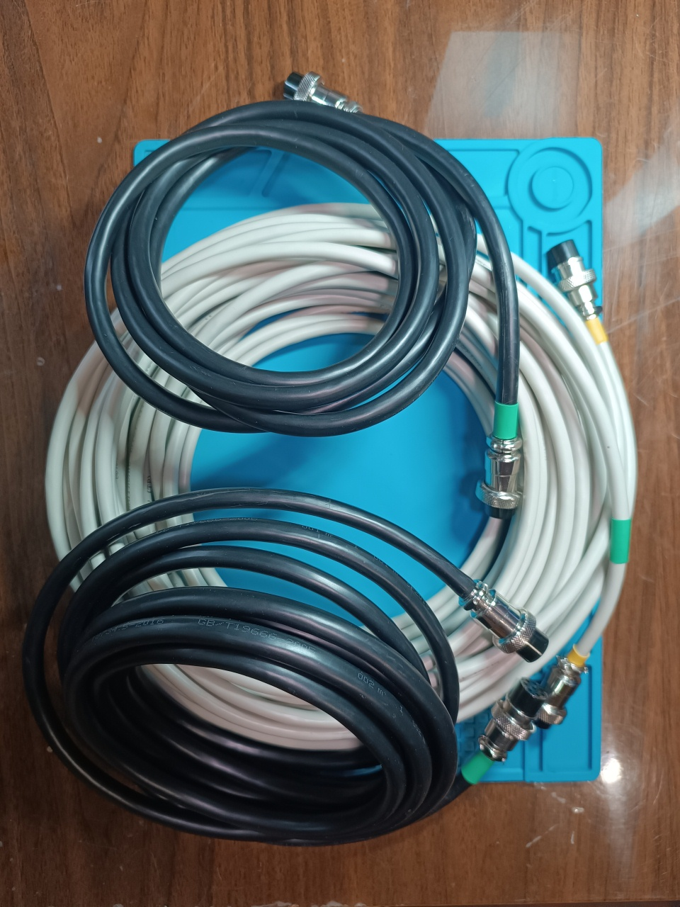
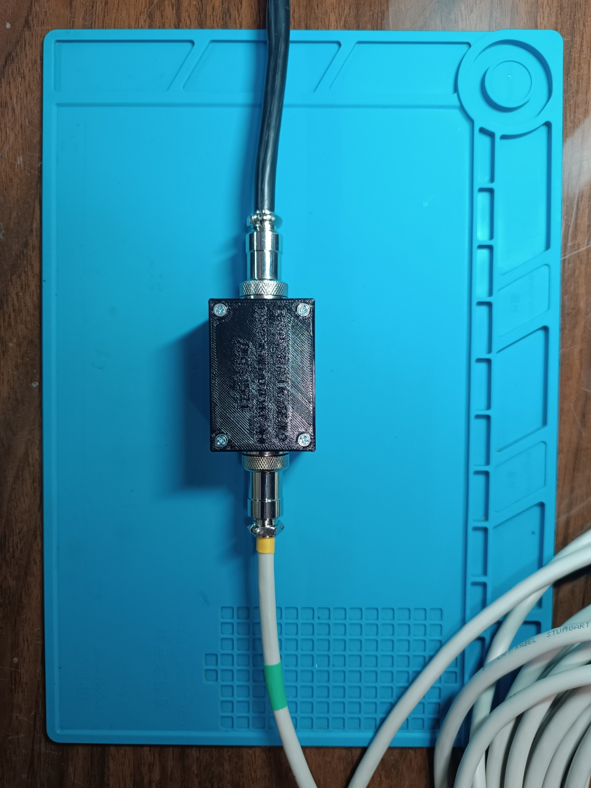
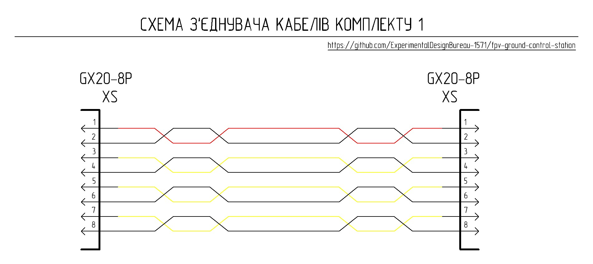
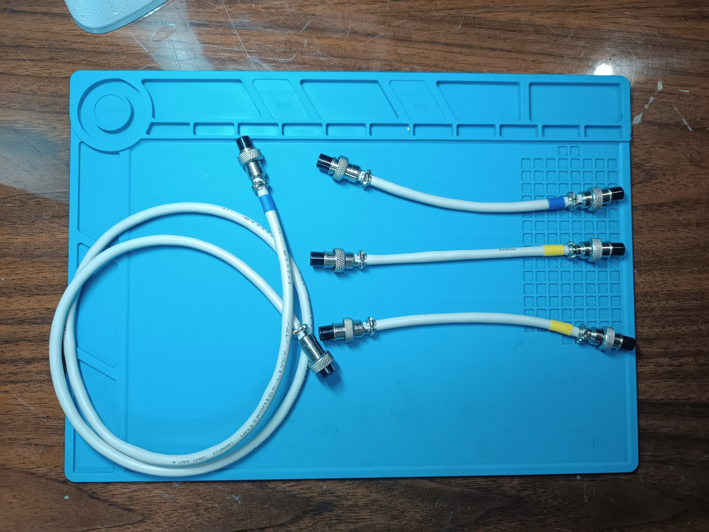
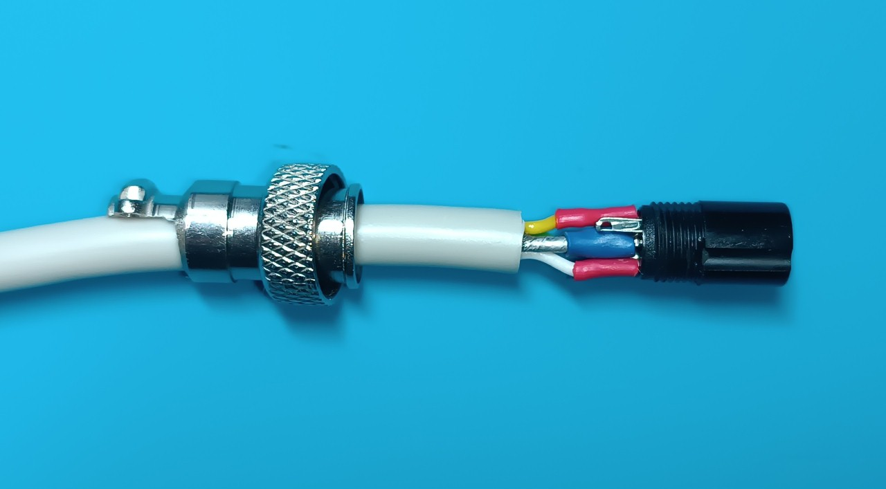

# Cables

ในการเชื่อมต่อ control unit เข้ากับ remote unit ของ station รวมถึงการเชื่อมต่ออุปกรณ์ peripheral เข้ากับพวกมัน จะใช้ cables ที่ทำจาก shielded multi-strand copper twisted pair

## Set 1 - Trunk

Set นี้ได้รับการออกแบบมาเพื่อเชื่อมต่อ control unit และ remote unit ของ station เข้าด้วยกัน โดยมาตรฐานของ trunk cable จะมีความยาว 2 meters และจัดเก็บไว้ใน station body ระหว่างการเคลื่อนย้าย ทั้งนี้ขึ้นอยู่กับลักษณะงาน set นี้สามารถเสริมด้วย trunk cables เพิ่มเติมได้ เช่น cable ขนาด 5-8 meters สำหรับใช้งานร่วมกับ repeater จาก shelter และ cable ขนาด 25-50 meters สำหรับการใช้งานแบบประจำที่ (stationary) จาก shelter

จุดเริ่มต้นของ standard trunk cable จะเชื่อมต่อกับ control unit และจุดสิ้นสุดจะเชื่อมต่อกับ remote unit hub ของ station

ในการเชื่อมต่อ standard trunk cable เข้ากับ additional cable จะใช้ cable connector โดยปลายของ standard trunk cable จะเสียบเข้ากับ port หนึ่งของ connector และจุดเริ่มต้นของ additional trunk cable จะเสียบเข้ากับ port ที่สอง จากนั้นปลายของ additional trunk cable จะเชื่อมต่อกับ remote unit hub ของ station ตามลำดับ

หากไม่มี connector ตัว additional trunk cable จะเชื่อมต่อโดยตรงกับ control unit แทน standard trunk cable

ในการผลิต trunk set สามารถใช้ cable types ต่อไปนี้ได้:
<ul>
<li>RVSP twisted pair 8x0.5mm² / 20AWG</li>
<li>RVSP twisted pair 8x0.3mm² / 22AWG</li>
<li>LAPP UNITRONIC LiYCY (TP) 4x2x0.5</li>
<li>LAPP UNITRONIC LiYCY (TP) 4x2x0.25</li>
</ul>

ความยาวของแนว trunk cable ขึ้นอยู่กับ cable type สำหรับ cables ที่มี cross-section ขนาด 0.5 mm² ความยาวสูงสุดของสายคือ 50 meters และสำหรับ cables ที่มี cross-section ขนาด 0.25-0.3 mm² ความยาวสูงสุดของสายคือ 25 meters

### Note!
<ul>
<li>ในการผลิต cables การเชื่อมต่อ cable shield เข้ากับสาย common (ground) บน connector จะทำเพียงด้านเดียวเท่านั้น เพื่อป้องกันไม่ให้เกิด ground loops</li>
<li>ด้านของ cable ที่เชื่อมต่อ shield เข้ากับสาย common จะเป็นจุดเริ่มต้น of cable โดยจุดเริ่มต้นของ cable จะถูกทำเครื่องหมายด้วย heat-shrink tubing</li>
<li>เมื่อใช้ cables ที่มี cross-section ขนาด 0.5 mm² ช่องทางเข้าของ connector housings จะต้องถูกตะไบหรือขยายขนาดด้วย needle file ให้มีขนาดเท่ากับเส้นผ่านศูนย์กลางของ cable ที่ใช้</li>
</ul>

### List of required components for manufacturing one standard trunk cable

| Component name | Quantity | Note |
| :--- | :--- | :---: |
| RVSP twisted pair 8x0.5mm² / 20AWG or RVSP twisted pair 8x0.3mm² / 22AWG or LAPP UNITRONIC LiYCY (TP) 4x2x0.5 or LAPP UNITRONIC LiYCY (TP) 4x2x0.25 | 2 meters |  |
| Cable socket GX20-8 pin (female) | 2 pcs |  |

## Set 1 Cable Connector

ในด้านการออกแบบ connector ถูกสร้างขึ้นใน enclosure ขนาดเล็กที่ประกอบด้วย sockets ซึ่งเชื่อมต่อสายเข้าด้วยกันตาม electrical schematic ที่เกี่ยวข้อง

### List of required components for manufacturing one connector

| Component name | Quantity | Note |
| :--- | :--- | :---: |
| Panel-mount plug GX20-8 pin (male) | 2 pcs |  |
| Copper wire 20 AWG with silicone insulation, red | 110 mm  |  |
| Copper wire 20 AWG with silicone insulation, black | 440 mm  |  |
| Copper wire 20 AWG with silicone insulation, yellow | 330 mm  |  |
| Screw M3x40 DIN 965 | 4 pcs |  |
| Nut M3 DIN 934 | 4 pcs  |  |
| Part 1 - 3D printed | 1 pc  |  |
| Part 2 - 3D printed | 1 pc   |  |

## Set 2 - Peripheral

Set นี้ออกแบบมาสำหรับเชื่อมต่ออุปกรณ์ peripheral เข้ากับ control unit และ remote unit ของ station ประกอบด้วย:
<ul>
<li>cables for connecting VRX blocks (ใช้ yellow heat-shrink tubing)</li>
<li>control subsystem cables (ใช้ blue heat-shrink tubing)</li>
</ul>

## Cables for Connecting VRX Blocks

ทั้งนี้ขึ้นอยู่กับ station configuration ซึ่งสามารถเลือกใช้ cable options ได้สองแบบ แตกต่างกันที่ความสามารถในการส่งสัญญาณควบคุมไปยัง VRX block หากควบคุม VRX block แบบ manual หรือผ่าน ELRS Backpack จะใช้สายทางเลือกแรก (first option cable) หากควบคุมผ่าน switching lines ของ ground station จะใช้สายทางเลือกที่สอง (second option cable) จุดเริ่มต้นของ cable เชื่อมต่อกับ remote unit hub และจุดสิ้นสุดของ cable เชื่อมต่อกับ VRX block

### Note!
<ul>
<li>ในการผลิต cables การเชื่อมต่อ cable shield เข้ากับสาย common (ground) บน connector จะทำเพียงด้านเดียวเท่านั้น เพื่อป้องกันไม่ให้เกิด ground loops</li>
<li>ด้านของ cable ที่เชื่อมต่อ shield เข้ากับสาย common จะเป็นจุดเริ่มต้นของ cable โดยจุดเริ่มต้นของ cable จะถูกทำเครื่องหมายด้วย heat-shrink tubing ซึ่งสีของ tubing จะเป็นตัวบ่งบอกประเภทของ cable ด้วย (ใช้สีเหลืองสำหรับการเชื่อมต่อ VRX blocks)</li>
<li>ในการผลิต cables ช่องทางเข้าของ connector housings จะต้องถูกตะไบหรือขยายขนาดด้วย needle file ให้มีขนาดเท่ากับเส้นผ่านศูนย์กลางของ cable ที่ใช้</li>
</ul>

### List of required components for manufacturing one VRX block connection cable

| Component name | Quantity | Note |
| :--- | :--- | :---: |
| LAPP UNITRONIC LiYCY (TP) 2x2x0.25 or LAPP UNITRONIC LiYCY (TP) 3x2x0.14 | 120 mm |  |
| Cable socket GX12-6 pin (female) | 2 pcs |  |

## Control Subsystem Cables

cable ประเภทนี้ใช้เพื่อเชื่อมต่อ JR module สำหรับ remote controller (สายยาว) และ TX unit (สายสั้น) โดยจุดเริ่มต้นของ cable ที่เชื่อมต่อ JR module เข้ากับ station control unit จะเชื่อมต่อเข้ากับ control unit และปลายสายเชื่อมต่อกับ JR module สำหรับจุดเริ่มต้นของ cable ที่เชื่อมต่อ TX unit เข้ากับ remote unit hub จะเชื่อมต่อเข้ากับ hub และปลายสายเชื่อมต่อกับ TX unit

### Note!
<ul>
<li>ในการผลิต cables การเชื่อมต่อ cable shield เข้ากับสาย common (ground) บน connector จะทำเพียงด้านเดียวเท่านั้น เพื่อป้องกันไม่ให้เกิด ground loops</li>
<li>ด้านของ cable ที่เชื่อมต่อ shield เข้ากับสาย common จะเป็นจุดเริ่มต้นของ cable โดยจุดเริ่มต้นของ cable จะถูกทำเครื่องหมายด้วย heat-shrink tubing ซึ่งสีของ tubing จะเป็นตัวบ่งบอกประเภทของ cable ด้วย (ใช้สีน้ำเงินสำหรับ control subsystem cables)</li>
<li>ในการผลิต cables ช่องทางเข้าของ connector housings จะต้องถูกตะไบหรือขยายขนาดด้วย needle file ให้มีขนาดเท่ากับเส้นผ่านศูนย์กลางของ cable ที่ใช้</li>
</ul>

### List of required components for manufacturing one set of control subsystem cables

| Component name | Quantity | Note |
| :--- | :--- | :---: |
| LAPP UNITRONIC LiYCY (TP) 2x2x0.25 | 1120 mm | 1000 mm - long cable, 120 mm - short cable |
| Cable socket GX12-6 pin (female) | 4 pcs |  |
