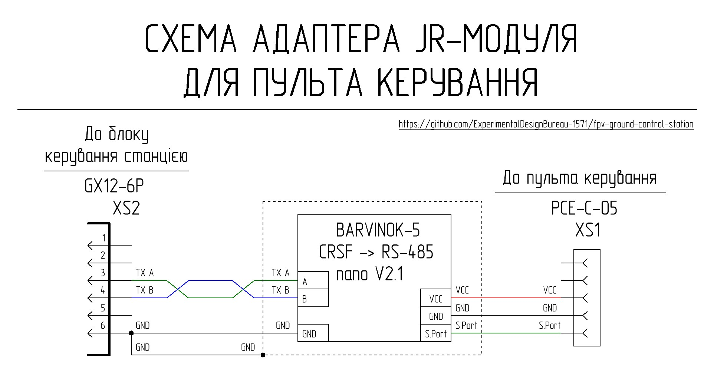

# JR_module_adapter

JR_module_adapter ทำหน้าที่เชื่อมต่อ control panel ที่มี JR-compatible bay เข้ากับ station control unit เพื่อส่งผ่านและแลกเปลี่ยนข้อมูลแบบสองทิศทาง (two-way data exchange) กับ control transmitter ที่อยู่บน remote unit ของสถานี

## Brief Technical Parameters

| Parameter | Value | Note |
|----------|---------|---------|
| Control protocol | CRSF | ผ่าน S.Port |
| Transmission interface | Differential signal ของมาตรฐาน RS-485 | |
| Operating mode | Two-way | Control + telemetry |
| JR module adapter power supply | 5–8.4 V | จาก control panel |
| Cooling | Passive | Heatsinks + ช่องระบายอากาศ |
| Shielding | Partial | |

### Interfaces

| Connector | Purpose | Main signals | Note |
|--------|------------|----------------|----------|
| XS1 | การเชื่อมต่อกับ control panel | +BAT, GND, CRSF | Control panel ต้องมี JR-compatible bay |
| XS2 | การเชื่อมต่อกับ station control unit | Differential signal ของมาตรฐาน RS-485, GND | |

## Circuitry and Functionality of the JR Module Adapter

Adapter นี้ใช้พลังงานโดยตรงจาก control panel ผ่าน connector XS1 ในย่านแรงดัน 5V–8.4V

สัญญาณความเร็วสูง (high-speed signal) จาก control panel ผ่านขา S.Port pin (โปรโตคอล CRSF) ของ connector XS1 จะถูกส่งไปยัง interface converter (โมดูล BARVINOK-5 RS-485 nano V2.1) ซึ่งจะแปลงสัญญาณดังกล่าวเป็น differential signal ของมาตรฐาน RS-485 และส่งออกผ่าน connector XS2 ไปยัง switching lines ของ ground control station

การรักษาเสถียรภาพของอุณหภูมิของอุปกรณ์ (temperature modes) ใช้ระบบระบายความร้อนแบบ passive cooling ซึ่งประกอบด้วยช่องระบายอากาศใน housing, silicone thermal pad และ copper heatsink ตัว heatsink จะถูกเชื่อมต่อทางไฟฟ้ากับสายกราวด์ร่วม (GND) ทำให้สามารถทำหน้าที่เป็นแผงป้องกันเพิ่มเติม (additional shield) เพื่อป้องกันสัญญาณรบกวนทางแม่เหล็กไฟฟ้า (electromagnetic interference) ได้

## List of Necessary Components for Manufacturing One JR Module Adapter

| Name | Quantity | Note |
| :--- | :--- | :---: |
| BARVINOK-5 RS-485 nano V2.1 interface converter module | 1 pc | โมดูลผลิตในยูเครน [ซื้อ BARVINOK-5 RS-485 nano V2.1 จากผู้ผลิต](https://prom.ua/ua/p2693881056-adapter-port-485.html) |
| PCE-C-05 connector | 1 pc | XS1 |
| GX12-6 pin panel mount plug (male) | 1 pc | XS2 |
| Double-sided prototyping board with 2.54 mm pitch | 30 mm x 70 mm |  |
| Sheet copper 0.8 mm thick | 25 mm x 28 mm |  |
| Silicone thermal pad 2 mm 6W/m.k | 25 mm x 28 mm |  |
| Copper wire 26 AWG with silicone insulation, black | 260 mm |  |
| Copper wire 26 AWG with silicone insulation, green | 170 mm |  |
| Copper wire 26 AWG with silicone insulation, blue | 170 mm |  |
| Screw M2x5 DIN 7985 | 2 pcs |  |
| Screw M2x6 DIN 965 | 3 pcs |  |
| Screw M2x10 DIN 7985 | 9 pcs |  |
| Washer M2 DIN 125 | 8 pcs |  |
| Nut M2 DIN 934 | 14 pcs |  |
| Screw M3x8 DIN 965 | 2 pcs |  |
| Nut M3 DIN 934 | 2 pcs |  |
| Part 1 - 3D print | 1 pc |  |
| Part 2 - 3D print | 1 pc |  |
| Part 3 - 3D print | 1 pc |  |
| Part 4 - 3D print | 1 pc |  |

## 3D Printing Settings and Material Used

| Parameter | Value |
| :---: | :---: |
| Number of perimeters | 4 |
| Solid top and bottom layers | 5 |
| Infill density | 40% |
| Infill pattern | Gyroid |
| Supports | Tree-like |

Material: coPET black MonoFilament

## Hardware Fasteners Details

| Name | Type/Size | Quantity | Note |
| :--- | :--- | :---: | :---: |
| Screw | M2x5 DIN 7985 | 2 pcs | การติดตั้ง board กับ XS1 connector |
| Nut | M2 DIN 934 | 2 pcs | การติดตั้ง board กับ XS1 connector |
| Screw | M2x10 DIN 7985 | 1 pc | การติดตั้ง XS1 connector retainer |
| Nut | M2 DIN 934 | 1 pc | การติดตั้ง XS1 connector retainer |
| Screw | M3x8 DIN 965 | 2 pcs | การติดตั้ง module BARVINOK-5 RS-485 nano V2.1 |
| Nut | M3 DIN 934 | 2 pcs | การติดตั้ง module BARVINOK-5 RS-485 nano V2.1 |
| Screw | M2x5 DIN 7985 | 4 pcs | การติดตั้ง heatsink |
| Washer | M2 DIN 125 | 4 pcs | การติดตั้ง heatsink |
| Nut | M2 DIN 934 | 4 pcs | การติดตั้ง heatsink |
| Screw | M2x6 DIN 965 | 3 pcs | การติดตั้ง internal strip เข้ากับ module base |
| Nut | M2 DIN 934 | 3 pcs | การติดตั้ง internal strip เข้ากับ module base |
| Screw | M2x10 DIN 7985 | 4 pcs | การติดตั้ง module cover เข้ากับ base |
| Washer | M2 DIN 125 | 4 pcs | การติดตั้ง module cover เข้ากับ base |
| Nut | M2 DIN 934 | 4 pcs | การติดตั้ง module cover เข้ากับ base |

## Wire Usage Details

| Type | Length | Note |
| :--- | :--- | :---: |
| 26 AWG black | 80 mm | XS1 - interface converter |
| 26 AWG green | 80 mm | XS1 - interface converter |
| 26 AWG blue | 80 mm | XS1 - interface converter |
| 26 AWG black | 90 mm | Interface converter - XS2 |
| 26 AWG green | 90 mm | Interface converter - XS2 |
| 26 AWG blue | 90 mm | Interface converter - XS2 |
| 26 AWG black | 90 mm | XS2 - heatsink |
