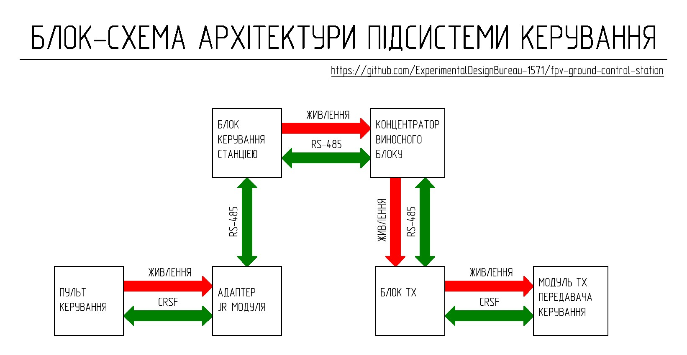

# Control_subsystem

Control subsystem ให้บริการแลกเปลี่ยนข้อมูลแบบสองทิศทาง (two-way data exchange) ผ่าน switching lines ของ ground control station โดยใช้มาตรฐาน RS-485 ระหว่าง operator's control panel และ control transmitter ที่ติดตั้งอยู่ใน remote unit ของ ground control station

Control subsystem ประกอบด้วย:
- JR_module_adapter (ทางฝั่ง control panel)
- TX_unit (ทางฝั่ง remote unit)

## Brief Technical Specifications

| Parameter | Value | Note |
|----------|---------|---------|
| Control protocol | CRSF | ผ่าน S.Port |
| Transmission interface | Differential signal ของมาตรฐาน RS-485 | Noise-immune, long lines |
| Data transmission channel | Switching lines ของ ground control station | ความยาวสูงสุดขึ้นอยู่กับประเภทของ cable |
| Operating mode | Two-way | Control + telemetry |
| JR module adapter power supply | 5–8.4 V | จาก control panel |
| TX unit power supply | จาก remote unit hub | ผ่าน XS2 |
| Control transmitter TX module power supply | 8V | จาก TX unit |
| TX unit output voltage via XS3 connector | 8V | กระแสต่อเนื่องสูงสุด 2A |
| Cooling | Passive | Heatsinks + ช่องระบายอากาศ |
| Shielding | Partial | |

## Operating Principle and Architecture

สัญญาณควบคุมจาก control panel จะถูกส่งไปยัง JR_module_adapter ซึ่งจะถูกแปลงเป็น differential signal ของมาตรฐาน RS-485 จากนั้นสัญญาณจะถูกส่งผ่าน switching lines ของ ground control station ไปยัง TX_unit ซึ่งจะเกิดการแปลงสัญญาณกลับ (reverse conversion) เป็นสัญญาณโปรโตคอล CRSF ก่อนที่จะส่งต่อไปยัง control transmitter สำหรับช่องสัญญาณขากลับ (telemetry) จะทำงานในลักษณะเดียวกันแต่ในทิศทางตรงกันข้าม

รายละเอียดการออกแบบและพัฒนาสำหรับแต่ละอุปกรณ์ของ control subsystem แสดงอยู่ในส่วนต่างๆ ดังนี้:

* **[JR_module_adapter](JR_module_adapter/)**
* **[TX_unit](TX_unit/)**
