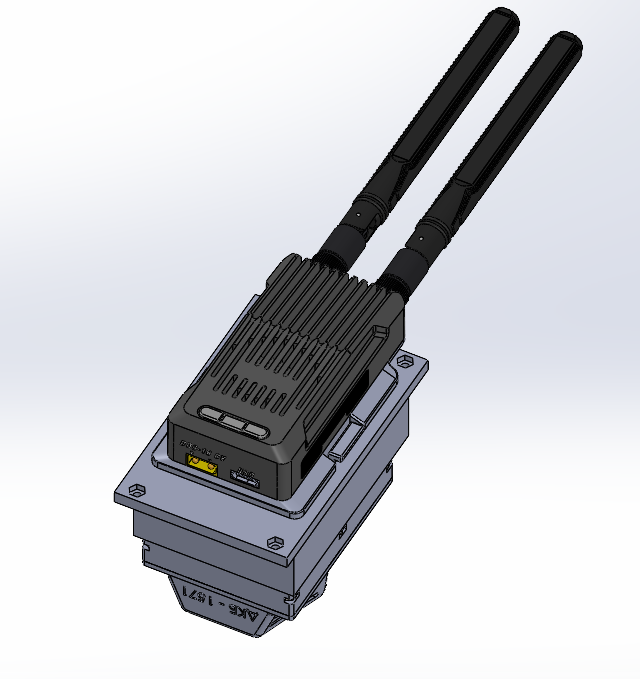
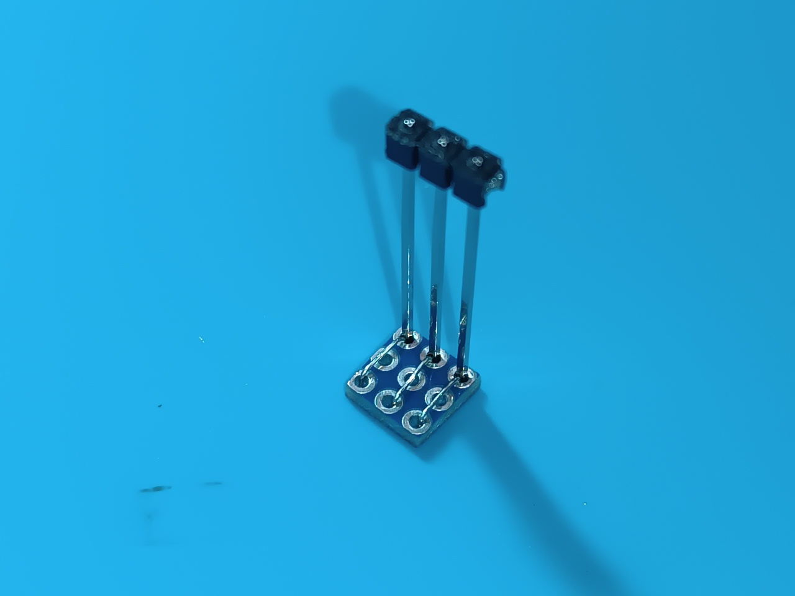
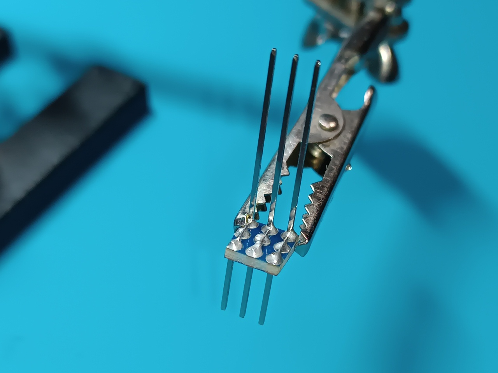
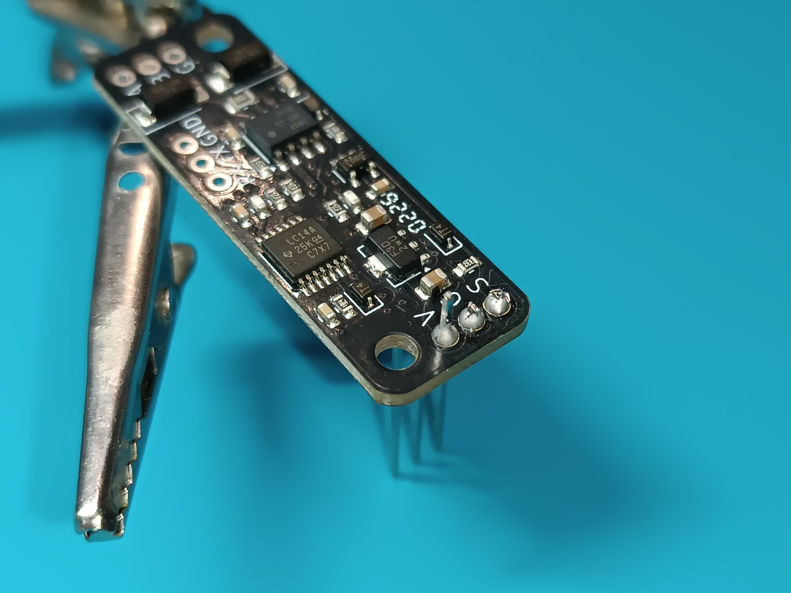
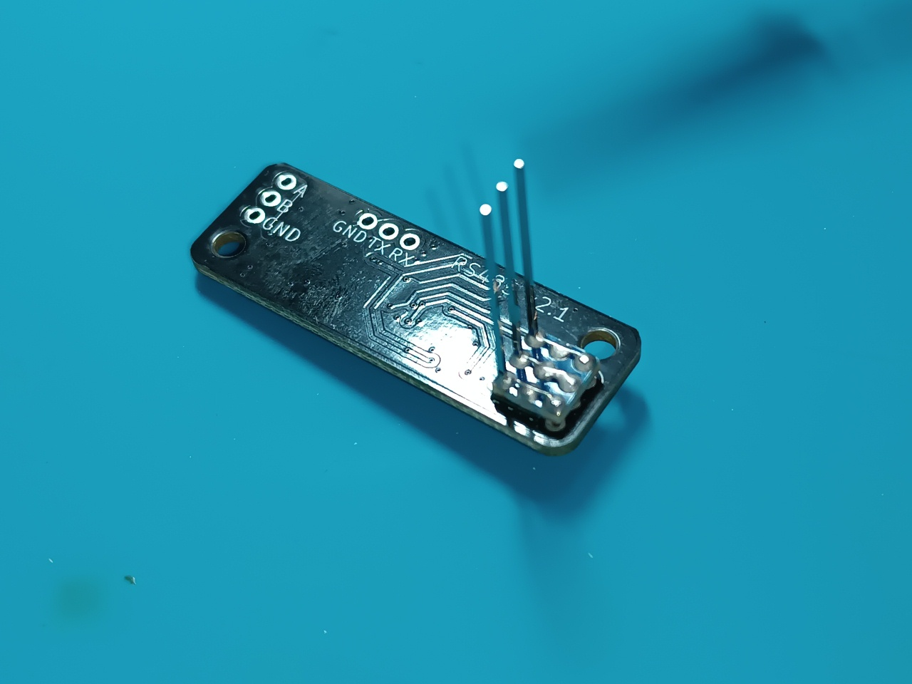

# TX_unit

TX unit ทำหน้าที่เชื่อมต่อ JR-compatible control transmitter module เข้ากับ remote unit hub เพื่อส่งผ่านและแลกเปลี่ยนข้อมูลแบบสองทิศทาง (two-way data exchange) กับ control panel ที่เชื่อมต่ออยู่กับ station control unit รูปภาพแสดงภาพรวมภายนอก (general view) ของ TX unit ขณะติดตั้ง control transmitter เรียบร้อยแล้ว

## Brief Technical Parameters

| Parameter | Value | Note |
|----------|---------|---------|
| Control protocol | CRSF | ผ่าน S.Port |
| Transmission interface | Differential signal ของมาตรฐาน RS-485 | |
| Operating mode | Two-way | Control + telemetry |
| TX unit power supply | จาก remote unit hub | ผ่าน XS2 |
| Control transmitter TX module power supply | 8V | จาก TX unit |
| TX unit output voltage via XS3 connector | 8V | กระแสต่อเนื่องสูงสุด 2A |
| Cooling | Passive | Heatsinks + ช่องระบายอากาศ |
| Shielding | Partial | |

### Interfaces

| Connector | Purpose | Main signals | Note |
|--------|------------|----------------|----------|
| XS1 | การเชื่อมต่อของ control transmitter | VCC, GND, CRSF (S.Port) | รองรับ JR-compatible control transmitters |
| XS2 | การเชื่อมต่อกับ remote unit hub | +BAT, GND, differential signal ของมาตรฐาน RS-485 | |
| XS3 | ช่องจ่ายไฟออก 8V power output | VCC, GND | การเชื่อมต่อของ high-power control transmitters |

## Circuitry and Functionality of the TX Unit for the Control Transmitter

TX unit รับพลังงานมาจาก remote unit hub โดยแรงดันไฟฟ้าจาก connector XS2 จะถูกส่งไปยัง common ground bus (ซึ่งใช้ copper cooling heatsink ในการระบายความร้อน) และส่งต่อไปยัง voltage converter ซึ่งจะสร้างแรงดัน 8V เพื่อจ่ายไฟให้กับ interface converter และ control transmitter (โปรดตรวจสอบให้แน่ใจว่า TX module ของคุณรองรับแหล่งจ่ายไฟ 8V) นอกจากนี้แรงดันไฟ 8V จะถูกจ่ายออกไปยัง connector XS3 เพื่อรองรับการจ่ายพลังงานให้แก่ high-power control transmitters ที่ต้องการแหล่งจ่ายไฟภายนอก (external power) ทั้งนี้ high-power control transmitter เมื่อรับไฟจาก connector XS3 แล้ว จะต้องไม่มีการเชื่อมต่อทางไฟฟ้ากับขา GND pin ของ connector XS1 เพื่อหลีกเลี่ยงการเกิด ground loop

การแลกเปลี่ยนข้อมูลแบบสองทิศทาง (two-way data exchange) ระหว่าง control transmitter และ control panel จะดำเนินการตามมาตรฐาน RS-485 ผ่าน switching lines ของ ground control station โดยสัญญาณควบคุมผ่าน connector XS2 จะถูกส่งไปยัง interface converter (โมดูล BARVINOK-5 RS-485 nano V2.1) ซึ่งจะแปลง differential signal ของมาตรฐาน RS-485 เป็นสัญญาณโปรโตคอล CRSF ความเร็วสูง แล้วส่งไปยัง control transmitter ผ่านขา S.Port pin ของ connector XS1

การรักษาเสถียรภาพของอุณหภูมิของอุปกรณ์ (temperature modes) ใช้ระบบระบายความร้อนแบบ passive cooling ซึ่งประกอบด้วยช่องระบายอากาศใน housing, silicone thermal pad และ copper heatsink ตัว copper heatsink นี้ทำหน้าที่เป็น common ground (GND) bus ซึ่งช่วยให้สามารถทำหน้าที่เป็นแผงป้องกันเพิ่มเติม (additional shield) เพื่อป้องกันสัญญาณรบกวนทางแม่เหล็กไฟฟ้า (electromagnetic interference) ได้

## List of Necessary Components for Manufacturing One TX Unit

| Name | Quantity | Note |
| :--- | :--- | :---: |
| BARVINOK-5 RS-485 nano V2.1 interface converter module | 1 pc | โมดูลผลิตในยูเครน [ซื้อ BARVINOK-5 RS-485 nano V2.1 จากผู้ผลิต](https://prom.ua/ua/p2693881056-adapter-port-485.html) |
| GUTI ELECTRONICS BEC12S-PRO voltage converter | 1 pc | โมดูลเทียบเท่าของยูเครนเทียบกับ Matek BEC 12S PRO [ซื้อ GUTI ELECTRONICS BEC12S-PRO จากผู้ผลิต](https://prom.ua/ua/p2814749849-otechestvennyj-analog-matek.html) |
| GX12-6 pin panel mount plug (male) | 1 pc | XS2 |
| DC-022 power socket | 1 pc | XS3 |
| Pin header 1x40 2.54mm pitch L=25mm | 3 pins | |
| Pin header 1x40 2.54mm pitch L=15mm | 3 pins | |
| Double-sided prototyping board with 2.54 mm pitch | 30 mm x 70 mm |  |
| Self-adhesive electrical insulating paper 0.2 mm | 30 mm x 30 mm |  |
| Sheet copper 0.8 mm thick | 26 mm x 57 mm |  |
| Silicone thermal pad 2 mm 6W/m.k | 26 mm x 57 mm |  |
| Copper wire 20 AWG with silicone insulation, red | 200 mm |  |
| Copper wire 20 AWG with silicone insulation, black | 250 mm |  |
| Copper wire 26 AWG with silicone insulation, red | 100 mm |  |
| Copper wire 26 AWG with silicone insulation, black | 50 mm |  |
| Copper wire 26 AWG with silicone insulation, green | 80 mm |  |
| Copper wire 26 AWG with silicone insulation, blue | 80 mm |  |
| Screw M3x8 DIN 965 | 2 pcs |  |
| Nut M3 DIN 934 | 2 pcs |  |
| Screw M2x10 DIN 7985 | 12 pcs |  |
| Washer M2 DIN 125 | 12 pcs |  |
| Nut M2 DIN 934 | 12 pcs |  |
| Part 1 - 3D print | 1 pc |  |
| Part 2 - 3D print | 1 pc |  |

## 3D Printing Settings and Material Used

| Parameter | Value |
| :---: | :---: |
| Number of perimeters | 4 |
| Solid top and bottom layers | 5 |
| Infill density | 40% |
| Infill pattern | Gyroid |
| Supports | Tree-like |

Material: coPET black MonoFilament

## XS1 Connector Assembly Process

connector XS1 ถูกประกอบโดยการติดตั้ง long pins และ short pins บน adapter board ที่ตัดมาจาก double-sided prototyping board โดย long pins (L=25mm) จะถูกบัดกรีในลักษณะที่ไม่ยื่นเลย adapter board ออกไปทางด้านของ short pins และใช้สายทองแดงขนาดเล็กเป็นสายเชื่อม (jumpers) ระหว่าง mounting holes ของ prototyping board

 

short pins (L=15mm) จะถูกบัดกรีในทิศทางตรงกันข้ามกับ long pins

ที่ฝั่งของ short pins จะมีการติด self-adhesive electrical insulating paper จำนวน 3 ชั้นลงบน adapter board เพื่อป้องกันการเกิดลัดวงจร (short circuits) จาก contact pads ของ adapter board ไปยัง common ground (GND) polygon ของ interface converter

short pins จะถูกบัดกรีเข้ากับ interface converter จากนั้นให้ตัดส่วนเกินของขาแกนกลาง (GND) และขาขวา (S.Port) ออก ส่วนขาซ้าย (VCC) ให้ตัดออกประมาณครึ่งหนึ่ง เพื่อสร้างเป็นจุดรับแรงดันไฟ 8V จาก voltage converter เพื่อนำไปเลี้ยง interface converter และ control transmitter สำหรับ long pins จะถูกเสียบเข้ากับช่องที่ตรงกันใน base ของ unit ระหว่างขั้นตอนการติดตั้ง interface converter

 

## Hardware Fasteners Details

| Name | Type/Size | Quantity | Note |
| :--- | :--- | :---: | :---: |
| Screw | M3x8 DIN 965 | 2 pcs | การติดตั้ง module BARVINOK-5 RS-485 nano V2.1 |
| Nut | M3 DIN 934 | 2 pcs | การติดตั้ง module BARVINOK-5 RS-485 nano V2.1 |
| Screw | M2x10 DIN 7985 | 6 pcs | การติดตั้ง heatsink |
| Washer | M2 DIN 125 | 6 pcs | การติดตั้ง heatsink |
| Nut | M2 DIN 934 | 6 pcs | การติดตั้ง heatsink |
| Screw | M2x10 DIN 7985 | 6 pcs | การติดตั้ง cover |
| Washer | M2 DIN 125 | 6 pcs | การติดตั้ง cover |
| Nut | M2 DIN 934 | 6 pcs | การติดตั้ง cover |

## Wire Usage Details

| Type | Length | Note |
| :--- | :--- | :---: |
| 20 AWG black | 100 mm | GND bus (cooling heatsink) - XS2 |
| 20 AWG black | 50 mm | GND bus (cooling heatsink) - 12S PRO voltage converter |
| 26 AWG black | 50 mm | GND bus (cooling heatsink) - interface converter |
| 20 AWG black | 100 mm | GND bus (cooling heatsink) - XS3 |
| 26 AWG green | 80 mm | Interface converter - XS2 |
| 26 AWG blue | 80 mm | Interface converter - XS2 |
| 20 AWG red | 100 mm | 12S PRO voltage converter - XS2 |
| 20 AWG red | 100 mm | 12S PRO voltage converter - XS3 |
| 26 AWG red | 100 mm | Interface converter - XS3 |
