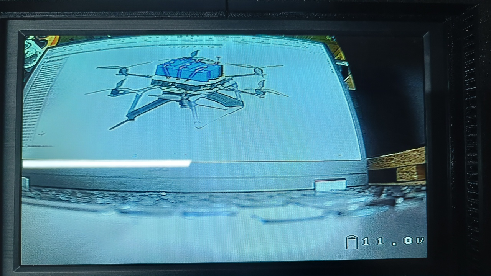
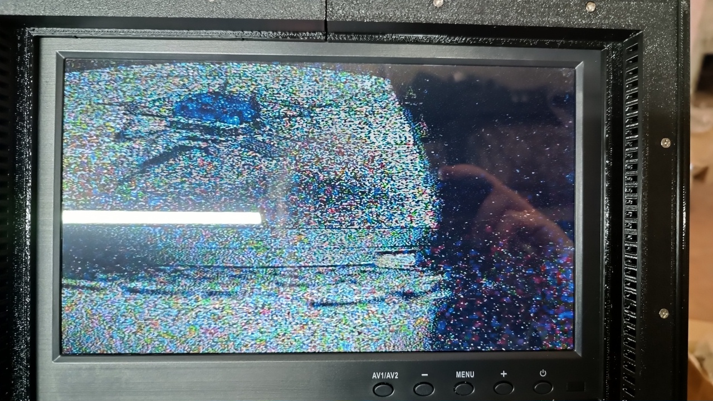
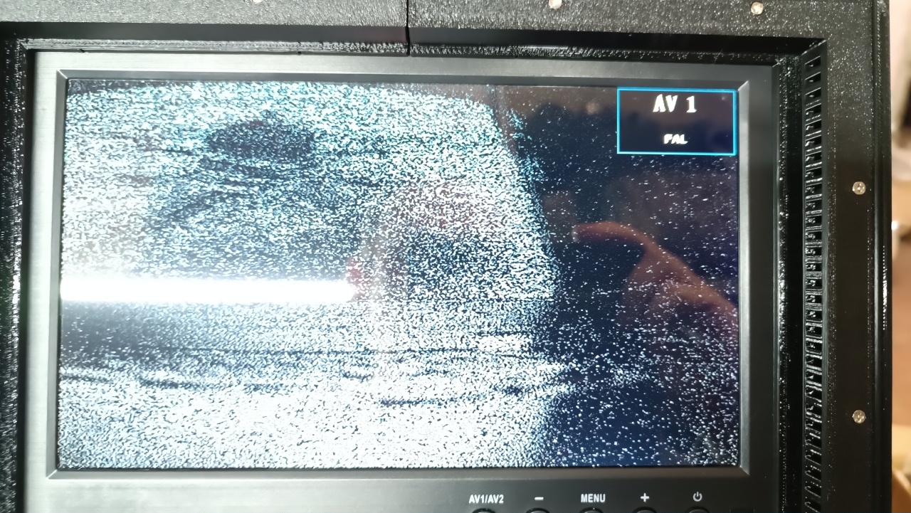
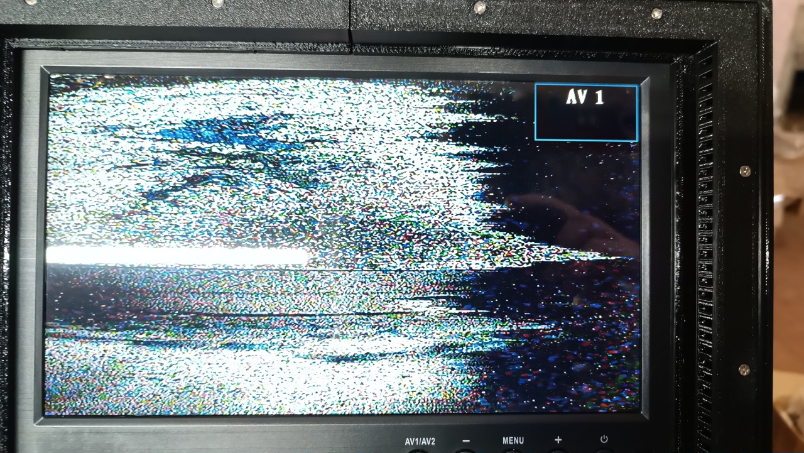
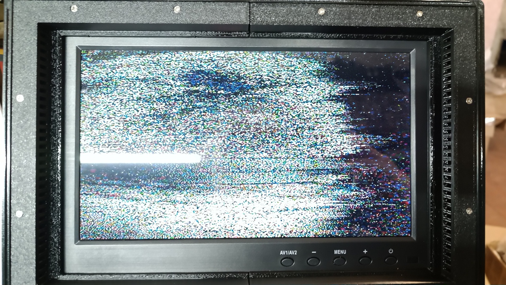
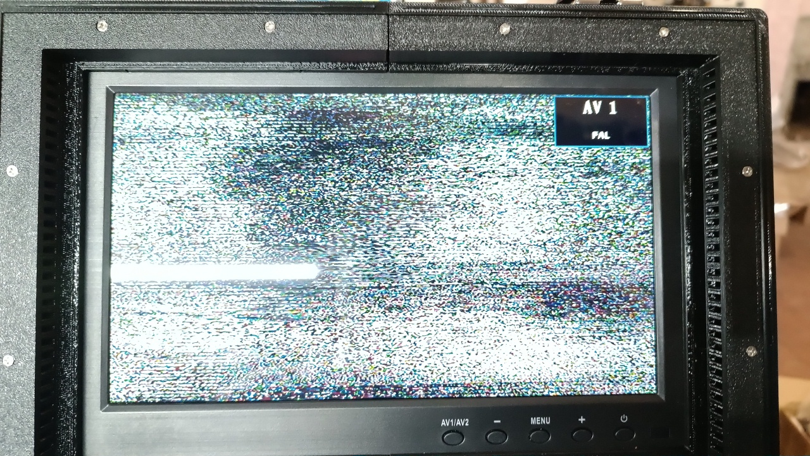
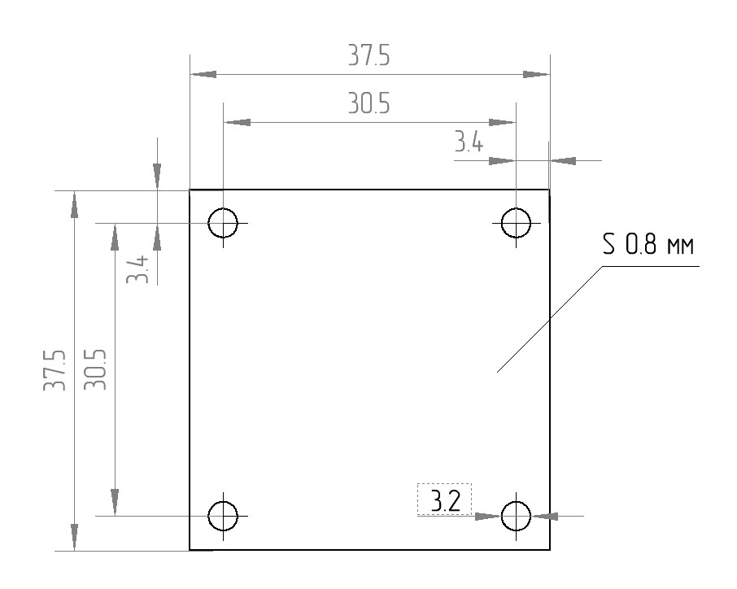
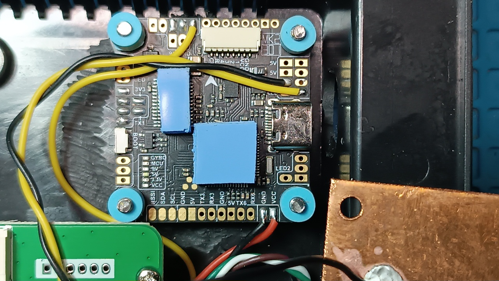
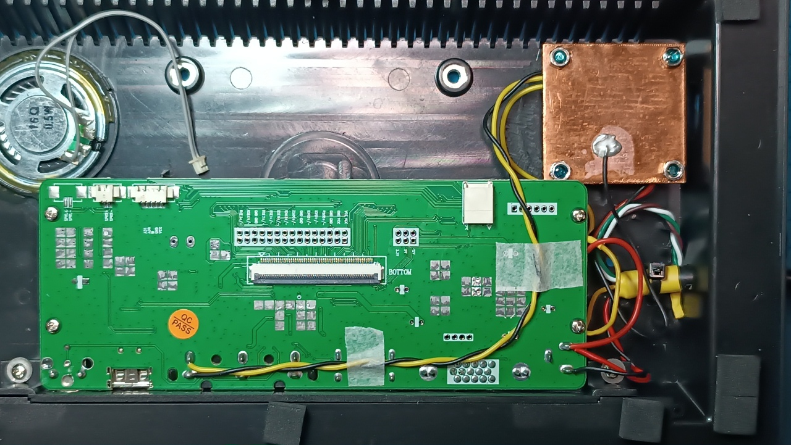

# Monitor Modernization

A universal monitor with a screen diagonal of 10.1 inches is used as the standard display device in the ground station. The use of this type of monitor is justified by its wide availability in terms of both stock and price, as well as the combination of its technical characteristics. Models are available both with an analog video input and with additional inputs, including a digital HDMI input. Using a monitor with an additional digital HDMI video input in the ground station expands the usage options; for example, it is possible to connect modules like Walksnail Avatar VRX and Walksnail Ascent VRX, or single-board computers like Raspberry Pi directly to the monitor.

This monitor has a "blue screen" mode that turns on if there is no video signal on the active video input or if it has significant distortion. When using the digital HDMI video input, this plays no role, but when using the analog video input, the ability to see the picture through noise is critically important. 

## Monitor Modernization - Theoretical Background

It is possible to solve the "blue screen" problem with a minor modernization of the monitor, which consists of additional video signal processing by the AT7456E chip. To simplify the modernization process as much as possible, a flight controller is used, where it is already installed with all its supporting circuitry. The practicality of using a flight controller specifically is justified by their wide availability in any field workshop. 

How it works: 
The output signal of the video receiver is processed by the AT7456E chip. The AT7456E chip restores and stabilizes synchronization, forming a correct composite video signal at the output even with a significant level of interference.

For the monitor, such a signal always looks "correct." Even if the picture from the drone is filled with noise or has almost disappeared, the monitor does not switch to "blue screen" mode.

Result: we see the picture until the very end without the monitor switching to "blue screen," which is critically important during strong interference.

 
 
 

If the signal consists mostly of static noise ("snow"), the monitor may still switch to "blue screen" mode. In this case, you can connect goggles to the station control unit via the XS4, XS5, or XS6 connector, although even with them it is unlikely that a useful signal can be extracted from the continuous noise.

The constant appearance of the "AV 1 PAL" text against a background of strong noise is a sign that the system is operating at its maximum limit. This is a signal to the operator: synchronization stabilization by the AT7456E chip is still holding, but at any moment the monitor may switch to "blue screen" mode due to the chip's input being overloaded with noise.

As soon as even a minimal useful signal that can be identified appears in the noise stream, the AT7456E chip will instantly restore synchronization, and the image on the monitor will appear again.

## Monitor Modernization - Practical Implementation

The practical implementation consists of assembling the following circuit:

Structurally, the flight controller is placed inside the monitor housing and secured using M3 screws and nuts. 

Given the operation in an enclosed space, it is advisable to use a copper heatsink to stabilize the temperature modes of the AT7456E chip and the flight controller's microcontroller, with heat dissipation to it occurring through a silicone thermal interface. The drawing of the copper heatsink is shown below.

The copper heatsink is connected to the common ground wire and forms additional shielding for the AT7456E chip. The shield connection of the UL2547 4x0.3mm2 (22AWG) cable to the common ground is made only on the connector side to prevent a ground loop from occurring. 

  

**Additional important information:** be sure to set the PAL standard in the monitor settings, the flight controller's OSD menu, and the camera's output signal settings. For additional monitoring of the +12V bus voltage that powers the monitor, you can configure the display of this voltage in the flight controller's OSD menu settings. Given the operating conditions, it is desirable to protect the LCD screen with a hydrogel film, which is convenient to do when the monitor is disassembled.

## List of Necessary Components for the Modernization of One Monitor

| Name | Quantity | Note |
|:---: | :---: | :---: |
| Flight controller with AT7456E | 1 pc | | 
| Damping standoff for flight controller M3*8 mm | 4 pcs |  | 
| Damping standoff for flight controller M3*4 mm | 4 pcs |  | 
| Screw M3x18 DIN 7985 A2 | 4 pcs | Securing the flight controller and cooling heatsink to the monitor housing | 
| Nut M3 DIN 934 | 4 pcs | Securing the flight controller and cooling heatsink to the monitor housing | 
| Silicone thermal pad 4 mm 3.5W\m.k | 25 mm x 20 mm | Heat dissipation from the AT7456E and STM32 chips to the copper heatsink | 
| Sheet copper 0.8 mm thick | 37.5 mm x 37.5 mm | Cooling heatsink | 
| Copper wire 26 AWG with silicone insulation, black | 310 mm | UL2547 cable -> FC = 120 mm; FC -> monitor = 210 mm | 
| Copper wire 26 AWG with silicone insulation, yellow | 330 mm | FC -> monitor = 210 mm; FC -> copper heatsink = 100 mm |
| Copper wire 26 AWG with silicone insulation, red | 100 mm | monitor -> FC |
| Copper shielded cable UL2547 4x0.3mm2 (22AWG) | 365 mm | Length distributed as follows: 85 mm inside the monitor and 280 mm outside it |
| GX12-6 pin cable socket (female) | 1 pc |  |
| Hydrogel film for monitor protection | 225 mm x 128 mm |  |
