# Наземна станція керування «ГАЛІТ» 

Наземна станція керування «ГАЛІТ» для FPV-дронів є модульною системою, яка допускає зміну конфігурації залежно від поставлених задач та умов експлуатації. 

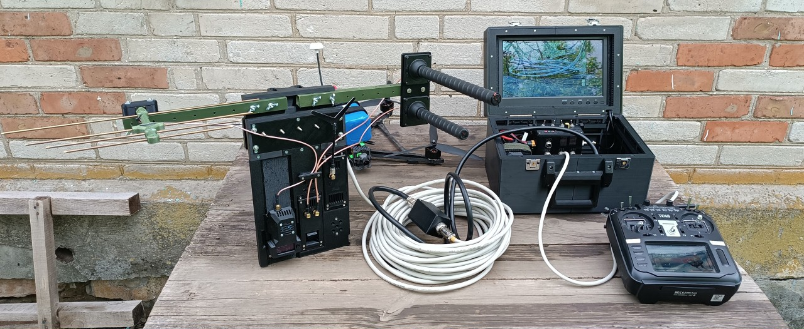

Архітектура станції побудована за принципом функціонального розділення складових системи та допускає розширення функціоналу шляхом інтеграції додаткових модулів без зміни базової структури.

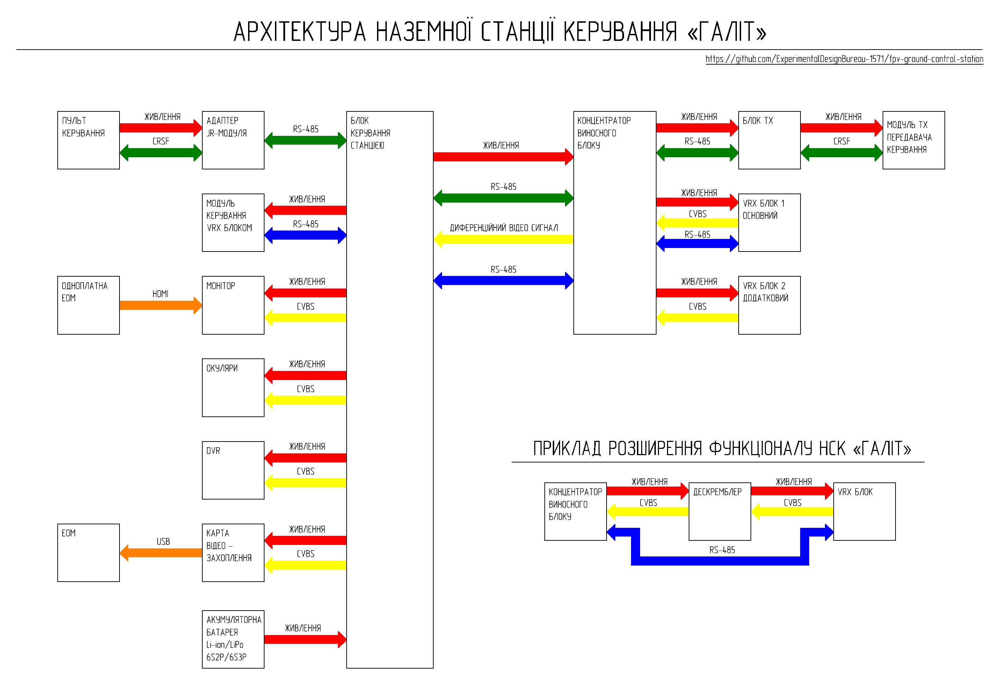

Розробка системи проводилася з урахуванням власного бойового досвіду, доступності компонентів, максимальної підтримки вітчизняних виробників та можливості відтворення конструкції технічним персоналом в умовах військово-польових, цивільних або волонтерських майстерень із середнім рівнем оснащеності.

Рекомендується дотримуватись наступного порядку виготовлення та складання системи:

1.	**[Універсальний кейс та корпус станції](Універсальний_кейс_та_корпус_станції/)**
2.	**[Блок керування станцією](Блок_керування_станцією/)**
3.	**[Модернізація монітора](Модернізація_монітора/)**
4.	**[Виносний блок](Виносний_блок/)**
5.	**[Блоки VRX](Блоки_VRX/)**
6.	**[Підсистема керування](Підсистема%20керування/)**
7.	**[Кабелі](Кабелі/)**

## Відеоінструкція з виготовлення та складання НСК «ГАЛІТ» 

*Натисніть на зображення, щоб перейти до перегляду на YouTube.*

При дотриманні технологічних інструкцій та культури виробництва готовий виріб забезпечує рівень механічної міцності, ремонтопридатності та експлуатаційних характеристик, співставний з комерційними зразками аналогічного класу. Загальний вигляд наземної станції керування «ГАЛІТ» показано на світлинах.

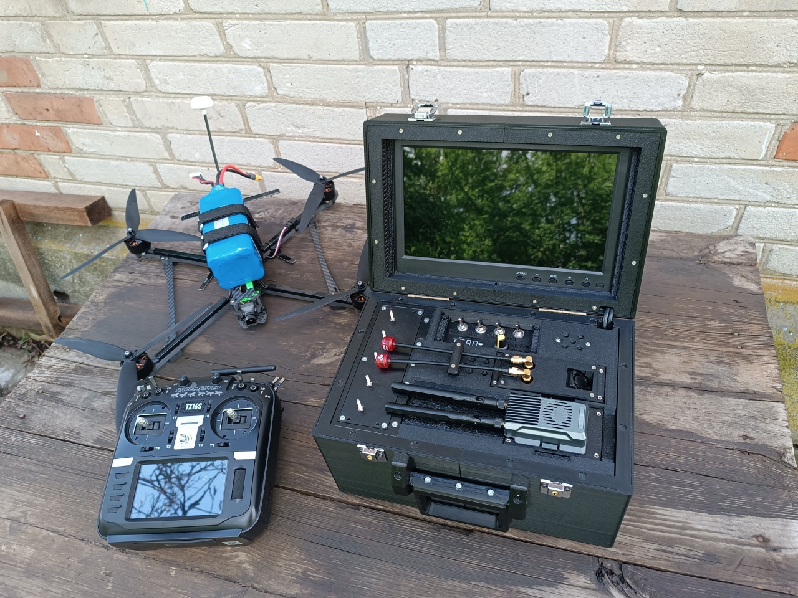 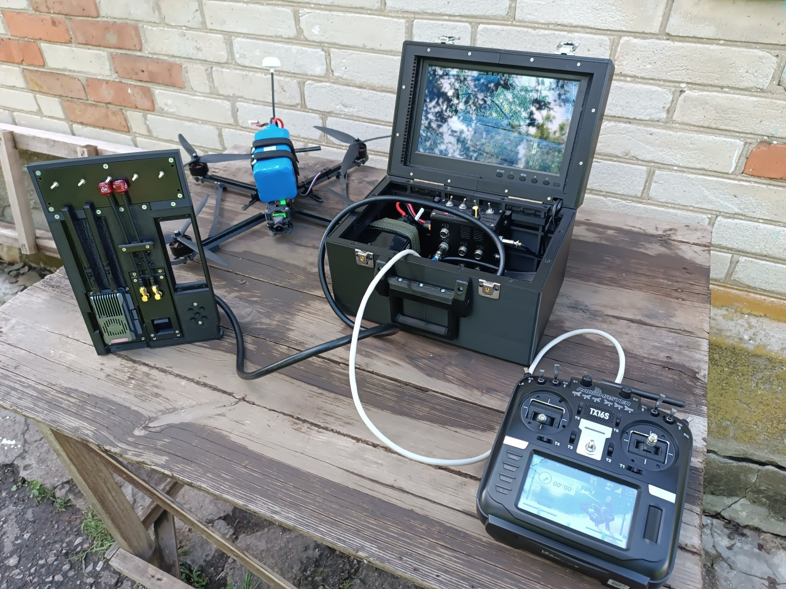 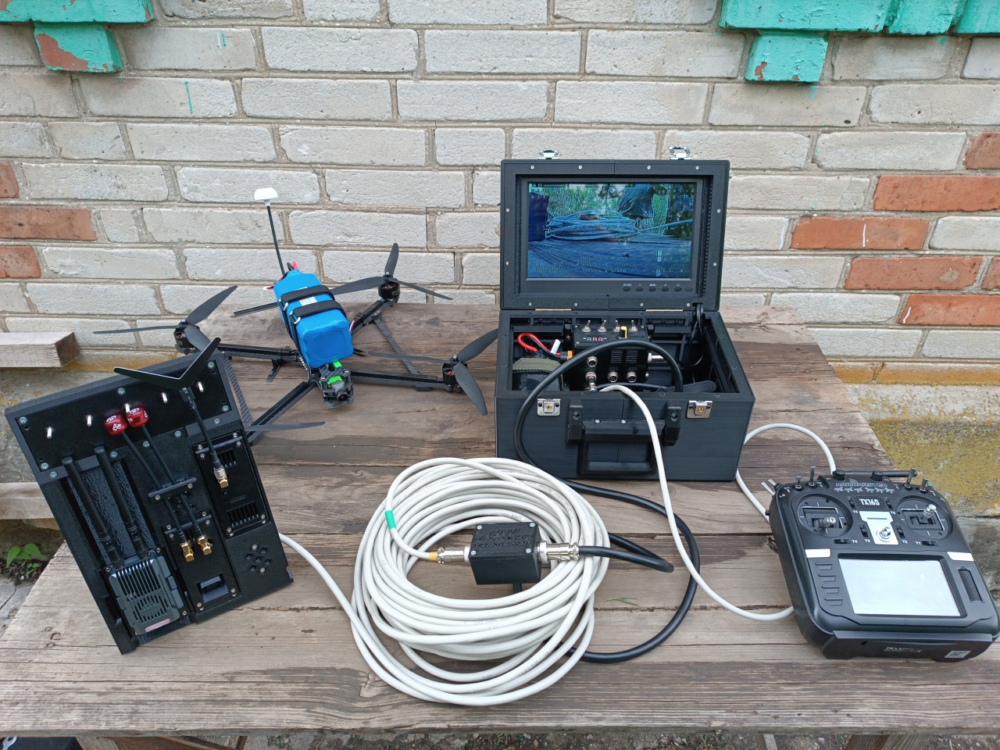

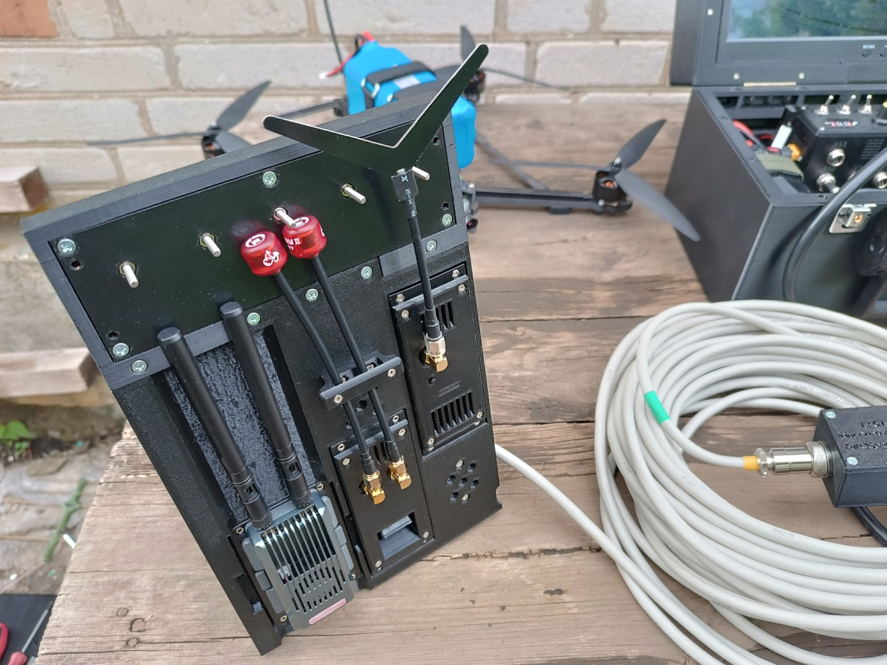 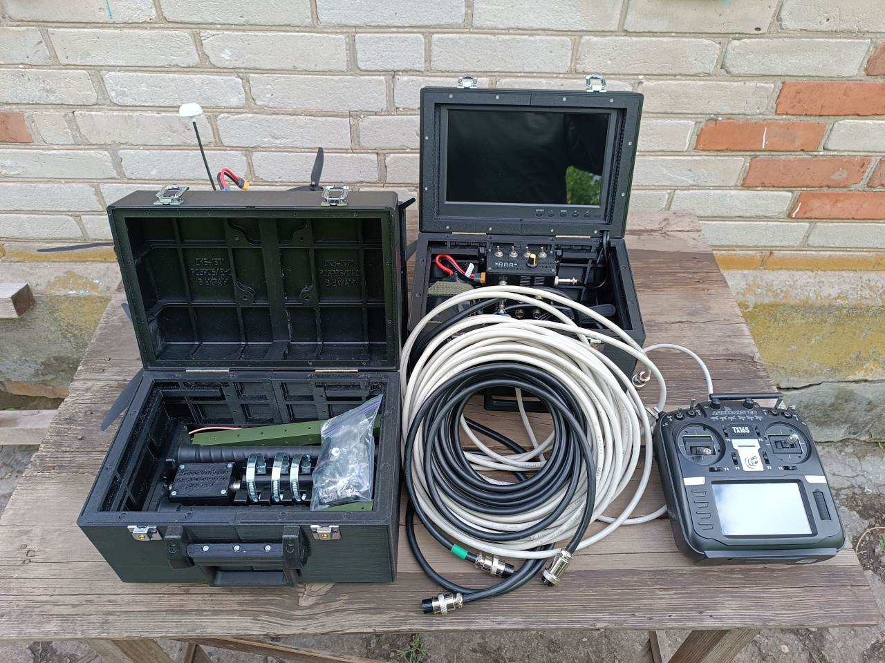 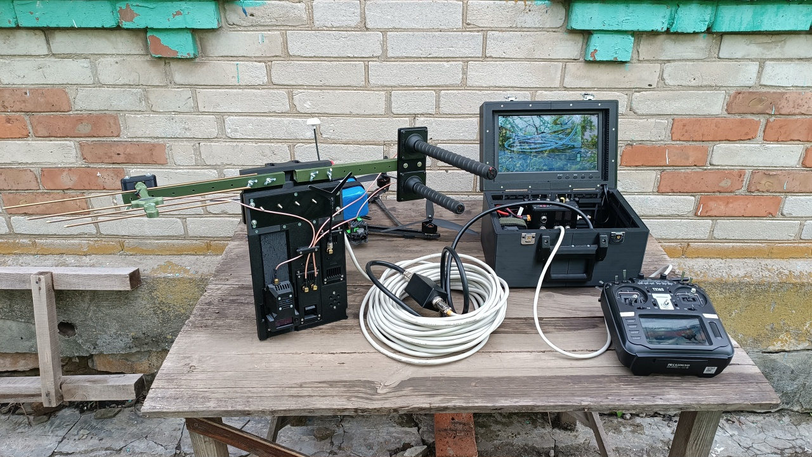

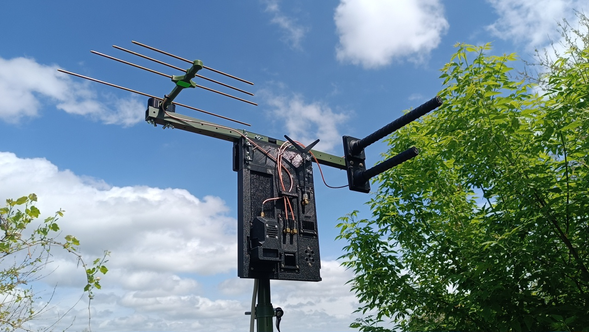 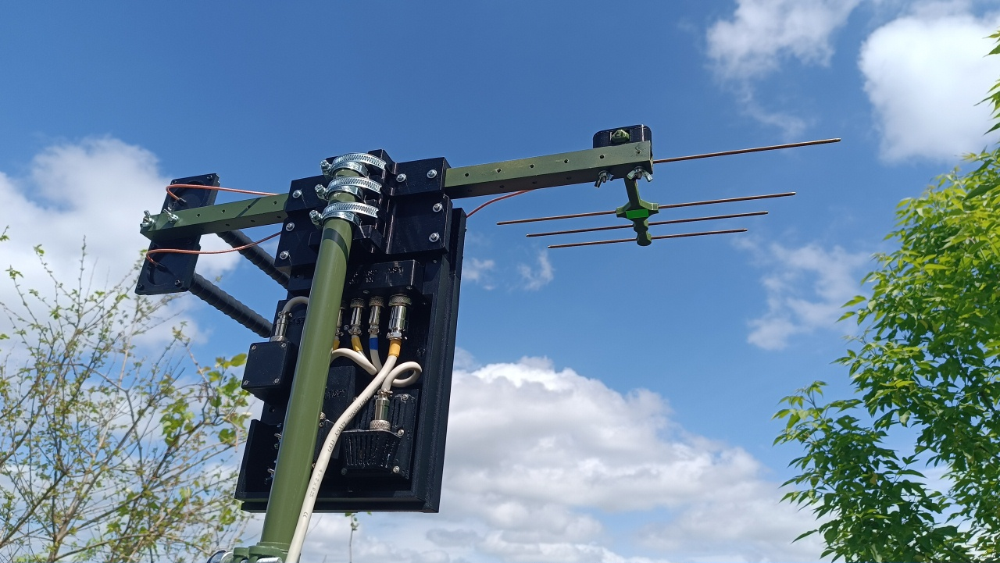 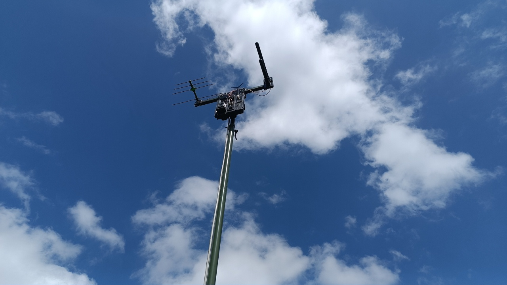

## Ліцензія

Використання матеріалів, розміщених у цьому репозиторії, регулюється Ліцензійною угодою, яка містить наступні ключові положення:

- Матеріали надаються виключно для технічного, навчального, дослідницького або іншого некомерційного використання.
- Виготовлення виробів на основі Матеріалів допускається виключно для некомерційного використання, зокрема для потреб оборони України.
- Будь-яке комерційне використання матеріалів, їх модифікацій або виробів, виготовлених на їх основі, заборонене без окремої письмової згоди ДКБ-1571.
- Повторне розповсюдження матеріалів не допускається. Дозволяється лише поширення посилань на офіційні ресурси ДКБ-1571.
- Матеріали надаються за принципом «як є» (as is). Користувач використовує їх на власний ризик.
- Виняткові майнові права інтелектуальної власності на Матеріали належать ДКБ-1571.

Будь ласка, ознайомтеся з повною версією ліцензійної угоди у файлі `LICENSE.md` цього репозиторію.

---

Проект створено на основі практичного бойового досвіду експлуатації FPV-систем.

Інженер «Тролейбус»  
Донецька область, Україна  
2026 рік
