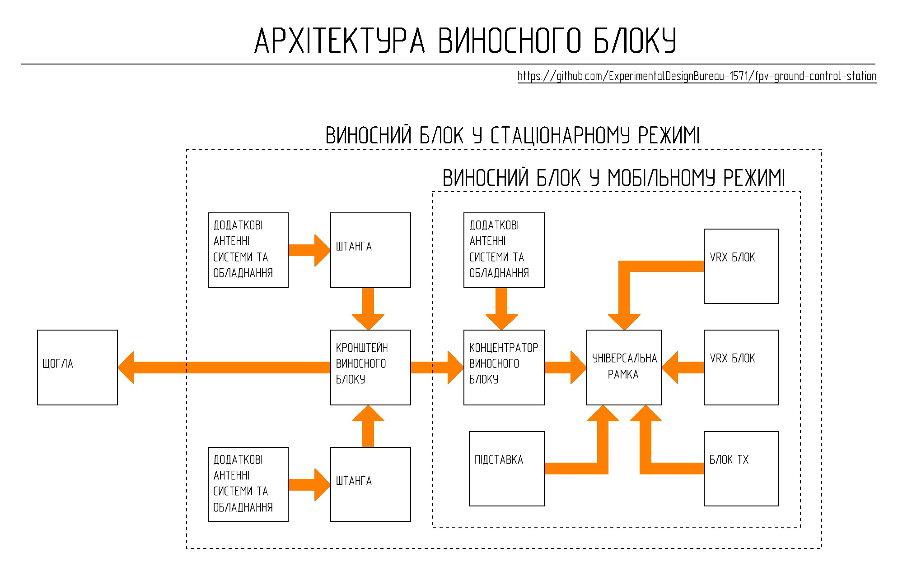

# Remote unit

Remote unit คือ functional component ของ ground control station ที่ออกแบบมาเพื่อผสานรวม video reception systems, control signal transmission และ antenna-feeder equipment เข้าด้วยกัน Remote unit เป็น modular platform ที่ช่วยให้สามารถปรับเปลี่ยน configuration ได้ตามภารกิจ, ประเภทของ video system หรือสภาพการใช้งาน

การออกแบบของ Remote unit ช่วยรองรับ:
- mechanical and electrical integration ของ remote unit peripherals
- การใช้ TX และ VRX units ที่สามารถสับเปลี่ยนกันได้
- การปรับเปลี่ยน configuration ของ peripheral devices โดยไม่ต้องเปลี่ยนโครงสร้างของ station subsystems อื่นๆ
- การติดตั้ง high-frequency modules ไว้ภายนอก station control unit
- การผสานรวม antenna systems เพิ่มเติม
- การทำงานใน mobile และ stationary modes
- การติดตั้งบน mast หรือ supporting structures อื่นๆ
- การปรับเปลี่ยนสถานะของสถานีอย่างรวดเร็วระหว่างตำแหน่ง transport และ operational

## Operating Modes

### Mobile Mode

Remote unit สามารถใช้งานได้โดยไม่ต้องติดตั้งบน mast เมื่อใช้งานในสภาวะที่มีความคล่องตัวสูง (high-mobility) หรือเมื่ออยู่ในระยะสายตาโดยตรง (direct line of sight)

### Stationary Mode

เพื่อปรับปรุงสภาวะการรับและส่งสัญญาณ Remote unit สามารถติดตั้งบน mast ได้โดยใช้ bracket ร่วมกับ antenna systems เพิ่มเติม

### Note

แนะนำให้ผลิต Remote unit ตามลำดับขั้นตอนดังต่อไปนี้:

1.	**[Remote unit hub](Remote_unit_hub/)**
2.	**[Universal frame](Universal_frame/)**
3.	**[Remote unit bracket](Remote_unit_bracket/)**
