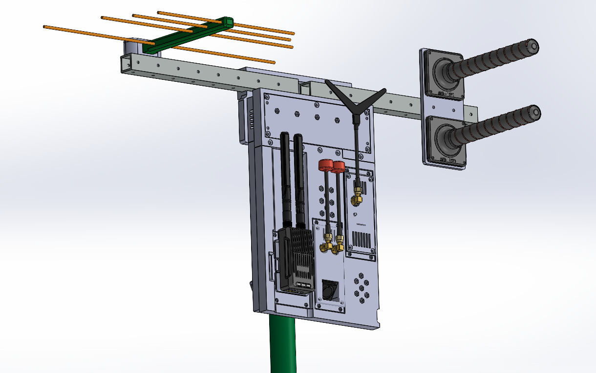

# Remote unit bracket

Bracket นี้ได้รับการออกแบบมาสำหรับการติดตั้ง remote unit ของ ground control station บน mast หรือ supporting structures อื่นๆ Bracket ถือเป็นส่วนหนึ่งของ mechanical integration system ของ remote unit การออกแบบนี้มุ่งเน้นไปที่ field operation และการขนย้าย (transportation) ภาพรวมทั่วไปของ remote unit ที่ติดตั้ง antenna เพิ่มเติมบน mast ผ่าน bracket แสดงอยู่ในรูปภาพ

การออกแบบของ bracket ช่วยรองรับ:
- การติดตั้งหรือใช้งานอย่างรวดเร็ว (quick deployment)
- การยึด remote unit ให้แน่นหนา
- การติดตั้ง rods สำหรับติดตั้ง antenna systems หรืออุปกรณ์อื่นๆ เพิ่มเติม
- การเพิ่มความสูงในการติดตั้ง antenna
- การขยาย antenna configuration ให้เหมาะสมกับสภาพการใช้งาน

## Brief Technical Specifications

| Parameter | Value | Note |
|---|---|---|
| Mounting type | Mast mount | Metal hose clamps |
| Structure type | Modular | |
| Additional antenna and equipment rods | Replaceable | |

## Bill of Materials for One Bracket

| Part Name | Qty | Note |
| :--- | :--- | :---: |
| Screw | M3x35 DIN 7985 | 2 pcs |  |
| Screw | M3x40 DIN 7985 | 4 pcs |  |
| Screw | M3x50 DIN 7985 | 6 pcs |  |
| Washer M3 DIN 9021 | 24 pcs |  |
| Wing nut M3 DIN 315 | 12 pcs |  |
| Hose clamp 28-48 mm DIN3017-1 | 3 pcs |  |
| Aluminum square tube 20x20x2 mm | 500 mm |  |
| Part 1 - 3D printing | 1 pc |  |
| Part 2 - 3D printing | 1 pc |  |
| Part 3 - 3D printing | 1 pc |  |
| Part 4 - 3D printing | 1 pc |  |

## 3D Printing Settings and Material Used

| Parameter | Value |
| :---: | :---: |
| Perimeter count | 4 |
| Top/Bottom solid layers | 5 |
| Infill density | 40% |
| Infill pattern | Gyroid |
| Support | Tree |

Material: coPET black MonoFilament

## Detailed Fastener Requirements

| Part Name | Type/Size | Qty | Note |
| :--- | :--- | :---: | :---: |
| Screw | M3x40 DIN 7985 | 4 pcs | ยึด rods เข้ากับ bracket |
| Washer | M3 DIN 9021 | 8 pcs | ยึด rods เข้ากับ bracket |
| Wing nut | M3 DIN 315 | 4 pcs | ยึด rods เข้ากับ bracket |
| Screw | M3x50 DIN 7985 | 2 pcs | ยึด control antenna bracket |
| Washer | M3 DIN 9021 | 4 pcs | ยึด control antenna bracket |
| Wing nut | M3 DIN 315 | 2 pcs | ยึด control antenna bracket |
| Screw | M3x35 DIN 7985 | 2 pcs | ยึด helical antenna bracket |
| Washer | M3 DIN 9021 | 4 pcs | ยึด helical antenna bracket |
| Wing nut | M3 DIN 315 | 2 pcs | ยึด helical antenna bracket |
| Screw | M3x50 DIN 7985 | 4 pcs | ยึด bracket เข้ากับ hub |
| Washer | M3 DIN 9021 | 8 pcs | ยึด bracket เข้ากับ hub |
| Wing nut | M3 DIN 315 | 4 pcs | ยึด bracket เข้ากับ hub |
| Hose clamp | Hose clamp 28-48 mm DIN3017-1 | 3 pcs | ยึด bracket เข้ากับ mast |
