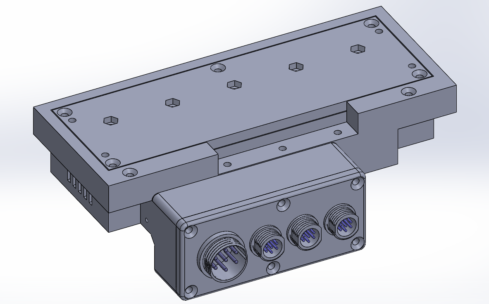
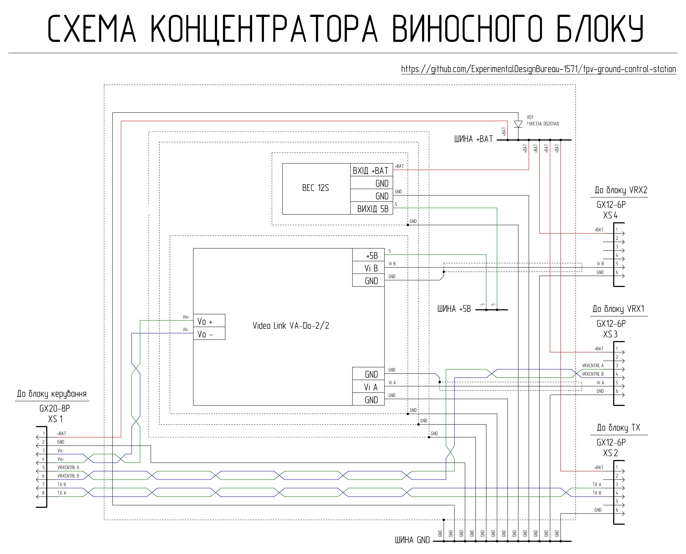

# Remote unit hub

Remote unit hub ทำหน้าที่ในส่วนของ power distribution, signal concentration และการ switching อุปกรณ์ peripheral devices ของ remote unit

## Brief Technical Specifications of the Remote Unit Hub

| Parameter | Value | Note |
| :--- | :--- | :---: |
| Input voltage | 6S Li-ion/LiPo battery (Min. 22.2 V, Max. 25.2 V) | จ่ายไฟผ่าน connector XS1 จาก station control unit |
| Power bus | +BAT | ต่อตรงจากแบตเตอรี่ของ station control unit |
| Auxiliary bus | +5 V | แปลงแรงดันโดย DC-DC converter |
| Number of video inputs | 2 | XS3, XS4 |
| Input video signal type | Analog composite (CVBS) | สัญญาณ Analog composite |
| Output video signal type | Analog differential | แปลงและขยายสัญญาณโดย module VA-Do-2/2 จากนั้นส่งสัญญาณผ่าน twisted pair |
| Video input selection | Remote | ควบคุมการ switching จากฝั่ง station control unit |
| VRX control | Supported | ผ่าน ELRS Backpack (video inputs XS3 หรือ XS4) หรือผ่านการเชื่อมต่อแบบสาย (XS3 เท่านั้น) |
| TX interface | Digital (differential) | การส่งข้อมูลของ XS2 ผ่าน twisted pair |
| Power protection | TVS diode | ป้องกันไฟกระชากแบบเหนี่ยวนำ (inductive surges) และแรงดันเกิน (overvoltage) |
| Cooling | Passive | Copper heatsinks + ช่องระบายอากาศ |
| Shielding | Yes | Copper shields |

### Interfaces

| Connector | Application | Main Signals | Note |
| :--- | :--- | :---: | :---: |
| XS1 (GX20-8) | การเชื่อมต่อไปยัง control unit | +BAT, GND, differential lines | การส่งกำลังไฟและการแลกเปลี่ยนสัญญาณ |
| XS2 (GX12-6) | การเชื่อมต่อ TX unit | +BAT, GND, differential line | |
| XS3 (GX12-6) | ช่องสัญญาณ Video input 1, การเชื่อมต่อ VRX1 | +BAT, GND, CVBS, differential line | ช่องสัญญาณ Video input ช่องแรก, รองรับการควบคุมผ่าน twisted pair |
| XS4 (GX12-6) | ช่องสัญญาณ Video input 2, การเชื่อมต่อ VRX2 | +BAT, GND, CVBS | ช่องสัญญาณ Video input สำรอง |

## Schematic Design and Functionality of the Remote Unit Hub

Remote unit hub รับไฟเลี้ยงผ่าน connector XS1 ซึ่งได้รับแรงดันไฟฟ้าจาก station control unit ที่จ่ายไฟด้วย battery pack แบบ 6S3P Li-ion/LiPo จาก connector XS1 ไฟจะถูกจ่ายไปยัง GND bus และ +BAT bus จากนั้นจะแยกไปยัง connectors XS2, XS3 และ XS4 เพื่อจ่ายไฟให้กับ peripheral devices และ voltage converter ซึ่งทำหน้าที่แปลงแรงดันและจ่ายไปยัง +5V bus เพื่อจ่ายไฟให้กับ video amplifier ทั้งนี้ เพื่อป้องกัน peripheral devices ของ remote unit จาก transient processes ในสายเชื่อมต่อที่เชื่อมไปยัง station control unit (ซึ่งเกิดจากส่วนประกอบที่เป็น inductive) จึงมีการใช้ semiconductor transient voltage suppressor (TVS) รุ่น 1.5KE33A

TX unit จะเชื่อมต่อเข้ากับ connector XS2 และทำการแลกเปลี่ยนข้อมูลระหว่างตัวมันกับ station control unit ผ่าน twisted pair

VRX units หรือแหล่งสัญญาณภาพอื่นๆ จะเชื่อมต่อเข้ากับ connectors XS3 และ XS4 สัญญาณ composite video จาก connectors XS3 และ XS4 จะส่งไปยัง video amplifier ซึ่งจะทำหน้าที่แปลงสัญญาณ composite ให้เป็น differential แล้วส่งผ่าน twisted pair ไปยัง station control unit โดยเมื่อผ่านกระบวนการแปลงสัญญาณกลับ (reverse conversion) ที่ฝั่งสถานีแล้ว สัญญาณภาพจะถูกส่งแยกไปยัง peripheral video devices ต่างๆ ของ station control unit ทั้งนี้ การเลือกช่องสัญญาณ video input ที่ใช้งานอยู่ (XS3 หรือ XS4) จะทำจากฝั่งของ station control unit และสำหรับช่องสัญญาณ video input XS3 จะมี option ในการแลกเปลี่ยนข้อมูลเพิ่มเติมกับ station control unit ผ่าน twisted pair เพื่อรองรับการควบคุมตัวรับสัญญาณวิดีโอจากระยะไกล (remote control)

การควบคุมอุณหภูมิ (temperature stability) ของ video amplifier และ voltage converter ได้รับการดูแลผ่าน copper cooling heatsinks และช่องระบายอากาศบน housing ของ remote unit hub โดย copper heatsinks จะถูกเชื่อมต่อเข้ากับ common ground (GND) bus และเมื่อทำงานร่วมกับ side shield ของ hub board และ shield บน hub cover (ซึ่งเชื่อมต่อเข้ากับ GND bus เช่นกัน) จะช่วยลดสัญญาณรบกวน (parasitic noise/interference) ใน video amplifier ให้เหลือน้อยที่สุด

Remote unit hub มีความหนาแน่นของชิ้นส่วนประกอบค่อนข้างสูงและมีการทำงานกับระดับแรงดันไฟหลายระดับ การประกอบอุปกรณ์ให้ประสบความสำเร็จจำเป็นต้องใช้ทักษะในการอ่าน schematic และประสบการณ์ระดับกลางในการประกอบอุปกรณ์อิเล็กทรอนิกส์ (electronics assembly)

## Bill of Materials for One Remote Unit Hub

| Part Name | Qty | Note |
| :--- | :--- | :---: |
| VideoLink VA-Do-2/2 Video Amplifier | 1 pc | module ผลิตในประเทศยูเครน [ซื้อ VideoLink VA-Do-2/2 จากผู้ผลิต](https://sezam.video/shop/videopidsilyuvach-z-simetrichnim-vihodom-aktivniy-balun-videolink-va-do-22/) |
| GUTI ELECTRONICS mBEC12S Voltage Converter | 1 pc | ชิ้นส่วนเทียบเท่าของยูเครนสำหรับ Matek BEC 12S [ซื้อ GUTI ELECTRONICS mBEC12S จากผู้ผลิต](https://prom.ua/ua/p2814749850-otechestvennyj-analog-matek.html) |
| Panel mount plug GX20-8 pin (male) | 1 pc | XS1 |
| Panel mount plug GX12-6 pin (male) | 3 pcs | XS2-XS4 |
| Single-sided copper clad laminate 1.5 mm | 34 mm x 16 mm | Power bus board |
| TVS Diode 1.5KE33A DO201AD | 1 pc | |
| Self-adhesive copper tape (width 50 mm; thickness 0.05 mm) | 156 mm | Shield สำหรับ remote unit hub cover |
| Self-adhesive copper tape (width 8 mm; thickness 0.05 mm) | 286 mm | Side shield ของ hub board |
| Sheet copper 0.8 mm thick | 100 mm x 38 mm | Large heatsink สำหรับ hub board |
| Sheet copper 0.8 mm thick | 30 mm x 19 mm | Voltage converter heatsink |
| Sheet copper 0.8 mm thick | 48 mm x 26 mm | Video amplifier heatsink |
| Silicone thermal pad 1 mm 6W/m.k | 18 mm x 16 mm | การระบายความร้อนจาก voltage converter ไปยัง large heatsink ของ hub board |
| Silicone thermal pad 1.5 mm 6W/m.k | 18 mm x 16 mm | การระบายความร้อนจาก voltage converter ไปยัง heatsink ของตัวเอง |
| Silicone thermal pad 2 mm 6W/m.k | 30 mm x 27 mm - 2 pcs | การระบายความร้อนจาก video amplifier ไปยัง large heatsink ของ hub board |
| Silicone thermal pad 1.5 mm 6W/m.k | 27 mm x 27 mm | การระบายความร้อนจาก video amplifier ไปยัง heatsink ของตัวเอง |
| Copper wire 20 AWG silicone insulated, black | 810 mm | |
| Copper wire 20 AWG silicone insulated, red | 810 mm | |
| Copper wire 26 AWG silicone insulated, black | 120 mm | |
| Copper wire 26 AWG silicone insulated, red | 60 mm | |
| Copper wire 26 AWG silicone insulated, green | 410 mm | |
| Copper wire 26 AWG silicone insulated, blue | 290 mm | |
| Copper wire 28 AWG silicone insulated, black | 680 mm | |
| Coaxial cable RG-316 | 500 mm | |
| Screw M2x6 DIN 7985 | 4 pcs | |
| Screw M2x8 DIN 7985 | 11 pcs | |
| Washer M2 DIN 125 | 15 pcs | |
| Nut M2 DIN 934 | 15 pcs | |
| Screw M3x18 DIN 7985 A2 | 6 pcs | |
| Screw M3x20 DIN 7985 A2 | 5 pcs | |
| Screw M3x25 DIN 965 | 3 pcs | |
| Screw M3x30 DIN 965 | 5 pcs | |
| Screw M3x40 DIN 965 | 3 pcs | |
| Washer M3 DIN 125 | 12 pcs | |
| Washer M3 DIN 9021 | 5 pcs | |
| Nut M3 DIN 934 | 22 pcs | |
| Wing nut M3 DIN 315 | 5 pcs | |
| Part 1 - 3D printing | 1 pc | |
| Part 2 - 3D printing | 1 pc | |
| Part 3 - 3D printing | 1 pc | |
| Part 4 - 3D printing | 1 pc | |

## 3D Printing Settings and Material Used

| Parameter | Value |
| :---: | :---: |
| Perimeter count | 4 |
| Top/Bottom solid layers | 5 |
| Infill density | 40% |
| Infill pattern | Gyroid |
| Support | Tree |

Material: coPET black MonoFilament

## Detailed Fastener Requirements

| Part Name | Type/Size | Qty | Note |
| :--- | :--- | :---: | :---: |
| Screw | M3x25 DIN 965 | 3 pcs | ยึด hub connector block cover |
| Screw | M3x40 DIN 965 | 3 pcs | ยึด hub connector block cover |
| Nut | M3 DIN 934 | 6 pcs | ยึด hub connector block cover |
| Screw | M2x8 DIN 7985 | 3 pcs | ยึด large heatsink เข้ากับ hub board |
| Washer | M2 DIN 125 | 3 pcs | ยึด large heatsink เข้ากับ hub board |
| Nut | M2 DIN 934 | 3 pcs | ยึด large heatsink เข้ากับ hub board |
| Screw | M2x8 DIN 7985 | 4 pcs | ยึด VA-Do-2/2 module heatsink เข้ากับ hub board |
| Washer | M2 DIN 125 | 4 pcs | ยึด VA-Do-2/2 module heatsink เข้ากับ hub board |
| Nut | M2 DIN 934 | 4 pcs | ยึด VA-Do-2/2 module heatsink เข้ากับ hub board |
| Screw | M2x8 DIN 7985 | 4 pcs | ยึด mBEC 12S voltage converter heatsink เข้ากับ hub board |
| Washer | M2 DIN 125 | 4 pcs | ยึด mBEC 12S voltage converter heatsink เข้ากับ hub board |
| Nut | M2 DIN 934 | 4 pcs | ยึด mBEC 12S voltage converter heatsink เข้ากับ hub board |
| Screw | M2x6 DIN 7985 | 4 pcs | ยึด power bus board เข้ากับ hub board |
| Washer | M2 DIN 125 | 4 pcs | ยึด power bus board เข้ากับ hub board |
| Nut | M2 DIN 934 | 4 pcs | ยึด power bus board เข้ากับ hub board |
| Screw | M3x18 DIN 7985 A2 | 6 pcs | ยึด hub board เข้ากับ base |
| Washer | M3 DIN 125 | 12 pcs | ยึด hub board เข้ากับ base (washers 2 ตัวต่อ screw 1 ตัว) |
| Nut | M3 DIN 934 | 6 pcs | ยึด hub board เข้ากับ base |
| Screw | M3x30 DIN 965 | 5 pcs | ยึด hub cover |
| Nut | M3 DIN 934 | 5 pcs | ยึด hub cover |
| Screw | M3x20 DIN 7985 A2 | 5 pcs | การยึดเพิ่มเติมใน hub cover |
| Washer | M3 DIN 9021 | 5 pcs | การยึดเพิ่มเติมใน hub cover |
| Nut | M3 DIN 934 | 5 pcs | การยึดเพิ่มเติมใน hub cover |
| Wing nut | M3 DIN 315 | 5 pcs | การยึดเพิ่มเติมใน hub cover |

## Detailed Wire Consumption

XS1
| Type | Length | Note |
| :--- | :--- | :---: |
| 20 AWG black | 170 mm | XS1 - GND bus ของ hub board |
| 20 AWG red | 170 mm | XS1 - +BAT bus ของ hub board |
| 26 AWG green | 150 mm | XS1 - VA-Do-2/2 |
| 26 AWG blue | 150 mm | XS1 - VA-Do-2/2 |
| 26 AWG green | 60 mm | XS1 - XS2 |
| 26 AWG blue | 60 mm | XS1 - XS2 |
| 26 AWG green | 80 mm | XS1 - XS3 |
| 26 AWG blue | 80 mm | XS1 - XS3 |

XS2
| Type | Length | Note |
| :--- | :--- | :---: |
| 20 AWG black | 190 mm | XS2 - GND bus ของ hub board |
| 20 AWG red | 190 mm | XS2 - +BAT bus ของ hub board |

XS3
| Type | Length | Note |
| :--- | :--- | :---: |
| 20 AWG black | 220 mm | XS3 - GND bus ของ hub board |
| 20 AWG red | 220 mm | XS3 - +BAT bus ของ hub board |
| RG-316 | 250 mm | XS3 - VA-Do-2/2 |

XS4
| Type | Length | Note |
| :--- | :--- | :---: |
| 20 AWG black | 230 mm | XS4 - GND bus ของ hub board |
| 20 AWG red | 230 mm | XS4 - +BAT bus ของ hub board |
| RG-316 | 250 mm | XS3 - VA-Do-2/2 |

mBEC 12S Voltage Converter
| Type | Length | Note |
| :--- | :--- | :---: |
| 26 AWG black | 60 mm | mBEC 12S - GND bus ของ hub board |
| 26 AWG red | 60 mm | mBEC 12S - +BAT bus ของ hub board |
| 26 AWG green | 60 mm | mBEC 12S - +5V bus ของ hub board |

VA-Do-2/2 Module
| Type | Length | Note |
| :--- | :--- | :---: |
| 26 AWG black | 60 mm | VA-Do-2/2 - GND bus ของ hub board |
| 26 AWG green | 60 mm | VA-Do-2/2 - +5V bus ของ hub board |
| 28 AWG black | 50 mm | VA-Do-2/2 - RG-316 cable shield จาก XS3 |
| 28 AWG black | 50 mm | VA-Do-2/2 - RG-316 cable shield จาก XS4 |

Heatsinks and Shields
| Type | Length | Note |
| :--- | :--- | :---: |
| 28 AWG black | 170 mm | Large heatsink ของ hub board - GND bus ของ hub board |
| 28 AWG black | 60 mm | VA-Do-2/2 module heatsink - GND bus ของ hub board |
| 28 AWG black | 60 mm | mBEC 12S voltage converter heatsink - GND bus ของ hub board |
| 28 AWG black | 120 mm | Side shield ของ hub board - GND bus ของ hub board |
| 28 AWG black | 170 mm | Front shield บน hub cover - GND bus ของ hub board |
