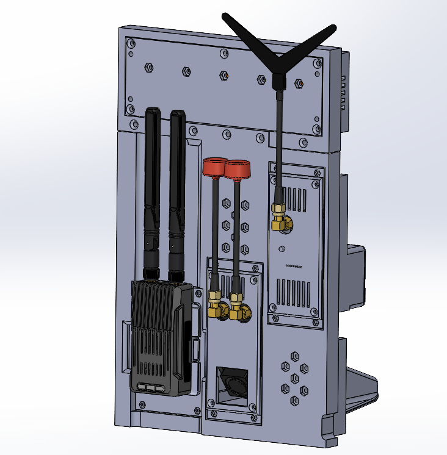
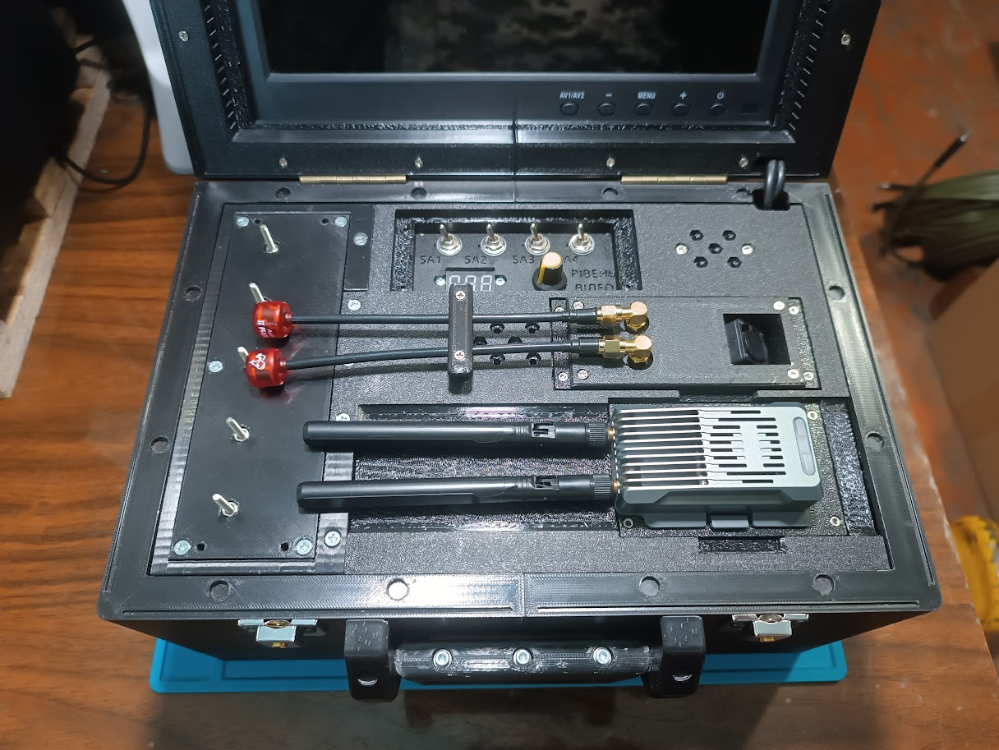

# Universal frame

The universal frame is designed for mounting and mechanical integration of the remote unit hub and peripheral devices. The remote unit hub, together with the peripheral devices installed on the universal frame, forms the remote unit of the ground control station.

The frame design ensures:
- installation of the remote unit hub
- installation of the TX unit and VRX units
- unified mounting of the system components
- quick transition of the remote unit between transport and operational positions

## Design Features

- The design has a modular architecture
- Provision is made for mounting interchangeable TX and VRX units
- All modules are secured with screw connections
- The design provides resistance to mechanical loads and vibrations

## Transport Position

The transport position of the remote unit in the ground control station case includes:
- dismantled stand
- no VRX unit in the auxiliary slot
- fixed position of peripheral devices

## Bill of Materials for One Universal Frame

| Part Name | Qty | Note |
| :--- | :--- | :---: |
| Screw M2x10 DIN 7985 | 12 pcs | Mounting peripheral devices |
| Nut M2 DIN 934 | 12 pcs | Mounting peripheral devices |
| Screw M3x14 DIN 7985 A2 | 2 pcs | Mounting remote unit handle |
| Screw M3x20 DIN 7985 A2 | 2 pcs | Mounting the stand |
| Screw M3x30 DIN 965 | 5 pcs | Mounting universal frame to the hub |
| Nut M3 DIN 934 | 9 pcs | Mounting universal frame to the hub, mounting the stand, mounting remote unit handle |
| Wing nut M3 DIN 315 | 2 pcs | Mounting the stand |
| Self-tapping screw 2x8 DIN 7982 | 2 pcs | Mounting antenna retainer |
| Part 1 - 3D printing | 1 pc |  |
| Part 2 - 3D printing | 1 pc |  |
| Part 3 - 3D printing | 1 pc |  |
| Part 4 - 3D printing | 1 pc |  |

## 3D Printing Settings and Material Used

| Parameter | Value |
| :---: | :---: |
| Perimeter count | 4 |
| Top/Bottom solid layers | 5 |
| Infill density | 40% |
| Infill pattern | Gyroid |
| Support | Tree |

Material: coPET black MonoFilament
