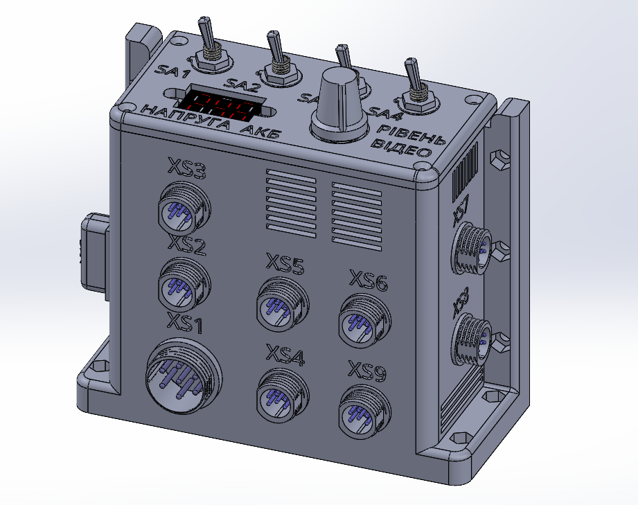
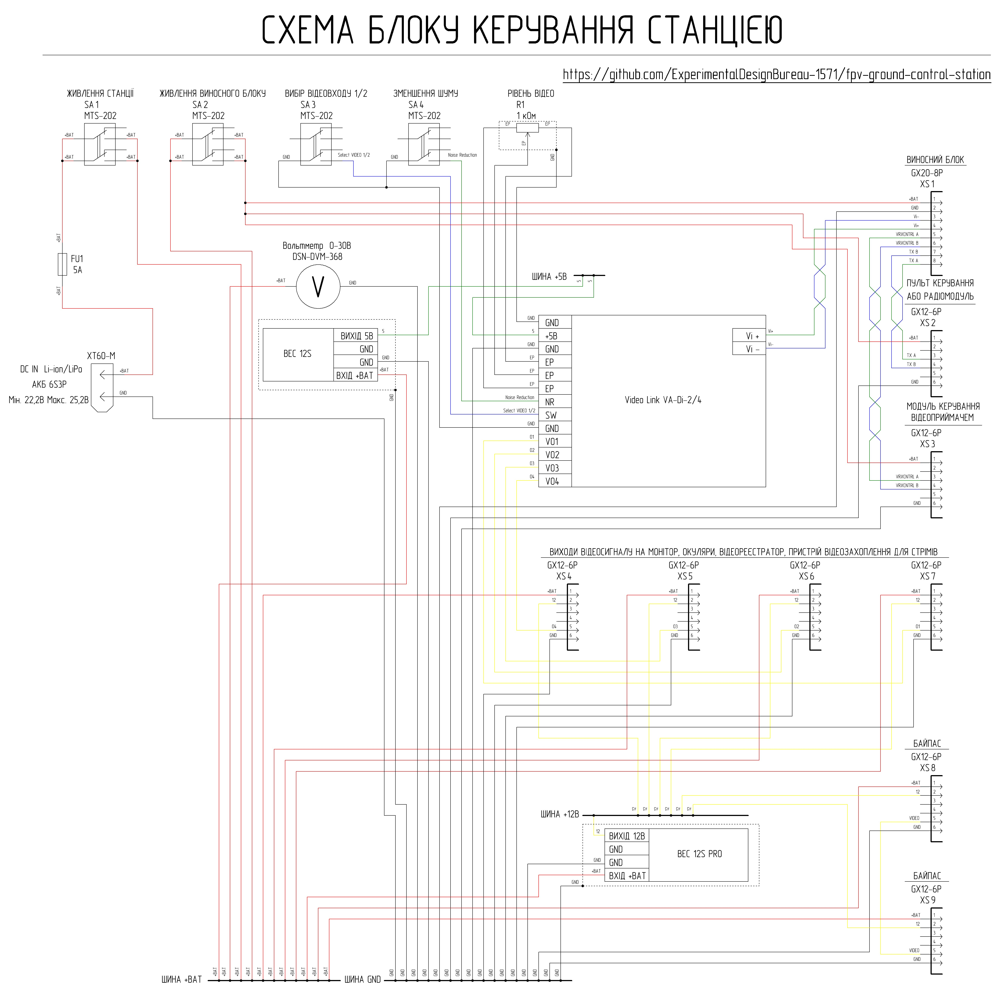
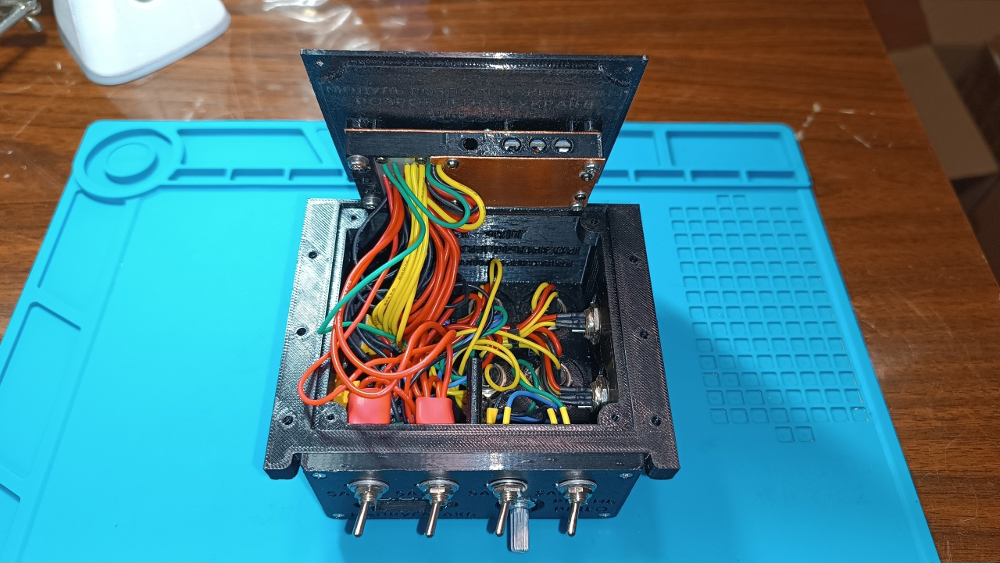
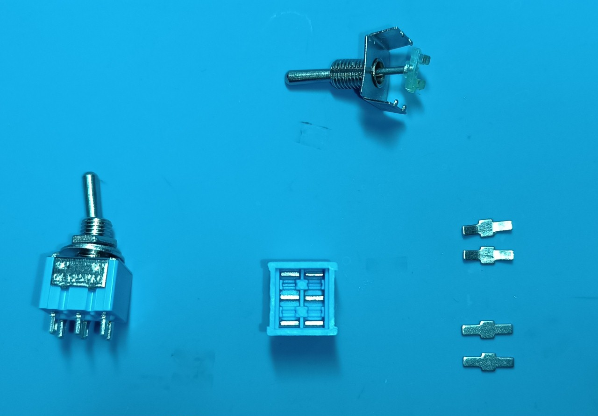

# Station control unit

The station control unit is used for power distribution and switching, signal concentration, and signal switching between the remote unit and peripheral devices. 

## Quick technical specifications of the station control unit

| Parameter | Value | Note |
|----------|---------|---------|
| Input voltage | 6S Li-ion/LiPo battery (Min 22.2V Max 25.2V) | Via XT60 |
| Power protection | 5A fuse | FU1 |
| Power switching | Toggle switches | SA1 (station main power), SA2 (remote unit power) |
| Power bus | +BAT | Direct from the battery |
| Auxiliary buses | +12V, +5V | Formed by DC-DC converters |
| Max current on the +12V bus | up to 3 A | Total load |
| Number of video inputs | 1 (with option to select active video input on the remote unit) | Toggle switch SA3 |
| Input video signal type | Analog differential | |
| Number of video outputs | 4 | XS4–XS7 |
| Output video signal type | Analog composite (CVBS) | |
| Video processing | Amplification / conversion / splitting / filtering | VA-Di-2/4 module |
| Video level adjustment | Yes | R1 potentiometer |
| Video noise filtering | Yes | Toggle switch SA4 |
| BYPASS mode | Yes | Connectors XS8–XS9 |
| TX interface | Yes | Via XS2 |
| VRX control | Supported | Via XS3 |
| Cooling | Passive | Copper heatsinks + ventilation holes |
| Shielding | Partial | Shielding of voltage converters with copper heatsinks |

### Interfaces

| Connector | Purpose | Main signals | Note |
|--------|------------|----------------|----------|
| XS1 (GX20-8) | Remote unit connection | +BAT, GND, differential lines | Main communication channel |
| XS2 (GX12-6) | Remote control (TX) | +BAT, GND, differential line | |
| XS3 (GX12-6) | VRX1 / remote unit peripheral control | +BAT, GND, differential line | Optional |
| XS4 (GX12-6) | Video output 1 | +BAT, +12V, GND, CVBS | Monitor, goggles, DVR video recorder, video capture card for streaming, etc. |
| XS5 (GX12-6) | Video output 2 | +BAT, +12V, GND, CVBS | Monitor, goggles, DVR video recorder, video capture card for streaming, etc. |
| XS6 (GX12-6) | Video output 3 | +BAT, +12V, GND, CVBS | Monitor, goggles, DVR video recorder, video capture card for streaming, etc. |
| XS7 (GX12-6) | Video output 4 (monitor) | +BAT, +12V, GND, CVBS | Monitor connection |
| XS8 (GX12-6) | BYPASS (output) | +BAT, +12V, GND, CVBS | Direct connection |
| XS9 (GX12-6) | BYPASS (input) | +BAT, +12V, GND, CVBS | Signal source |
| XT60 | Power input | +BAT, GND | Via fuse |

## Schematic design and functionality of the station control unit

Power is supplied to the control unit from a 6S3P Li-ion/LiPo battery via a 5A FU1 fuse and goes to the SA1 toggle switch. Turning on the SA1 toggle switch supplies power to the +BAT bus, which provides general power to the ground control station.

The remote unit is connected to the control unit via a cable through the XS1 connector. The remote control connects via a JR module with a CRSF -> RS-485 converter to the XS2 connector. The XS3 connector is used when remote control of the video receiver via a twisted pair is required (note that this option is only available for the 1st video input of the remote unit). If necessary, the twisted pair from the XS3 connector can be used to transmit control signals to other peripheral devices of the remote unit. Power is supplied to the XS1, XS2, and XS3 connectors from the +BAT bus via the SA2 toggle switch. 

Connection of peripheral video devices (monitor, goggles, DVR video recorder, video capture card for streaming, etc.) is done through connectors XS4, XS5, XS6, and XS7. The XS7 connector is reserved for the station's built-in monitor. The XS4, XS5, XS6, and XS7 connectors receive power from the +BAT and +12V buses. The video signal to the XS4, XS5, XS6, and XS7 connectors comes from the active video amplifier-splitter, which is powered by the +5V bus. It features selection of the active video input on the remote unit (SA3 toggle switch), a noise reduction function for strong interference (SA4 toggle switch), and video level adjustment via the R1 variable resistor (video level).

If it is necessary to feed the video signal directly to the monitor, the "BYPASS" option can be used (connectors XS8 and XS9). To do this, the monitor is connected to the XS8 connector, and the video signal source is connected to the XS9 connector. Power is supplied to the XS8 and XS9 connectors from the +BAT and +12V buses.

Power to the +12V and +5V buses comes from voltage converters. Heat dissipation from the converters is performed by two copper heatsinks through a silicone thermal interface. The copper heatsinks are connected to the common ground wire (GND) and, together with ceramic capacitors at the output of the voltage converters, minimize parasitic noise from the converters' operation. The total continuous load of the +12V bus through connectors XS4, XS5, XS6, XS7, XS8, and XS9 must not exceed 3A.

The station control unit has a high component density and requires working with various voltage levels. Successful assembly of the device requires schematic reading skills and experience in performing medium-complexity assembly work.

## List of necessary components for manufacturing one control unit

| Component Name | Quantity | Note |
| :--- | :--- | :---: |
| 100DP1T1B1M1QEH toggle switch or widely available MTS-202 6-pin ON-ON | 4 pcs | SA1-SA4 (note that widely available toggle switches must be modified for reliable switching!) |
| WH148 1 kOhm potentiometer | 1 pc | Video level regulator |
| WH148 potentiometer knob | 1 pc | |
| VideoLink VA-Di-2/4 video amplifier-splitter | 1 pc | Ukrainian manufactured module [purchase VideoLink VA-Di-2/4 from manufacturer](https://sezam.video/shop/videopidsilyuvach-videolink-va-di-24/) |
| GUTI ELECTRONICS BEC12S-PRO voltage converter | 1 pc | Ukrainian analogue of Matek BEC 12S PRO [purchase GUTI ELECTRONICS BEC12S-PRO from manufacturer](https://prom.ua/ua/p2814749849-otechestvennyj-analog-matek.html) |
| GUTI ELECTRONICS mBEC12S voltage converter | 1 pc | Ukrainian analogue of Matek BEC 12S [purchase GUTI ELECTRONICS mBEC12S from manufacturer](https://prom.ua/ua/p2814749850-otechestvennyj-analog-matek.html) |
| DSN-DVM-368 0-30V voltmeter | 1 pc | |
| GX20-8 pin panel mount plug (male) | 1 pc | XS1 |
| GX12-6 pin panel mount plug (male) | 8 pcs | XS2-XS9 |
| XT60E-M connector | 1 pc | |
| FH-501 (KLS5-701) fuse holder | 1 pc | |
| FT Standard 5A fuse | 1 pc | |
| Sheet copper 0.8 mm thick | 134 mm x 40 mm | Cooling heatsinks for the power distribution module |
| Silicone thermal pad 1.5 mm 6W/m.k | 84 mm x 24 mm | Heat dissipation from voltage converters to cooling heatsinks |
| Silicone thermal pad 1 mm 6W/m.k | 18 mm x 16 mm | Heat dissipation from voltage converters to cooling heatsinks |
| Single-sided copper-clad fiberglass (FR4) 1.5 mm | 35 mm x 17 mm | Power bus board in the power distribution module |
| Copper wire 26 AWG with silicone insulation, black | 760 mm | |
| Copper wire 26 AWG with silicone insulation, red | 250 mm | |
| Copper wire 26 AWG with silicone insulation, yellow | 490 mm | |
| Copper wire 26 AWG with silicone insulation, blue | 410 mm | |
| Copper wire 26 AWG with silicone insulation, green | 660 mm | |
| Copper wire 20 AWG with silicone insulation, black | 1540 mm | |
| Copper wire 20 AWG with silicone insulation, red | 2140 mm | |
| Copper wire 20 AWG with silicone insulation, yellow | 1060 mm | |
| M2x8 screw DIN 7985 | 14 pcs | |
| M2.5x8 screw DIN 965 | 2 pcs | |
| M2.5x12 screw DIN 7985 | 2 pcs | |
| M3x8 screw DIN 7985 A2 | 2 pcs | |
| M3x16 screw DIN 7985 A2 | 4 pcs | |
| M2 washer DIN 125 | 14 pcs | |
| M2.5 washer DIN 125 | 2 pcs | |
| M3 washer DIN 125 | 2 pcs | |
| M2 nut DIN 934 | 14 pcs | |
| M2.5 nut DIN 934 | 2 pcs | |
| M3 nut DIN 934 | 6 pcs | |
| 2x8 self-tapping screw DIN 7982 | 8 pcs | |
| Part 1 - 3D print | 1 pc | |
| Part 2 - 3D print | 1 pc | |
| Part 3 - 3D print | 1 pc | |
| Part 4 - 3D print | 1 pc | |

## 3D printing settings and material used

| Parameter | Value |
| :---: | :---: |
| Wall line count (perimeters) | 4 |
| Top and bottom solid layers | 5 |
| Infill density | 40% |
| Infill pattern | Gyroid |
| Supports | Tree-like |

Material: coPET black MonoFilament

## Modernization of MTS-202 toggle switches (6-pin, ON-ON)

Finding high-quality toggle switches for sale can be difficult, but widely available models can be easily adapted for reliable operation. Modernization improves switching reliability.

### Steps for performing the work:

1. **Disassembly:** Carefully disassemble the toggle switch by bending back the metal tabs of the housing.

2. **Contact preparation:** Remove the rocker arms (moving contacts) and bend them slightly to ensure reliable contact.

 

3. **Lubrication:** To reduce wear and improve smoothness of travel, apply a small amount of thick silicone grease to the plastic pusher of the toggle switch.
4. **Assembly:** Reassemble the toggle switch in reverse order, tightly securing the metal cover with the tabs.
5. **Testing:** Check the toggle switch operation using a multimeter

## Detailed list of hardware usage

| Component Name | Type/Size | Quantity | Note |
| :--- | :--- | :---: | :---: |
| Screw | M2x8 DIN 7985 | 4 pcs | Mounting the power bus PCB to Part 4 |
| Screw | M2x8 DIN 7985 | 10 pcs | Mounting the heatsinks to Part 4 |
| Screw | M2.5x8 DIN 965 | 2 pcs | Mounting the XT60 power connector to Part 1 |
| Screw | M2.5x12 DIN 7985 | 2 pcs | Mounting the voltmeter to Part 2 |
| Screw | M3x8 DIN 7985 A2 | 2 pcs | Mounting the fuse holder to Part 1 |
| Screw | M3x16 DIN 7985 A2 | 4 pcs | Mounting the power distribution module to Part 3 |
| Washer | M2 DIN 125 | 4 pcs | Mounting the power bus PCB to Part 4 |
| Washer | M2 DIN 125 | 10 pcs | Mounting the heatsinks to Part 4 |
| Washer | M2.5 DIN 125 | 2 pcs | Mounting the voltmeter to Part 2 |
| Washer | M3 DIN 125 | 2 pcs | Mounting the power distribution module to Part 3 |
| Nut | M2 DIN 934 | 4 pcs | Mounting the power bus PCB to Part 4 |
| Nut | M2 DIN 934 | 10 pcs | Mounting the heatsinks to Part 4 |
| Nut | M2.5 DIN 934 | 2 pcs | Mounting the voltmeter to Part 2 |
| Nut | M3 DIN 934 | 2 pcs | Mounting the fuse holder to Part 1 |
| Nut | M3 DIN 934 | 4 pcs | Mounting the power distribution module to Part 3 |
| Screw | 2x8 DIN 7982 | 4 pcs | Mounting Part 2 to Part 1 |
| Screw | 2x8 DIN 7982 | 4 pcs | Mounting Part 3 to Part 1 |

## Detailed list of wire usage

### XS1
| Type | Length | Note |
| :--- | :--- | :---: |
| 20 AWG black | 100 mm | XS1 - power distribution module GND bus |
| 20 AWG red | 160 mm | XS1 - SA2 |
| 26 AWG green | 110 mm | XS1 - VA-Di-2/4 |
| 26 AWG blue | 110 mm | XS1 - VA-Di-2/4 |

### XS2
| Type | Length | Note |
| :--- | :--- | :---: |
| 20 AWG black | 140 mm | XS2 - power distribution module GND bus |
| 20 AWG red | 110 mm | XS2 - SA2 |
| 26 AWG green | 100 mm | XS2 - XS1 |
| 26 AWG blue | 100 mm | XS2 - XS1 |

### XS3
| Type | Length | Note |
| :--- | :--- | :---: |
| 20 AWG black | 140 mm | XS3 - power distribution module GND bus |
| 20 AWG red | 110 mm | XS3 - SA2 |
| 26 AWG green | 100 mm | XS3 - XS1 |
| 26 AWG blue | 100 mm | XS3 - XS1 |

### XS4
| Type | Length | Note |
| :--- | :--- | :---: |
| 20 AWG black | 150 mm | XS4 - power distribution module GND bus |
| 20 AWG red | 150 mm | XS4 - power distribution module +BAT bus |
| 20 AWG yellow | 150 mm | XS4 - power distribution module +12V bus |
| 26 AWG yellow | 110 mm | XS4 - VA-Di-2/4 |

### XS5
| Type | Length | Note |
| :--- | :--- | :---: |
| 20 AWG black | 150 mm | XS5 - power distribution module GND bus |
| 20 AWG red | 150 mm | XS5 - power distribution module +BAT bus |
| 20 AWG yellow | 150 mm | XS5 - power distribution module +12V bus |
| 26 AWG yellow | 100 mm | XS5 - VA-Di-2/4 |

### XS6
| Type | Length | Note |
| :--- | :--- | :---: |
| 20 AWG black | 160 mm | XS6 - power distribution module GND bus |
| 20 AWG red | 160 mm | XS6 - power distribution module +BAT bus |
| 20 AWG yellow | 160 mm | XS6 - power distribution module +12V bus |
| 26 AWG yellow | 100 mm | XS6 - VA-Di-2/4 |

### XS7
| Type | Length | Note |
| :--- | :--- | :---: |
| 20 AWG black | 170 mm | XS7 - power distribution module GND bus |
| 20 AWG red | 170 mm | XS7 - power distribution module +BAT bus |
| 20 AWG yellow | 170 mm | XS7 - power distribution module +12V bus |
| 26 AWG yellow | 110 mm | XS7 - VA-Di-2/4 |

### XS8
| Type | Length | Note |
| :--- | :--- | :---: |
| 20 AWG black | 170 mm | XS8 - power distribution module GND bus |
| 20 AWG red | 170 mm | XS8 - power distribution module +BAT bus |
| 20 AWG yellow | 170 mm | XS8 - power distribution module +12V bus |
| 26 AWG yellow | 70 mm | XS8 - XS9 |

### XS9
| Type | Length | Note |
| :--- | :--- | :---: |
| 20 AWG black | 160 mm | XS9 - power distribution module GND bus |
| 20 AWG red | 160 mm | XS9 - power distribution module +BAT bus |
| 20 AWG yellow | 160 mm | XS9 - power distribution module +12V bus |

### XT60
| Type | Length | Note |
| :--- | :--- | :---: |
| 20 AWG black | 100 mm | XT60 - power distribution module GND bus |
| 20 AWG red | 50 mm | XT60 - Fuse holder |

### Fuse holder
| Type | Length | Note |
| :--- | :--- | :---: |
| 20 AWG red | 120 mm | Fuse holder - SA1 |

### Voltmeter
| Type | Length | Note |
| :--- | :--- | :---: |
| 26 AWG black | 170 mm | Voltmeter - power distribution module GND bus |
| 26 AWG red | 170 mm | Voltmeter - power distribution module +BAT bus |

### SA1
| Type | Length | Note |
| :--- | :--- | :---: |
| 20 AWG red | 170 mm | SA1 - power distribution module +BAT bus |
| 20 AWG red | 100 mm | SA1 - SA1 jumpers |

### SA2
| Type | Length | Note |
| :--- | :--- | :---: |
| 20 AWG red | 170 mm | SA2 - power distribution module +BAT bus |
| 20 AWG red | 100 mm | SA2 - SA2 jumpers |

### SA3
| Type | Length | Note |
| :--- | :--- | :---: |
| 26 AWG black | 100 mm | SA3 - VA-Di-2/4 |
| 26 AWG black | 30 mm | SA3 - SA4 |
| 26 AWG blue | 100 mm | SA3 - VA-Di-2/4 |

### SA4
| Type | Length | Note |
| :--- | :--- | :---: |
| 26 AWG green | 100 mm | SA4 - VA-Di-2/4 |

### R1
| Type | Length | Note |
| :--- | :--- | :---: |
| 26 AWG black | 30 mm | R1 - VA-Di-2/4 |

### VA-Di-2/4
| Type | Length | Note |
| :--- | :--- | :---: |
| 26 AWG black | 170 mm | VA-Di-2/4 - power distribution module GND bus |
| 26 AWG green | 170 mm | VA-Di-2/4 - power distribution module +5V bus |

### Power distribution module
| Type | Length | Note |
| :--- | :--- | :---: |
| 26 AWG black | 80 mm | Large heatsink - power distribution module GND bus |
| 26 AWG black | 80 mm | Small heatsink - power distribution module GND bus |
| 26 AWG black | 80 mm | 12S voltage converter - power distribution module GND bus |
| 26 AWG red | 80 mm | 12S voltage converter - power distribution module +BAT bus |
| 26 AWG green | 80 mm | 12S voltage converter - power distribution module +5V bus |
| 20 AWG black | 100 mm | 12S PRO voltage converter - power distribution module GND bus |
| 20 AWG red | 100 mm | 12S PRO voltage converter - power distribution module +BAT bus |
| 20 AWG yellow | 100 mm | 12S PRO voltage converter - power distribution module +12V bus |
