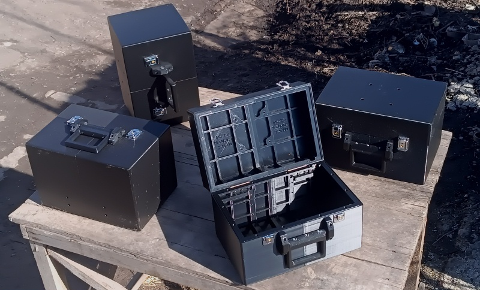
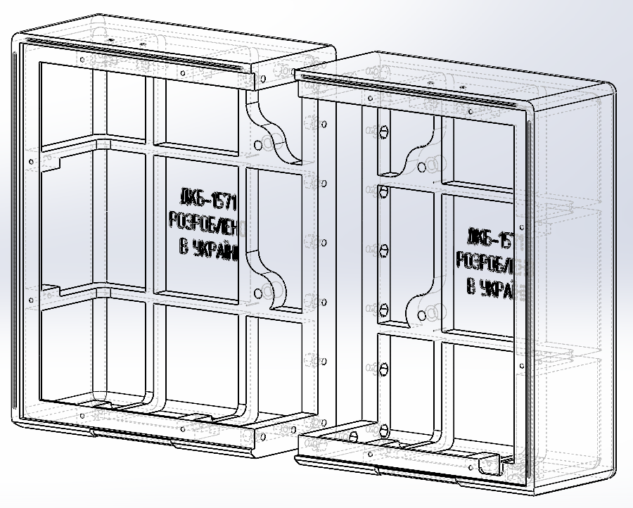
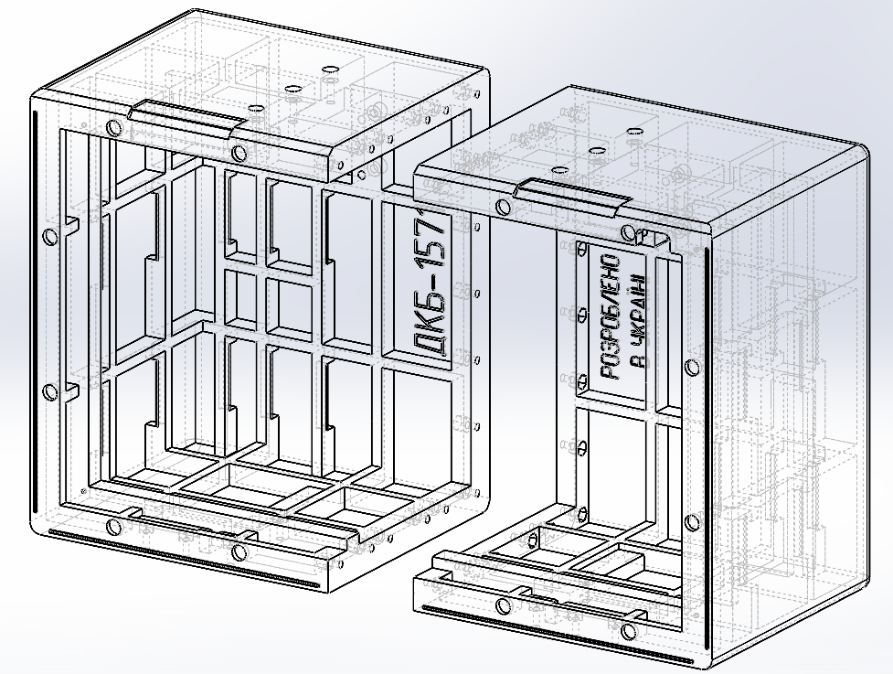
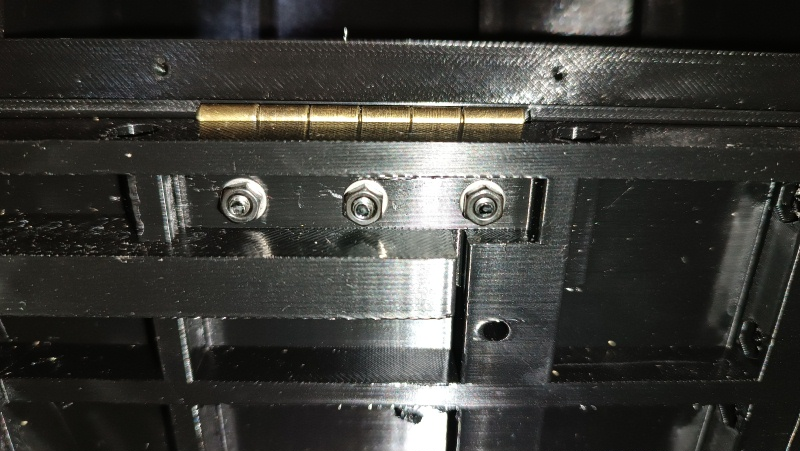
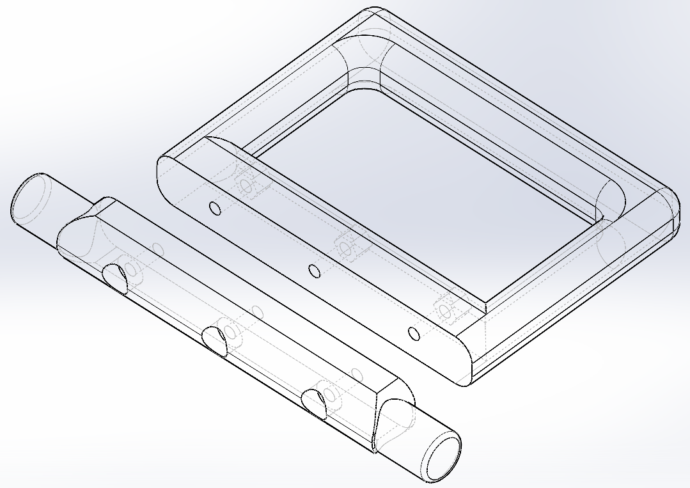
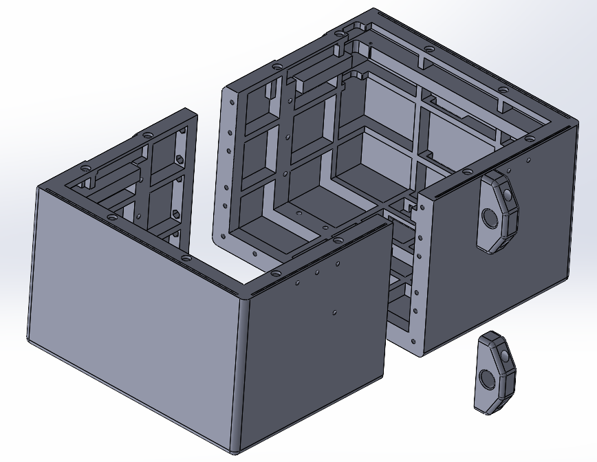
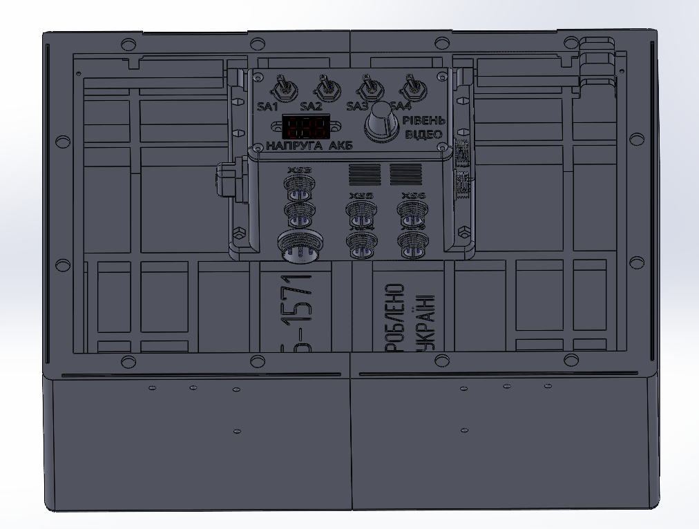
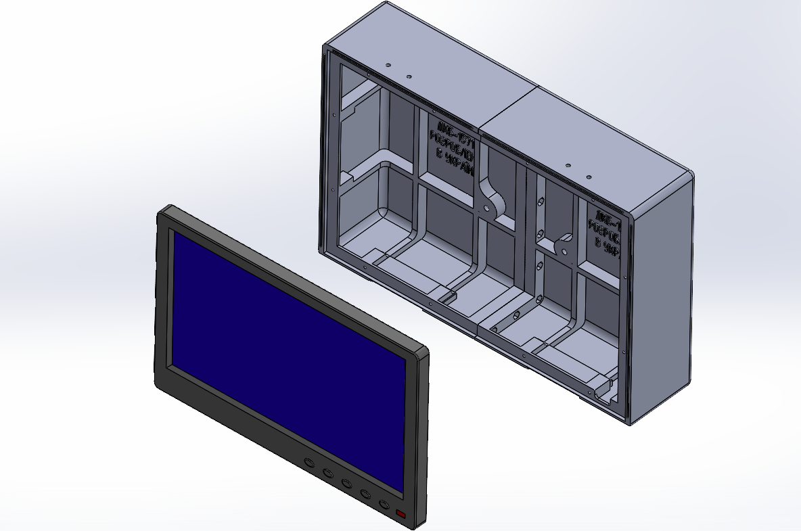
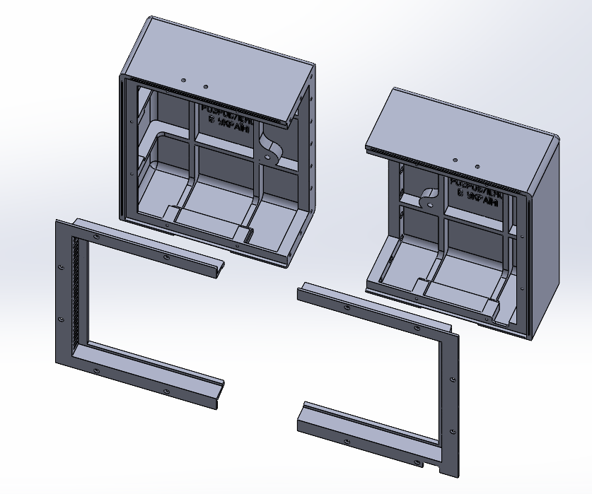

# Universal case and station body

การออกแบบ universal case ได้รับการพัฒนาให้เป็นโซลูชันที่สมดุลสำหรับการขนส่งและการใช้งาน FPV drone ground control station ในภาคสนาม โดยจุดมุ่งหมายหลักในการออกแบบคือการผสมผสานระหว่างความน่าเชื่อถือ (reliability), ความคล่องตัว (mobility), และความสามารถในการผลิตได้ง่าย (manufacturing accessibility)

## Key design features:
<ul>
<li><b>Compactness and mobility:</b> ขนาดของตัว body ได้รับการปรับปรุงให้เหมาะสมเพื่อความคล่องตัวสูงสุดของผู้ใช้งาน รูปทรงที่กะทัดรัด (compact form factor) ของ case ช่วยให้ขนส่งสถานีในกระเป๋าเป้หรือเป็นอุปกรณ์ชิ้นเล็กๆ แยกต่างหากได้อย่างสะดวกสบาย</li>

<li><b>Optimization for additive manufacturing:</b> รูปทรงเรขาคณิตของชิ้นส่วนต่างๆ ได้รับการออกแบบสำหรับการพิมพ์ 3D printing บนเครื่องพิมพ์ FDM ทั่วไป ขนาดสูงสุดของชิ้นส่วนเดี่ยวแต่ละชิ้นไม่เกิน 250 × 250 × 250 mm ทำให้โครงการนี้สามารถทำได้จริงบนอุปกรณ์ราคาประหยัด</li>

<li><b>Cost effectiveness:</b> การออกแบบใช้หลักการลดต้นทุนการผลิตให้เหลือน้อยที่สุด การใช้วัสดุที่ราคาจับต้องได้ (พลาสติกประเภท PETG/ABS) และอุปกรณ์ hardware มาตรฐานช่วยลดต้นทุนของผลิตภัณฑ์สำเร็จรูปได้อย่างมากโดยไม่สูญเสียฟังก์ชันการทำงาน</li>

<li><b>Operational durability and repeatability:</b> การออกแบบมีเกณฑ์ความปลอดภัย (safety margin) ที่เพียงพอสำหรับการใช้งานหนัก โซลูชันทางเทคนิคช่วยให้ง่ายต่อการผลิตตัว body ซ้ำในโรงงานท้องถิ่นหรือโรงงานภาคสนาม</li>

<li><b>Modular architecture and maintainability:</b></li>
<ul>
<li>ตัว body ประกอบด้วยโมดูลแยกส่วนที่สามารถเปลี่ยนทดแทนกันได้</li>

<li>High maintainability: ในกรณีที่เกิดความเสียหายทางกลไก สามารถเปลี่ยนเฉพาะชิ้นส่วนที่เสียหายได้</li>

<li>Hardware unification: การเชื่อมต่อส่วนใหญ่ใช้ตัวยึดมาตรฐานเมตริก (สกรู M3 และน็อตตัวเมีย) ซึ่งช่วยลดความยุ่งยากในการประกอบและการจัดการชิ้นส่วน</li>
</ul>
</ul>

## Required quantity of components for manufacturing one universal case - station body

| Component Name | Type/Size | Quantity | Note |
| :---: | :---: | :---: | :---: |
| Self-tapping screw | 2x8 DIN 7982 | 12 ชิ้น | หากใช้ case เป็น station body |
| Screw | M3x14 DIN 7985 | 48 ชิ้น | |
| Screw | M3x20 DIN 7985 A2 | 10 ชิ้น | หากใช้ case เป็น station body |
| Screw | M3x25 DIN 912 | 7 ชิ้น | |
| Screw | M4x12 DIN 7985 | 4 ชิ้น | หากใช้ case เป็น station body |
| Nut | M3 DIN 934 | 65 ชิ้น | |
| Washer | M3 DIN 125 | 18 ชิ้น | |
| Lock with key | A-014/2 | 2 ชิ้น | [ซื้อ Lock with key A-014/2](https://prom.ua/ua/p2153719864-zamok-klyuchem-0142.html) |
| Hinges | B-114 | 2 ชิ้น | [ซื้อ Hinges B-114](https://prom.ua/ua/p779613844-petlya-114.html) |
| Part 1 |  | 1 ชิ้น | |
| Part 2 |  | 1 ชิ้น | |
| Part 3 |  | 1 ชิ้น | หากใช้ case เป็น station body |
| Part 4 |  | 1 ชิ้น | หากใช้ case เป็น station body |
| Part 5 |  | 1 ชิ้น | |
| Part 6 |  | 1 ชิ้น | |
| Part 7 |  | 2 ชิ้น | |
| Part 8 |  | 1 ชิ้น | |
| Part 9 |  | 1 ชิ้น | |

## 3D printing settings and material used

| Parameter | Value |
| :---: | :---: |
| Wall line count (perimeters) | 5 |
| Top and bottom solid layers | 5 |
| Infill density | 40% |
| Infill pattern | Gyroid |
| Supports | Tree-like |

Material: coPET black MonoFilament

## Detailed list of hardware usage

| Component Name | Type/Size | Quantity | Note |
| :---: | :---: | :---: | :---: |
| Screw | M3x14 DIN 7985 | 11 ชิ้น | การเชื่อมต่อระหว่าง Part 1 และ Part 2 |
| Nut | M3 DIN 934 | 11 ชิ้น | การเชื่อมต่อระหว่าง Part 1 และ Part 2 |

| Component Name | Type/Size | Quantity | Note |
| :---: | :---: | :---: | :---: |
| Screw | M3x14 DIN 7985 | 17 ชิ้น | การเชื่อมต่อระหว่าง Part 5 และ Part 6 |
| Nut | M3 DIN 934 | 17 ชิ้น | การเชื่อมต่อระหว่าง Part 5 และ Part 6 |

| Component Name | Type/Size | Quantity | Note |
| :---: | :---: | :---: | :---: |
| Screw | M3x14 DIN 7985 | 8 ชิ้น | การยึด locks เข้ากับ top cover และ base ของ universal case and station body |
| Nut | M3 DIN 934 | 8 ชิ้น | การยึด locks เข้ากับ top cover และ base ของ universal case and station body |

| Component Name | Type/Size | Quantity | Note |
| :---: | :---: | :---: | :---: |
| Screw | M3x14 DIN 7985 | 12 ชิ้น | การยึด hinges เข้ากับ top cover และ base ของ universal case and station body |
| Nut | M3 DIN 934 | 12 ชิ้น | การยึด hinges เข้ากับ top cover และ base ของ universal case and station body |
| Washer | M3 DIN 125 | 12 ชิ้น | การยึด hinges เข้ากับ top cover และ base ของ universal case and station body |

 

| Component Name | Type/Size | Quantity | Note |
| :---: | :---: | :---: | :---: |
| Screw | M3x25 DIN 912 | 3 ชิ้น | การเชื่อมต่อระหว่าง Part 8 และ Part 9 |
| Nut | M3 DIN 934 | 3 ชิ้น | การเชื่อมต่อระหว่าง Part 8 และ Part 9 |
| Washer | M3 DIN 125 | 6 ชิ้น | การเชื่อมต่อระหว่าง Part 8 และ Part 9 |

| Component Name | Type/Size | Quantity | Note |
| :---: | :---: | :---: | :---: |
| Screw | M3x25 DIN 912 | 4 ชิ้น | การเชื่อมต่อระหว่าง Part 7 และ base ของ universal case and station body |
| Nut | M3 DIN 934 | 4 ชิ้น | การเชื่อมต่อระหว่าง Part 7 และ base ของ universal case and station body |

| Component Name | Type/Size | Quantity | Note |
| :---: | :---: | :---: | :---: |
| Screw | M3x20 DIN 7985 A2 | 10 ชิ้น | การยึด control unit เข้ากับ base ของ universal case and station body |
| Nut | M3 DIN 934 | 10 ชิ้น | การยึด control unit เข้ากับ base ของ universal case and station body |

| Component Name | Type/Size | Quantity | Note |
| :---: | :---: | :---: | :---: |
| Screw | M4x12 DIN 7985 | 4 ชิ้น | การยึด monitor เข้ากับ top cover ของ universal case and station body |

| Component Name | Type/Size | Quantity | Note |
| :---: | :---: | :---: | :---: |
| Self-tapping screw | 2x8 DIN 7982 | 6 ชิ้น | การยึด Part 3 เข้ากับ Part 1 |
| Self-tapping screw | 2x8 DIN 7982 | 6 ชิ้น | การยึด Part 4 เข้ากับ Part 2 |

