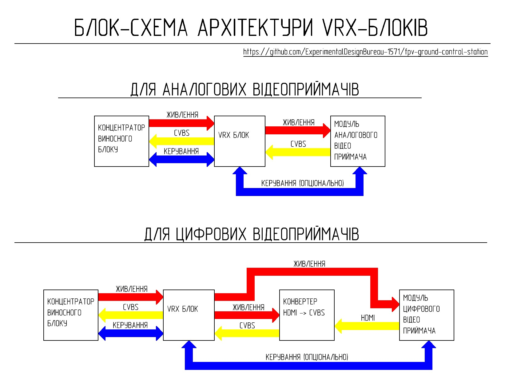

# VRX Blocks

ส่วนนี้ประกอบด้วยเอกสารคู่มือ, 3D models, schematics และคำแนะนำสำหรับการผลิต interchangeable video receiver units (VRX blocks) ที่ใช้เป็นส่วนหนึ่งของ Ground Control Station โดยที่แต่ละ VRX block คือ module ที่ทำงานได้อย่างสมบูรณ์ในตัวเอง (functionally complete module) ซึ่งออกแบบมาให้ทำงานในย่านความถี่ (frequency band), มาตรฐานการส่งสัญญาณ (transmission standard) ที่เฉพาะเจาะจง หรือทำงานร่วมกับอุปกรณ์รับสัญญาณวิดีโอ (video receiver equipment) เฉพาะประเภท

## Purpose

VRX blocks ทำหน้าที่:
- video signal reception
- transmission of the output video signal ไปยัง switching lines ของ Ground Control Station
- mechanical integration ของ video receiver equipment เข้ากับ remote unit ของ station
- unified power and signal lines connection

## Architecture and Implementation Details

### The architecture supports the use of:
<ul>
<li>analog video receivers</li>
<li>digital video receiver systems ที่ประกอบร่วมกับ video signal converter</li>
<li>video receiver control ผ่านทาง Ground Control Station switching lines</li>
</ul>

### Implementation Details
<ul>
<li>VRX blocks ทั้งหมดมี unified connection เข้ากับ remote unit hub</li>
<li>VRX blocks ใหม่สามารถรวมเข้ากับ Ground Control Station ได้โดยไม่ต้องเปลี่ยนแปลงสถาปัตยกรรมของ subsystems อื่นๆ</li>
<li>แต่ละ VRX block ได้รับการออกแบบมาสำหรับอุปกรณ์รับสัญญาณวิดีโอ (video receiver equipment) หรือมาตรฐานการส่งสัญญาณ (transmission standard) เฉพาะประเภท</li>
<li>การออกแบบช่วยให้มั่นใจได้ว่า VRX blocks สามารถถอดเปลี่ยนได้โดยไม่ต้องแก้ไขส่วนประกอบอื่นๆ ของ station</li>
</ul>
