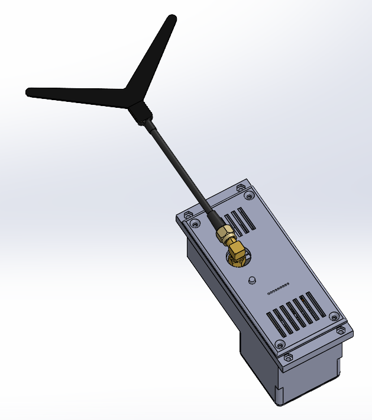

# VRX block based on Readytosky 1.2G/1.3G

VRX block ที่อิงตาม Readytosky 1.2–1.3 GHz 9CH video receiver คือโมดูลการทำงานที่ติดตั้งบน remote unit และออกแบบมาเพื่อรับสัญญาณ video แบบ analog ในช่วงความถี่ 1.2–1.3 GHz เพื่อส่งต่อไปยังสายสลับสัญญาณ (switching lines) ของ ground station

## Quick technical specifications of the VRX block based on the Readytosky 1.2–1.3 GHz 9CH video receiver

| Parameter | Value | Note |
|----------|---------|---------|
| Input voltage | แบตเตอรี่ 6S Li-ion/LiPo (Min 22.2V Max 25.2V) | รับพลังงานจาก remote unit hub |
| Frequency range | 1060 - 1380 MHz | 9 channels (1080/1120/1160/1200/1240/1280/1320/1360/1258 MHz) |
| Control | Manual | ผ่าน stock channel selector |
| Output video signal type | Analog composite (CVBS) | |

### Interfaces

| Connector | Purpose | Main signals | Note |
|--------|------------|----------------|----------|
| XS1 (GX12-6) | การเชื่อมต่อกับ remote unit hub | +BAT, GND, CVBS |  |

## Schematic design and functionality

พลังงานจะถูกจ่ายไปยัง VRX block ผ่าน connector XS1 จากบัส +BAT ของ remote unit hub สัญญาณเอาต์พุต CVBS จาก video receiver จะถูกส่งผ่าน XS1 ไปยังสายสลับสัญญาณ (switching lines) ของ ground control station ส่วนการควบคุมช่องความถี่จะดำเนินการผ่าน stock channel selector ของ video receiver

## List of necessary components for manufacturing one VRX block

| Component Name | Quantity | Note |
| :--- | :--- | :---: |
| Readytosky 1.2–1.3 GHz 9CH video receiver kit | 1 ชิ้น | |
| 90-degree SMA Female to SMA Male elbow adapter | 1 ชิ้น | |
| GX12-6 pin panel mount plug (male) | 1 ชิ้น | XS1 |
| M2x18 screw DIN 7985 | 1 ชิ้น | การยึด video receiver เข้ากับ Part 1 |
| M2 nut DIN 934 | 1 ชิ้น | การยึด video receiver เข้ากับ Part 1 |
| 2x8 self-tapping screw DIN 7982 | 8 ชิ้น | การยึด Part 2 และ Part 3 เข้ากับ Part 1 |
| Part 1 - 3D print | 1 ชิ้น | |
| Part 2 - 3D print | 1 ชิ้น | |
| Part 3 - 3D print | 1 ชิ้น | |
| Part 4 - 3D print | 1 ชิ้น | |

## 3D printing settings and material used

| Parameter | Value |
| :---: | :---: |
| Wall line count (perimeters) | 4 |
| Top and bottom solid layers | 5 |
| Infill density | 40% |
| Infill pattern | Gyroid |
| Supports | Tree-like |

Material: coPET black MonoFilament
