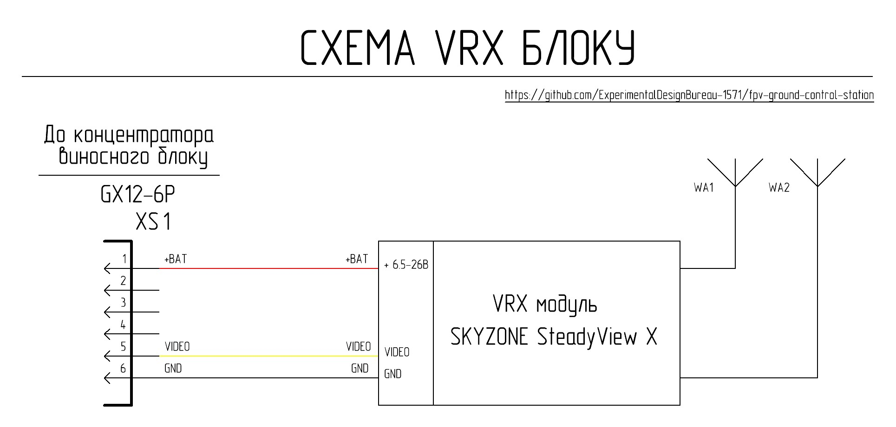

# VRX block based on SKYZONE SteadyView X 5G

VRX block ที่อิงตาม Skyzone SteadyView X 5G video receiver คือโมดูลการทำงานที่ติดตั้งบน remote unit และออกแบบมาเพื่อรับสัญญาณ video แบบ analog ในช่วงความถี่ 4.9–5.9 GHz เพื่อส่งต่อไปยังสายสลับสัญญาณ (switching lines) ของ ground station เพื่อลดการเปล่งแสงของหน้าจอ (screen light emission) สามารถติดตั้ง masking cover ได้ โดยรูปลักษณ์ภายนอกของ VRX block ทั้งแบบที่มีและไม่มี masking cover จะแสดงในภาพถัดไป

## Quick technical specifications of the VRX block based on the Skyzone SteadyView X 5G video receiver

| Parameter | Value | Note |
|----------|---------|---------|
| Input voltage | แบตเตอรี่ 6S Li-ion/LiPo (Min 22.2V Max 25.2V) | รับพลังงานจาก remote unit hub |
| Frequency range | 4.9–5.9 GHz |  |
| Control | Manual or remote | ผ่าน stock control elements หรือ ELRS Backpack |
| Output video signal type | Analog composite (CVBS) | |

### Interfaces

| Connector | Purpose | Main signals | Note |
|--------|------------|----------------|----------|
| XS1 (GX12-6) | การเชื่อมต่อกับ remote unit hub | +BAT, GND, CVBS |  |

## Schematic design and functionality

พลังงานจะถูกจ่ายไปยัง VRX block ผ่าน connector XS1 จากบัส +BAT ของ remote unit hub สัญญาณเอาต์พุต CVBS จาก video receiver จะถูกส่งผ่าน XS1 ไปยังสายสลับสัญญาณ (switching lines) ของ ground station

การเชื่อมต่อระหว่าง video receiver และ connector XS1 จะใช้สายไฟทองแดงที่มีหน้าตัด 26 AWG พร้อมฉนวนซิลิโคน สายไฟสีแดง (+BAT) จะเชื่อมต่อเข้ากับแคโทด (cathode) ของ TVS diode (suppressor), สายไฟสีดำ (GND) เชื่อมต่อเข้ากับขั้วลบของ capacitor, และสายไฟสีเหลือง (CVBS) เชื่อมต่อเข้ากับ pin ที่ 6 ของขั้วต่อบอร์ด RXPORT100 V1.1 ของ Skyzone SteadyView X 5G video receiver

การควบคุมช่องความถี่จะดำเนินการผ่าน stock control elements ของ video receiver หรือผ่าน ELRS Backpack

## List of necessary components for manufacturing one VRX block

| Component Name | Quantity | Note |
| :--- | :--- | :---: |
| VRX Skyzone SteadyView X 5G video receiver kit | 1 ชิ้น | |
| 90-degree SMA Female to SMA Male elbow adapter | 2 ชิ้น | |
| GX12-6 pin panel mount plug (male) | 1 ชิ้น | XS1 |
| Double-sided acrylic tape 2 mm | 100 mm | การยึด VRX Skyzone SteadyView X 5G เข้ากับ Part 1 |
| 2x8 self-tapping screw DIN 7982 | 8 ชิ้น | การยึด Part 2 และ Part 3 เข้ากับ Part 1 |
| สายไฟทองแดง 26 AWG หุ้มฉนวนซิลิโคน, สีดำ | 150 mm | VRX Skyzone SteadyView X 5G -> XS1 |
| สายไฟทองแดง 26 AWG หุ้มฉนวนซิลิโคน, สีแดง | 150 mm | VRX Skyzone SteadyView X 5G -> XS1 |
| สายไฟทองแดง 26 AWG หุ้มฉนวนซิลิโคน, สีเหลือง | 150 mm | VRX Skyzone SteadyView X 5G -> XS1 |
| Part 1 - 3D print | 1 ชิ้น | |
| Part 2 - 3D print | 1 ชิ้น | |
| Part 3 - 3D print | 1 ชิ้น | |

## 3D printing settings and material used

| Parameter | Value |
| :---: | :---: |
| Wall line count (perimeters) | 4 |
| Top and bottom solid layers | 5 |
| Infill density | 40% |
| Infill pattern | Gyroid |
| Supports | Tree-like |

Material: coPET black MonoFilament
