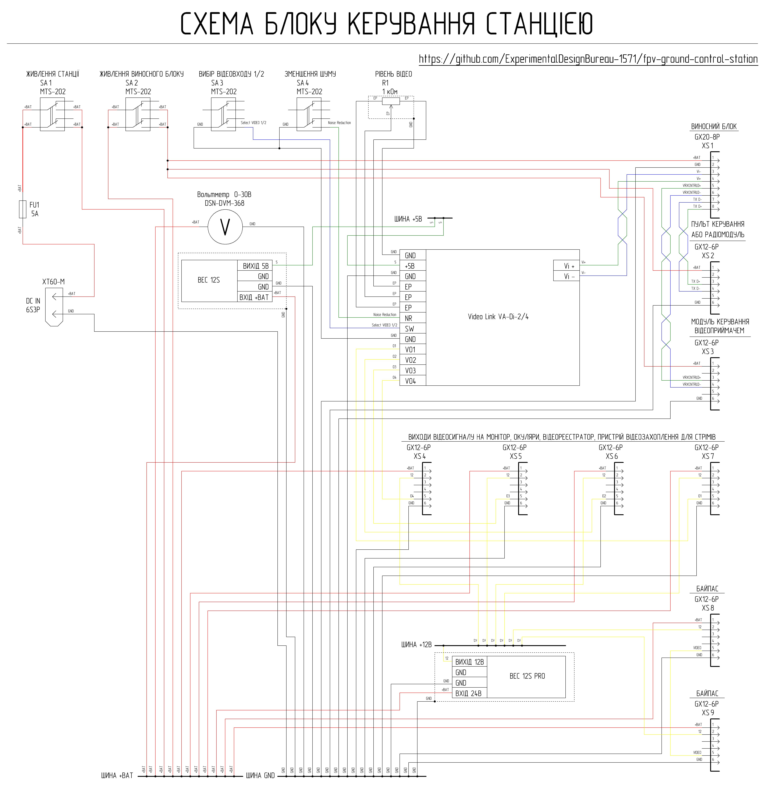

# Блок керування станцією

Блок керування станцією використовується для розподілу та комутації живлення, концентрації та комутації сигналів між виносним блоком та периферійними пристроями. 

## Короткі технічні параметри блоку керування станцією

| Параметр | Значення | Примітка |
|----------|---------|---------|
| Вхідна напруга | АКБ 6S Li-ion/LiPo (Мін. 22.2В Макс. 25.2 В) | Через XT60 |
| Захист по живленню | Запобіжник 5А | FU1 |
| Комутація живлення | Тумблери | SA1 (основне живлення станції), SA2 (живлення виносного блоку) |
| Шина живлення | +BAT | Пряма від АКБ |
| Допоміжні шини | +12В, +5В | Формуються DC-DC перетворювачами |
| Макс. струм по шині +12В | до 3 А | Сумарне навантаження |
| Кількість відеовходів | 1 (з можливістю вибору активного відеовходу на виносному блоці) | Тумблер SA3 |
| Тип вхідного відеосигналу | Аналоговий диференційний | |
| Кількість відеовиходів | 4 | XS4–XS7 |
| Тип вихідного відеосигналу | Аналоговий композитний (CVBS) | |
| Відеообробка | Підсилення / перетворення / розгалуження / фільтрація  | Модуль VA-Di-2/4 |
| Регулювання рівня відео | Є | Потенціометр R1 |
| Фільтрація відеошумів | Є | Тумблер SA4 |
| BYPASS режим | Є | Роз'єми XS8–XS9 |
| Інтерфейс TX | Є | Через XS2 |
| Керування VRX | Підтримується | Через XS3 |
| Охолодження | Пасивне | Мідні радіатори + вентиляційні отвори |
| Екранування | Часткове | Екранування перетворювачів напруги мідними радіаторами |

### Інтерфейси

| Роз’єм | Призначення | Основні сигнали | Примітка |
|--------|------------|----------------|----------|
| XS1 (GX20-8) | Підключення виносного блоку | +BAT, GND, диференційні лінії | Основний канал зв’язку |
| XS2 (GX12-6) | Пульт керування (TX) | +BAT, GND, диференційна лінія | |
| XS3 (GX12-6) | Керування VRX1 / периферією виносного блоку | +BAT, GND, диференційна лінія | Опціонально |
| XS4 (GX12-6) | Відеовихід 1 | +BAT, +12В, GND, CVBS | Монітор, окуляри, DVR пристрій для запису відео, пристрій для захоплення та оцифрування відео для стрімів тощо |
| XS5 (GX12-6) | Відеовихід 2 | +BAT, +12В, GND, CVBS | Монітор, окуляри, DVR пристрій для запису відео, пристрій для захоплення та оцифрування відео для стрімів тощо |
| XS6 (GX12-6) | Відеовихід 3 | +BAT, +12В, GND, CVBS | Монітор, окуляри, DVR пристрій для запису відео, пристрій для захоплення та оцифрування відео для стрімів тощо |
| XS7 (GX12-6) | Відеовихід 4 (монітор) | +BAT, +12В, GND, CVBS | Підключення монітору |
| XS8 (GX12-6) | BYPASS (вихід) | +BAT, +12В, GND, CVBS | Пряме підключення |
| XS9 (GX12-6) | BYPASS (вхід) | +BAT, +12В, GND, CVBS | Джерело сигналу |
| XT60 | Вхід живлення | +BAT, GND | Через запобіжник |

## Схемотехніка та функціонал блоку керування станцією

Живлення на блок керування подається від Li-ion/LiPo АКБ 6S3P через запобіжник FU1 5А та надходить на тумблер SA1. Вмикання тумблера SA1 подає живлення на шину +ВАТ, що забезпечує загальне живлення наземної станції.

Виносний блок підключається до блоку керування кабелем через роз’єм XS1. Пульт керування через JR-модуль з конвертором CRSF -> RS-485 підключається до роз’єму XS2. Роз’єм XS3 використовується в разі необхідності віддаленого керування відеоприймачем через звиту пару (зверніть увагу на те, що ця опція доступна тільки для 1-го відеовходу виносного блоку). В разі необхідності звиту пару від роз’єму  XS3 можна використати для передачі сигналів керування на інші периферійні пристрої виносного блоку. Живлення на роз’єми XS1, XS2 та XS3 надходить від шини +ВАТ через тумблер SA2. 

Підключення периферійних відеопристроїв (монітор, окуляри, DVR пристрій для запису відео, пристрій для захоплення та оцифрування відео для стрімів тощо) відбувається через роз’єми XS4, XS5, XS6 та XS7. Роз’єм XS7 зарезервовано для використання штатним монітором станції. На роз’єми XS4, XS5, XS6 та XS7 надходить живлення від шини +ВАТ та +12В. Відеосигнал на роз’єми XS4, XS5, XS6 та XS7 надходить з активного підсилювача-відеорозгалуджувача який живиться по шині +5В та має можливість вибору активного відеовходу на виносному блоці (тумблер SA3), функцію зменшення рівня шумів при сильних завадах (тумблер SA4) та підлаштування рівня відео через змінний резистор R1 (рівень відео).

В разі необхідності подачі відеосигналу напряму в монітор можна використати «БАЙПАС» (роз’єми XS8 та XS9). Для цього монітор підключається до роз’єму XS8, а джерело відеосигналу до роз’єму XS9. Живлення на роз’єми XS8 та XS9 надходить від шини +ВАТ та +12В.

Живлення на шини +12В та +5В надходить від перетворювачів напруги. Відведення тепла з перетворювачів здійснюється двома мідними радіаторами через силіконовий термоінтерфейс. Мідні радіатори з’єднані з шиною загального проводу GND та разом з керамічними конденсаторами на виході перетворювачів напруги мінімізують паразитні наведення від роботи перетворювачів напруги. Сумарне довготривале навантаження шини +12В через роз’єми XS4, XS5, XS6, XS7, XS8 та XS9 не повинно перевищувати 3А.

Блок керування станцією має високу щільність монтажу та передбачає роботу з різними рівнями напруги. Для успішної збірки пристрою необхідні навички читання принципових схем та досвід виконання монтажних робіт середньої складності.

## Перелік необхідних комплектуючих для виготовлення одного блоку керування

| Найменування | Кількість| Примітка |
| :--- | :--- | :---: |
| Тумблер 100DP1T1B1M1QEH або широкодоступний MTS-202 6 pin ON-ON | 4 штуки | SA1-SA4 (зверніть увагу що широкодоступні тумблери треба доробити для надійної комутації!) |
| Потенціометр 1 кОм WH148 | 1 штука | Регулятор рівня відео |
| Ручка для потенціометра WH148 | 1 штука | |
| Відеопідсилювач - розгалуджувач VideoLink VA-Di-2/4 | 1 штука | Модуль Українського виробництва [придбати VideoLink VA-Di-2/4 у виробника](https://sezam.video/shop/videopidsilyuvach-videolink-va-di-24/) |
| Перетворювач напруги GUTI ELECTRONICS BEC12S-PRO | 1 штука | Український аналог Matek BEC 12S PRO [придбати GUTI ELECTRONICS BEC12S-PRO у виробника](https://prom.ua/ua/p2814749849-otechestvennyj-analog-matek.html) |
| Перетворювач напруги GUTI ELECTRONICS mBEC12S | 1 штука | Український аналог Matek BEC 12S [придбати GUTI ELECTRONICS mBEC12S у виробника](https://prom.ua/ua/p2814749850-otechestvennyj-analog-matek.html) |
| Вольтметр DSN-DVM-368 0-30В | 1 штука | |
| Вилка блочна GX20-8 pin (male) | 1 штука | XS1 |
| Вилка блочна GX12-6 pin (male) | 8 штук | XS2-XS9 |
| Роз'єм XT60E-M | 1 штука | |
| Тримач запобіжника FH-501 (KLS5-701) | 1 штука | |
| Запобіжник FT Standart 5A | 1 штука | |
| Листова мідь товщиною 0.8 мм | 134 мм х 40 мм | Радіатори охолодження модулю розподілу живлення |
| Силіконова термопрокладка 1.5 мм 6W\m.k | 84 мм х 24 мм | Відведення тепла від перетворювачів напруги на радіатори охолодження |
| Силіконова термопрокладка 1 мм 6W\m.k | 18 мм х 16 мм | Відведення тепла від перетворювачів напруги на радіатори охолодження |
| Фольгований склотекстоліт односторонній 1.5 мм | 35 мм х 17 мм | Плата шин живлення в модулі розподілу живлення |
| Провід мідний 26 AWG з силіконовою ізоляцією чорний | 760 мм | |
| Провід мідний 26 AWG з силіконовою ізоляцією червоний | 250 мм | |
| Провід мідний 26 AWG з силіконовою ізоляцією жовтий | 490 мм | |
| Провід мідний 26 AWG з силіконовою ізоляцією синій | 410 мм | |
| Провід мідний 26 AWG з силіконовою ізоляцією зелений | 660 мм | |
| Провід мідний 20 AWG з силіконовою ізоляцією чорний | 1540 мм | |
| Провід мідний 20 AWG з силіконовою ізоляцією червоний | 2140 мм | |
| Провід мідний 20 AWG з силіконовою ізоляцією жовтий | 1060 мм | |
|  Гвинт M2x8 DIN 7985 | 14 штук | |
|  Гвинт M2.5x8 DIN 965 | 2 штуки | |
|  Гвинт M2.5x12 DIN 7985 | 2 штуки | |
|  Гвинт M3x8 DIN 7985 A2 | 2 штуки | |
|  Гвинт M3x16 DIN 7985 A2 | 4 штуки | |
|  Шайба M2 DIN 125  | 14 штук | |
|  Шайба M2.5 DIN 125  | 2 штуки | |
|  Шайба M3 DIN 125  | 2 штуки | |
|  Гайка M2 DIN 934  | 14 штук | |
|  Гайка M2.5 DIN 934  | 2 штуки | |
|  Гайка M3 DIN 934  | 6 штук | |
|  Шуруп 2х8 DIN 7982  | 8 штук | |
|  Деталь 1 - 3D друк | 1 штука | |
|  Деталь 2 - 3D друк | 1 штука | |
|  Деталь 3 - 3D друк | 1 штука | |
|  Деталь 4 - 3D друк | 1 штука | |

## Налаштування 3Д-друку та використаний матеріал

| Параметр | Значення |
| :---: | :---: |
| Кількість периметрів | 4 |
| Суцільних шарів зверху і знизу | 5 |
| Щільність заповнення | 40% |
| Малюнок заповнення | Гіроїд |
| Підтримка | Деревоподібна |

Матеріал coPET black MonoFilament

## Модернізація тумблерів MTS-202 (6 pin, ON-ON)

Знайти у продажу якісні тумблери буває складно, проте широкодоступні моделі можна легко адаптувати для надійної роботи. Модернізація дозволяє покращити надійність комутації.

### Порядок виконання робіт:

1. **Розбирання:** Обережно розберіть тумблер, відігнувши металеві вушка корпусу.

2. **Підготовка контактів:** Вийміть коромисла (рухомі контакти) та трохи підігніть їх для забезпечення надійної комутації.

 

3. **Змащування:** Для зменшення зносу та підвищення плавності ходу нанесіть невелику кількість густого силіконового мастила на пластиковий штовхач тумблера.
4. **Збірка:** Зберіть тумблер у зворотному порядку, щільно зафіксувавши металеву кришку вушками.
5. **Перевірка:** Перевірте за допомогою мультиметра спрацювання тумблера

## Деталізація по витраті метизів

| Найменування | Тип/Розмір | Кількість | Примітка |
| :--- | :--- | :---: | :---: |
| Гвинт | M2x8 DIN 7985 | 4 штуки | Кріплення плати шин живлення до Деталь 4 |
| Гвинт | M2x8 DIN 7985 | 10 штук | Кріплення радіаторів до Деталь 4 |
| Гвинт | M2.5x8 DIN 965 | 2 штуки | Кріплення роз'єму живлення XT60 до Деталь 1 |
| Гвинт | M2.5x12 DIN 7985 | 2 штуки | Кріплення вольтметру до Деталь 2 |
| Гвинт | M3x8 DIN 7985 A2 | 2 штуки | Кріплення тримача запобіжника до Деталь 1 |
| Гвинт | M3x16 DIN 7985 A2 | 4 штуки | Кріплення модуля розподілу живлення до Деталь 3 |
| Шайба | M2 DIN 125 | 4 штуки | Кріплення плати шин живлення до Деталь 4 |
| Шайба | M2 DIN 125 | 10 штук | Кріплення радіаторів до Деталь 4 |
| Шайба | M2.5 DIN 125 | 2 штуки | Кріплення вольтметру до Деталь 2 |
| Шайба | M3 DIN 125 | 2 штуки | Кріплення модуля розподілу живлення до Деталь 3 |
| Гайка | M2 DIN 934 | 4 штуки | Кріплення плати шин живлення до Деталь 4 |
| Гайка | M2 DIN 934 | 10 штук | Кріплення радіаторів до Деталь 4 |
| Гайка | M2.5 DIN 934 | 2 штуки | Кріплення вольтметру до Деталь 2 |
| Гайка | M3 DIN 934 | 2 штуки | Кріплення тримача запобіжника до Деталь 1 |
| Гайка | M3 DIN 934 | 4 штуки | Кріплення модуля розподілу живлення до Деталь 3 |
| Шуруп | 2х8 DIN 7982 | 4 штуки | Кріплення Деталь 2 до Деталь 1 |
| Шуруп | 2х8 DIN 7982 | 4 штуки | Кріплення Деталь 3 до Деталь 1 |

## Деталізація по витраті проводу

XS1
| Тип | Довжина | Примітка |
| :--- | :--- | :---: |
| 20 AWG чорний | 100 мм | XS1 - шина GND модуля розподілу живлення |
| 20 AWG червоний | 160 мм | XS1 - SA2 |
| 26 AWG зелений | 110 мм | XS1 - VA-Di-2/4 |
| 26 AWG синій | 110 мм | XS1 - VA-Di-2/4 |

XS2
| Тип | Довжина | Примітка |
| :--- | :--- | :---: |
| 20 AWG чорний | 140 мм | XS2 - шина GND модуля розподілу живлення |
| 20 AWG червоний | 110 мм | XS2 - SA2 |
| 26 AWG зелений | 100 мм | XS2 - XS1 |
| 26 AWG синій | 100 мм | XS2 - XS1 |

XS3
| Тип | Довжина | Примітка |
| :--- | :--- | :---: |
| 20 AWG чорний | 140 мм | XS3 - шина GND модуля розподілу живлення |
| 20 AWG червоний | 110 мм | XS3 - SA2 |
| 26 AWG зелений | 100 мм | XS3 - XS1 |
| 26 AWG синій | 100 мм | XS3 - XS1 |

XS4
| Тип | Довжина | Примітка |
| :--- | :--- | :---: |
| 20 AWG чорний | 150 мм | XS4 - шина GND модуля розподілу живлення |
| 20 AWG червоний | 150 мм | XS4 - шина +BAT модуля розподілу живлення |
| 20 AWG жовтий | 150 мм | XS4 - шина +12В модуля розподілу живлення |
| 26 AWG жовтий | 110 мм | XS4 - VA-Di-2/4 |

XS5
| Тип | Довжина | Примітка |
| :--- | :--- | :---: |
| 20 AWG чорний | 150 мм | XS5 - шина GND модуля розподілу живлення |
| 20 AWG червоний | 150 мм | XS5 - шина +BAT модуля розподілу живлення |
| 20 AWG жовтий | 150 мм | XS5 - шина +12В модуля розподілу живлення |
| 26 AWG жовтий | 100 мм | XS5 - VA-Di-2/4 |

XS6
| Тип | Довжина | Примітка |
| :--- | :--- | :---: |
| 20 AWG чорний | 160 мм | XS6 - шина GND модуля розподілу живлення |
| 20 AWG червоний | 160 мм | XS6 - шина +BAT модуля розподілу живлення |
| 20 AWG жовтий | 160 мм | XS6 - шина +12В модуля розподілу живлення |
| 26 AWG жовтий | 100 мм | XS6 - VA-Di-2/4 |

XS7
| Тип | Довжина | Примітка |
| :--- | :--- | :---: |
| 20 AWG чорний | 170 мм | XS7 - шина GND модуля розподілу живлення |
| 20 AWG червоний | 170 мм | XS7 - шина +BAT модуля розподілу живлення |
| 20 AWG жовтий | 170 мм | XS7 - шина +12В модуля розподілу живлення |
| 26 AWG жовтий | 110 мм | XS7 - VA-Di-2/4 |

XS8
| Тип | Довжина | Примітка |
| :--- | :--- | :---: |
| 20 AWG чорний | 170 мм | XS8 - шина GND модуля розподілу живлення |
| 20 AWG червоний | 170 мм | XS8 - шина +BAT модуля розподілу живлення |
| 20 AWG жовтий | 170 мм | XS8 - шина +12В модуля розподілу живлення |
| 26 AWG жовтий | 70 мм | XS8 - XS9 |

XS9
| Тип | Довжина | Примітка |
| :--- | :--- | :---: |
| 20 AWG чорний | 160 мм | XS9 - шина GND модуля розподілу живлення |
| 20 AWG червоний | 160 мм | XS9 - шина +BAT модуля розподілу живлення |
| 20 AWG жовтий | 160 мм | XS9 - шина +12В модуля розподілу живлення |

XT60
| Тип | Довжина | Примітка |
| :--- | :--- | :---: |
| 20 AWG чорний | 100 мм | XT60 - шина GND модуля розподілу живлення |
| 20 AWG червоний | 50 мм | XT60 - Тримач запобіжника |

Тримач запобіжника
| Тип | Довжина | Примітка |
| :--- | :--- | :---: |
| 20 AWG червоний | 120 мм | Тримач запобіжника - SA1 |

Вольтметр
| Тип | Довжина | Примітка |
| :--- | :--- | :---: |
| 26 AWG чорний | 170 мм | Вольтметр - шина GND модуля розподілу живлення |
| 26 AWG червоний | 170 мм | Вольтметр - шина +BAT модуля розподілу живлення |

SA1
| Тип | Довжина | Примітка |
| :--- | :--- | :---: |
| 20 AWG червоний | 170 мм | SA1 - шина +BAT модуля розподілу живлення |
| 20 AWG червоний | 100 мм | SA1 - SA1 перемички |

SA2
| Тип | Довжина | Примітка |
| :--- | :--- | :---: |
| 20 AWG червоний | 170 мм | SA2 - шина +BAT модуля розподілу живлення |
| 20 AWG червоний | 100 мм | SA2 - SA2 перемички |

SA3
| Тип | Довжина | Примітка |
| :--- | :--- | :---: |
| 26 AWG чорний | 100 мм | SA3 - VA-Di-2/4 |
| 26 AWG чорний | 30 мм | SA3 - SA4 |
| 26 AWG синій | 100 мм | SA3 - VA-Di-2/4 |

SA4
| Тип | Довжина | Примітка |
| :--- | :--- | :---: |
| 26 AWG зелений | 100 мм | SA4 - VA-Di-2/4 |

R1
| Тип | Довжина | Примітка |
| :--- | :--- | :---: |
| 26 AWG чорний | 30 мм | R1 - VA-Di-2/4 |

VA-Di-2/4
| Тип | Довжина | Примітка |
| :--- | :--- | :---: |
| 26 AWG чорний | 170 мм | VA-Di-2/4 - шина GND модуля розподілу живлення |
| 26 AWG зелений | 170 мм | VA-Di-2/4 - шина +5В модуля розподілу живлення |

Модуль розподілу живлення
| Тип | Довжина | Примітка |
| :--- | :--- | :---: |
| 26 AWG чорний | 80 мм | Великий радіатор - шина GND модуля розподілу живлення |
| 26 AWG чорний | 80 мм | Малий радіатор - шина GND модуля розподілу живлення |
| 26 AWG чорний | 80 мм | Перетворювач напруги 12S - шина GND модуля розподілу живлення |
| 26 AWG червоний | 80 мм | Перетворювач напруги 12S - шина +BAT модуля розподілу живлення |
| 26 AWG зелений | 80 мм | Перетворювач напруги 12S - шина +5В модуля розподілу живлення |
| 20 AWG чоний | 100 мм | Перетворювач напруги 12S PRO - шина GND модуля розподілу живлення  |
| 20 AWG червоний | 100 мм | Перетворювач напруги 12S PRO - шина +BAT модуля розподілу живлення |
| 20 AWG жовтий | 100 мм | Перетворювач напруги 12S PRO - шина +12В модуля розподілу живлення  |
