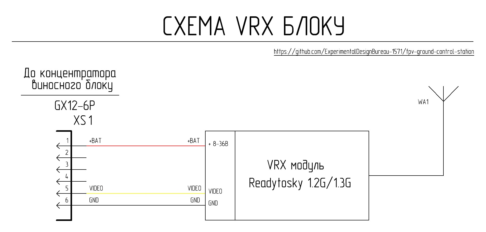

# Загальний опис

VRX блок на базі відеоприймача Readytosky 1.2–1.3 ГГц 9CH являє собою функціональний модуль який монтується на виносному блоці та призначений для прийому аналогових відеосигналів в діапазоні 1.2–1.3 ГГц з подальшою їх подачею в комутаційні лінії наземної станції.

## Короткі технічні параметри VRX блоку на базі відеоприймача Readytosky 1.2–1.3 ГГц 9CH

| Параметр | Значення | Примітка |
|----------|---------|---------|
| Вхідна напруга | АКБ 6S Li-ion/LiPo (Мін. 22.2В Макс. 25.2 В) | Живлення від концентратора виносного блоку |
| Діапазон частот | 1060 - 1380 МГц | 9 каналів (1080/1120/1160/1200/1240/1280/1320/1360/1258 МГц) |
| Керування | Ручне | Через штатний селектор каналів |
| Тип вихідного відеосигналу | Аналоговий композитний (CVBS) | |

### Інтерфейси

| Роз’єм | Призначення | Основні сигнали | Примітка |
|--------|------------|----------------|----------|
| XS1 (GX12-6) | Підключення до концентратора виносного блоку | +BAT, GND, CVBS |  |

## Схемотехніка та функціонал

Живлення VRX блоку здійснюється через роз’єм XS1 від шини +BAT концентратора виносного блоку. Вихідний CVBS сигнал відеоприймача через XS1 передається в комутаційні лінії наземної станції. Керування каналами здійснюється штатним селектором відеоприймача. VRX блок є функціонально завершеним модулем та не потребує модифікації внутрішньої схемотехніки.

## Перелік необхідних комплектуючих для виготовлення одного VRX блоку

| Найменування | Кількість| Примітка |
| :--- | :--- | :---: |
| Комплект відеоприймача Readytosky 1.2–1.3 ГГц 9 CH | 1 штука |  |
| Перехідник кутовий 90 SMA Female на SMA Male | 1 штука |  |
| Вилка блочна GX12-6 pin (male) | 1 штука | XS1 |
| Гвинт M2x18 DIN 7985 | 1 штука | Кріплення відеоприймача до Деталь 1 |
| Гайка M2 DIN 934 | 1 штука | Кріплення відеоприймача до Деталь 1 |
| Шуруп 2х8 DIN 7982 | 8 штук | Кріплення Деталь 2 та Деталь 3 до Деталь  |
| Деталь 1 - 3D друк | 1 штука |  |
| Деталь 2 - 3D друк | 1 штука |  |
| Деталь 3 - 3D друк | 1 штука |  |
| Деталь 4 - 3D друк | 1 штука |  |

## Налаштування 3Д-друку та використаний матеріал

| Параметр | Значення |
| :---: | :---: |
| Кількість периметрів | 4 |
| Суцільних шарів зверху і знизу | 5 |
| Щільність заповнення | 40% |
| Малюнок заповнення | Гіроїд |
| Підтримка | Деревоподібна |

Матеріал coPET black MonoFilament
