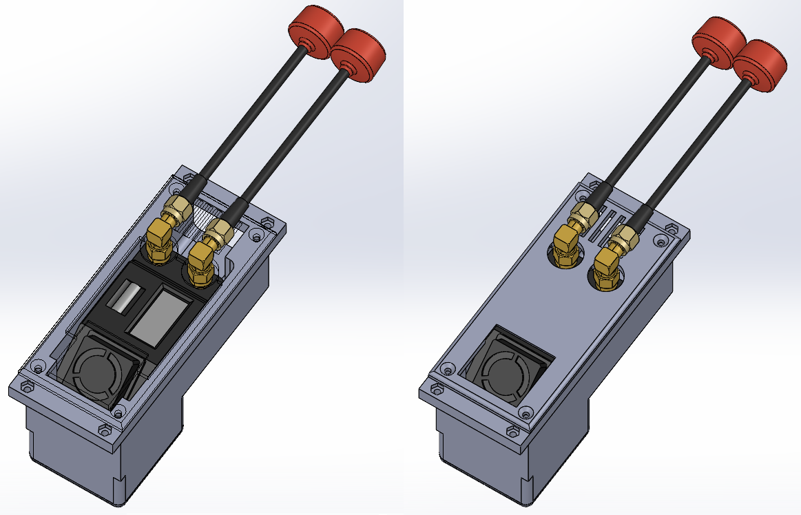
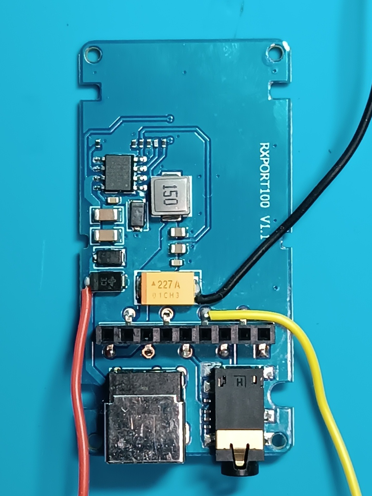

# Загальний опис

VRX блок на базі відеоприймача Skyzone SteadyView X 5G являє собою функціональний модуль який монтується на виносному блоці та призначений для прийому аналогових відеосигналів в діапазоні 4.9–5.9 ГГц з подальшою їх подачею в комутаційні лінії наземної станції. Для зменшення світлового випромінювання екрану можливо встановлювати маскувальну кришку. Зовнішній вигляд VRX блоку з маскувальною кришкою та без показано на наступному малюнку.

## Короткі технічні параметри VRX блоку на базі відеоприймача VRX Skyzone SteadyView X 5G

| Параметр | Значення | Примітка |
|----------|---------|---------|
| Вхідна напруга | АКБ 6S Li-ion/LiPo (Мін. 22.2В Макс. 25.2 В) | Живлення від концентратора виносного блоку |
| Діапазон частот | 4.9–5.9 ГГц |  |
| Керування | Ручне або віддалене | Через штатні органи керування або через ELRS Backpack |
| Тип вихідного відеосигналу | Аналоговий композитний (CVBS) | |

### Інтерфейси

| Роз’єм | Призначення | Основні сигнали | Примітка |
|--------|------------|----------------|----------|
| XS1 (GX12-6) | Підключення до концентратора виносного блоку | +BAT, GND, CVBS |  |

## Схемотехніка та функціонал

Живлення VRX блоку здійснюється через роз’єм XS1 від шини +BAT концентратора виносного блоку. Вихідний CVBS сигнал відеоприймача через XS1 передається в комутаційні лінії наземної станції. 

З’єднання відеоприймача з роз’ємом XS1 виконано за допомогою мідних дротів перерізу 26 AWG з силіконовою ізоляцією. Червоний дріт (+BAT) з’єднано з катодом супресора,  чорний дріт (GND)  з мінусовим виводом конденсатора, жовтий дріт (CVBS) з шостим виводом роз’єму плати RXPORT100 V1.1 відеоприймача Skyzone SteadyView X 5G.

Керування каналами здійснюється штатним органами керування відеоприймача або через ELRS Backpack.

## Перелік необхідних комплектуючих для виготовлення одного VRX блоку

| Найменування | Кількість| Примітка |
| :--- | :--- | :---: |
| Комплект відеоприймача VRX Skyzone SteadyView X 5G | 1 штука |  |
| Перехідник кутовий 90 SMA Female на SMA Male | 2 штуки |  |
| Вилка блочна GX12-6 pin (male) | 1 штука | XS1 |
| Двосторонній акриловий скотч 2 мм | 100 мм | Кріплення VRX Skyzone SteadyView X 5G до Деталь 1 |
| Шуруп 2х8 DIN 7982 | 8 штук | Кріплення Деталь 2 та Деталь 3 до Деталь 1 |
| Провід мідний 26 AWG з силіконовою ізоляцією чорний | 150 мм | VRX Skyzone SteadyView X 5G -> XS1 |
| Провід мідний 26 AWG з силіконовою ізоляцією червоний | 150 мм | VRX Skyzone SteadyView X 5G -> XS1 |
| Провід мідний 26 AWG з силіконовою ізоляцією жовтий | 150 мм | VRX Skyzone SteadyView X 5G -> XS1 |
| Деталь 1 - 3D друк | 1 штука |  |
| Деталь 2 - 3D друк | 1 штука |  |
| Деталь 3 - 3D друк | 1 штука |  |

## Налаштування 3Д-друку та використаний матеріал

| Параметр | Значення |
| :---: | :---: |
| Кількість периметрів | 4 |
| Суцільних шарів зверху і знизу | 5 |
| Щільність заповнення | 40% |
| Малюнок заповнення | Гіроїд |
| Підтримка | Деревоподібна |

Матеріал coPET black MonoFilament
