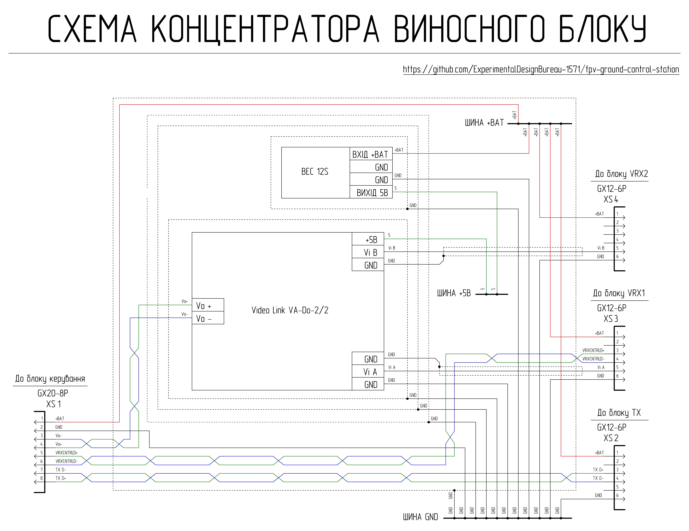
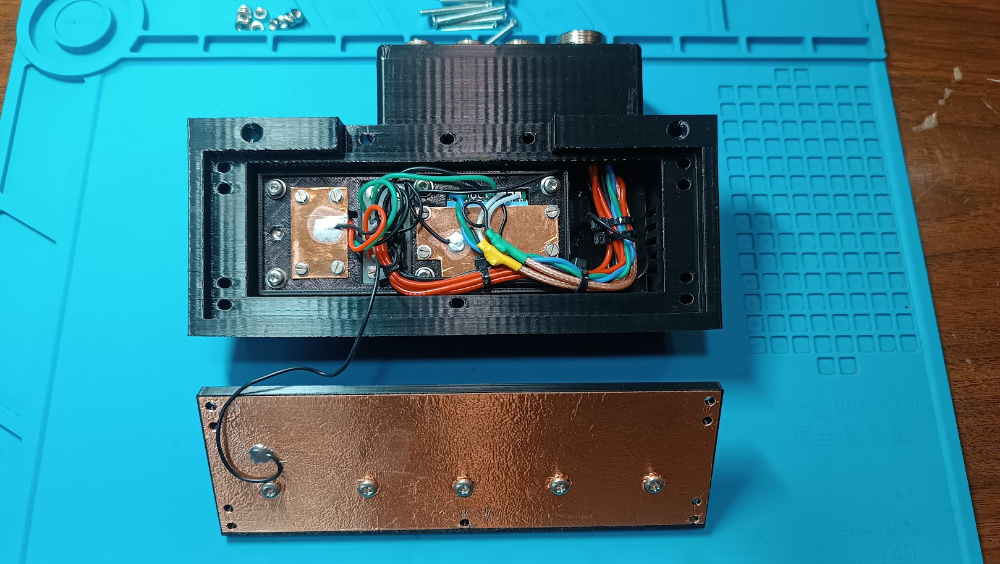

# Загальний опис

Концентратор виносного блоку забезпечує розподіл живлення, концентрацію та комутацію сигналів периферійних пристроїв виносного блоку.

## Короткі технічні параметри концентратора виносного блоку

| Параметр | Значення | Примітка |
| :--- | :--- | :---: |
| Вхідна напруга | АКБ 6S Li-ion/LiPo (Мін. 22.2В Макс. 25.2 В) | Живлення через роз'єм XS1 від блоку керування станцією |
| Шина живлення | +BAT | Пряма від АКБ блоку керування станцією |
| Допоміжна шина | +5 В | Формується DC-DC перетворювачем |
| Кількість відеовходів | 2 | XS3, XS4 |
| Тип вхідного відеосигналу | CVBS | Аналоговий композитний сигнал |
| Тип вихідного відеосигналу | Диференційний | Перетворення та підсилення сигналу модулем VA-Do-2/2 з подальшою передачею по звитій парі |
| Вибір відеовходу | Віддалений | Комутація зі сторони блоку керування станцією |
| Керування VRX | Підтримується | Через Backpack ELRS (відеовходи XS3 або XS4) або дротове підключення (тільки для XS3) |
| Інтерфейс TX | Цифровий (диференційний) | XS2 передача даних через звиту пару  |
| Захист по живленню | TVS-діод | Захист від індуктивних викидів та перенапруги |
| Охолодження | Пасивне | Мідні радіатори + вентиляційні отвори |
| Екранування | Є | Мідні екрани |

### Інтерфейси

| Роз’єм | Призначення | Основні сигнали | Примітка |
| :--- | :--- | :---: | :---: |
| XS1 (GX20-8) | Підключення до блоку керування | +BAT, GND, диференційні лінії | Живлення та обмін сигналами |
| XS2 (GX12-6) | Підключення TX блоку | +BAT, GND, диференційна лінія | |
| XS3 (GX12-6) | Відеовхід 1, підключення VRX1 | +BAT, GND, CVBS, диференційна лінія | Перший відеовхід, підтримує керування через звиту пару |
| XS4 (GX12-6) | Відеовхід 2, підключення VRX2 | +BAT, GND, CVBS | Додатковий відеовхід |

## Схемотехніка та функціонал концентратора виносного блоку

Живлення концентратора виносного блоку здійснюється через роз’єм XS1, куди надходить напруга з блоку керування станцією що живиться від Li-ion/LiPo АКБ 6S3P. З роз’єму XS1 живлення подається на шину GND та шину +BAT, звідки розгалужується на роз’єми XS2, XS3, XS4 для живлення периферійних пристроїв та перетворювача напруги який формує напругу для шини +5В від якої живиться відеопідсилювач. Для захисту периферійних пристроїв виносного блоку від перехідних процесів в лінії якою він підключений до блоку керування станцією, що викликані її індуктивною складовою, застосовано напівпровідниковий обмежувач напруги типу 1.5KE33A. 

До роз’єму XS2 підключається блок TX, обмін інформацією між ним та блоком керування станцією здійснюється через звиту пару.

До роз’ємів XS3 та XS4 підключаються VRX блоки або інше джерело відеосигналу. Композитний відеосигнал з роз’ємів XS3 та XS4 надходить на відеопісилювач, який  перетворює композитний сигнал в диференційний, та через звиту пару передає його на блок керування станцією, де він розгалужується після зворотного перетворення на периферійні відеопристрої блоку керування станцією. Вибір активного відеовходу XS3 або XS4 здійснюється зі сторони блоку керування станцією. Відеовхід XS3 має можливість додаткового обміну інформацією з блоком керування станцією через звиту пару для віддаленого керування відеоприймачем.  

Стабільність температурного режиму відеопідсилювача та перетворювача напруги забезпечується мідними радіаторами охолодження та вентиляційними отворами в корпусі концентратора виносного блоку. Мідні радіатори з’єднані з шиною загального проводу GND та разом з бічним екраном плати концентратора та екраном на кришці концентратора, які також з’єднані з шиною загального проводу GND мінімізують паразитні наведення на відеопідсилювач. 

Концентратор виносного блоку має доволі високу щільність монтажу та передбачає роботу з різними рівнями напруги. Для успішної збірки пристрою необхідні навички читання принципових схем та досвід виконання монтажних робіт середньої складності.

## Перелік необхідних комплектуючих для виготовлення одного концентратора виносного блоку

| Найменування | Кількість| Примітка |
| :--- | :--- | :---: |
| Відеопідсилювач VideoLink VA-Do-2/2 | 1 штука | Модуль Українського виробництва |
| Перетворювач напруги GUTI ELECTRONICS mBEC12S | 1 штука | Український аналог Matek BEC 12S |
| Вилка блочна GX20-8 pin (male) | 1 штука | XS1 |
| Вилка блочна GX12-6 pin (male) | 3 штуки | XS2-XS4 |
| Фольгований склотекстоліт односторонній 1.5 мм | 34 мм х 16 мм | Плата шин живлення |
| Супресор 1.5KE33A DO201AD | 1 штука | |
| Самоклеюча мідна стрічка (ширина 50 мм; товщина 0,05 мм) | 156 мм | Екран кришки концентратора виносного блоку |
| Самоклеюча мідна стрічка (ширина 8 мм; товщина 0,05 мм) | 286 мм | Бічний екран плати концентратора |
| Листова мідь товщиною 0.8 мм | 100 мм х 38 мм | Великий радіатор плати концентратора |
| Листова мідь товщиною 0.8 мм | 30 мм х 19 мм | Радіатор перетворювача напруги |
| Листова мідь товщиною 0.8 мм | 48 мм х 26 мм | Радіатор відеопідсилювача |
| Силіконова термопрокладка 1 мм 6W\m.k | 18 мм х 16 мм | Відведення тепла від перетворювача напруги на великий радіатор плати концентратора |
| Силіконова термопрокладка 1.5 мм 6W\m.k | 18 мм х 16 мм | Відведення тепла від перетворювача напруги на його радіатор |
| Силіконова термопрокладка 2 мм 6W\m.k | 30 мм х 27 мм - 2 штуки | Відведення тепла від відеопідсилювача на великий радіатор плати концентратора |
| Силіконова термопрокладка 1.5 мм 6W\m.k | 27 мм х 27 мм | Відведення тепла від відеопідсилювача на його радіатор |
| Провід мідний 20 AWG з силіконовою ізоляцією чорний | 810 мм |  |
| Провід мідний 20 AWG з силіконовою ізоляцією червоний | 810 мм |  |
| Провід мідний 26 AWG з силіконовою ізоляцією чорний | 120 мм |  |
| Провід мідний 26 AWG з силіконовою ізоляцією червоний | 60 мм |  |
| Провід мідний 26 AWG з силіконовою ізоляцією зелений | 410 мм |  |
| Провід мідний 26 AWG з силіконовою ізоляцією синій | 290 мм |  |
| Провід мідний 28 AWG з силіконовою ізоляцією чорний | 680 мм |  |
| Коаксіальний кабель RG-316 | 500 мм |  |
| Гвинт M2x6 DIN 7985 | 4 штуки |  |
| Гвинт M2x8 DIN 7985 | 11 штук |  |
| Шайба M2 DIN 125 | 15 штук |  |
| Гайка M2 DIN 934 | 15 штук |  |
| Гвинт M3x18 DIN 7985 A2 | 6 штук |  |
| Гвинт M3x20 DIN 7985 A2 | 5 штук |  |
| Гвинт M3x25 DIN 965 | 3 штуки |  |
| Гвинт M3x30 DIN 965 | 5 штук |  |
| Гвинт M3x40 DIN 965 | 3 штуки |  |
| Шайба M3 DIN 125 | 12 штук |  |
| Шайба M3 DIN 9021 | 5 штук |  |
| Гайка M3 DIN 934 | 22 штуки |  |
| Гайка баранцева M3 DIN 315 | 5 штук |  |
| Деталь 1 - 3D друк | 1 штука |  |
| Деталь 2 - 3D друк | 1 штука |  |
| Деталь 3 - 3D друк | 1 штука |  |
| Деталь 4 - 3D друк | 1 штука |  |

## Налаштування 3Д-друку та використаний матеріал

| Параметр | Значення |
| :---: | :---: |
| Кількість периметрів | 4 |
| Суцільних шарів зверху і знизу | 5 |
| Щільність заповнення | 40% |
| Малюнок заповнення | Гіроїд |
| Підтримка | Деревоподібна |

Матеріал coPET black MonoFilament

## Деталізація по витраті метизів

| Найменування | Тип/Розмір | Кількість | Примітка |
| :--- | :--- | :---: | :---: |
| Гвинт | M3x25 DIN 965 | 3 штуки | Кріплення кришки блоку роз'ємів концентратора |
| Гвинт | M3x40 DIN 965 | 3 штуки | Кріплення кришки блоку роз'ємів концентратора |
| Гайка | M3 DIN 934 | 6 штук | Кріплення кришки блоку роз'ємів концентратора |
| Гвинт | M2x8 DIN 7985 | 3 штуки | Кріплення великого радіатора до плати концентратора |
| Шайба | M2 DIN 125 | 3 штуки | Кріплення великого радіатора до плати концентратора |
| Гайка | M2 DIN 934 | 3 штуки | Кріплення великого радіатора до плати концентратора |
| Гвинт | M2x8 DIN 7985 | 4 штуки | Кріплення радіатора модуля VA-Do-2/2 до плати концентратора |
| Шайба | M2 DIN 125 | 4 штуки | Кріплення радіатора модуля VA-Do-2/2 до плати концентратора |
| Гайка | M2 DIN 934 | 4 штуки | Кріплення радіатора модуля VA-Do-2/2 до плати концентратора |
| Гвинт | M2x8 DIN 7985 | 4 штуки | Кріплення радіатора перетворювача напруги mBEC 12S до плати концентратора |
| Шайба | M2 DIN 125 | 4 штуки | Кріплення радіатора перетворювача напруги mBEC 12S до плати концентратора |
| Гайка | M2 DIN 934 | 4 штуки | Кріплення радіатора перетворювача напруги mBEC 12S до плати концентратора |
| Гвинт | M2x6 DIN 7985 | 4 штуки | Кріплення плати шин живлення до плати концентратора |
| Шайба | M2 DIN 125 | 4 штуки | Кріплення плати шин живлення до плати концентратора |
| Гайка | M2 DIN 934 | 4 штуки | Кріплення плати шин живлення до плати концентратора |
| Гвинт | M3x18 DIN 7985 A2 | 6 штуки | Кріплення плати концентратора до основи |
| Шайба | M3 DIN 125 | 12 штук | Кріплення плати концентратора до основи (під один гвинт 2 шайби) |
| Гайка | M3 DIN 934 | 6 штук | Кріплення плати концентратора до основи |
| Гвинт | M3x30 DIN 965 | 5 штук | Кріплення кришки концентратора |
| Гайка | M3 DIN 934 | 5 штук | Кріплення кришки концентратора |
| Гвинт | M3x20 DIN 7985 A2 | 5 штук | Додаткове кріплення в кришці концентратора |
| Шайба | M3 DIN 9021| 5 штук | Додаткове кріплення в кришці концентратора |
| Гайка | M3 DIN 934 | 5 штук | Додаткове кріплення в кришці концентратора |
| Гайка баранцева | M3 DIN 315 | 5 штук | Додаткове кріплення в кришці концентратора |

## Деталізація по витраті проводу

XS1
| Тип | Довжина | Примітка |
| :--- | :--- | :---: |
| 20 AWG чорний | 170 мм | XS1 - шина GND плати концентратора |
| 20 AWG червоний | 170 мм | XS1 - шина +BAT плати концентратора |
| 26 AWG зелений | 150 мм | XS1 - VA-Do-2/2 |
| 26 AWG синій | 150 мм | XS1 - VA-Do-2/2 |
| 26 AWG зелений | 60 мм | XS1 - XS2 |
| 26 AWG синій | 60 мм | XS1 - XS2 |
| 26 AWG зелений | 80 мм | XS1 - XS3 |
| 26 AWG синій | 80 мм | XS1 - XS3 |

XS2
| Тип | Довжина | Примітка |
| :--- | :--- | :---: |
| 20 AWG чорний | 190 мм | XS2 - шина GND плати концентратора |
| 20 AWG червоний | 190 мм | XS2 - шина +BAT плати концентратора |

XS3
| Тип | Довжина | Примітка |
| :--- | :--- | :---: |
| 20 AWG чорний | 220 мм | XS3 - шина GND плати концентратора |
| 20 AWG червоний | 220 мм | XS3 - шина +BAT плати концентратора |
| RG-316 |250 мм | XS3 - VA-Do-2/2 |

XS4
| Тип | Довжина | Примітка |
| :--- | :--- | :---: |
| 20 AWG чорний | 230 мм | XS4 - шина GND плати концентратора |
| 20 AWG червоний | 230 мм | XS4 - шина +BAT плати концентратора |
| RG-316 |250 мм | XS3 - VA-Do-2/2 |

Перетворювач напруги mBEC 12S
| Тип | Довжина | Примітка |
| :--- | :--- | :---: |
| 26 AWG чорний | 60 мм | mBEC 12S - шина GND плати концентратора |
| 26 AWG червоний | 60 мм | mBEC 12S - шина +BAT плати концентратора |
| 26 AWG зелений | 60 мм | mBEC 12S - шина +5В плати концентратора |

Модуль VA-Do-2/2
| Тип | Довжина | Примітка |
| :--- | :--- | :---: |
| 26 AWG чорний | 60 мм | VA-Do-2/2 - шина GND плати концентратора |
| 26 AWG зелений | 60 мм | VA-Do-2/2 - шина +5В плати концентратора |
| 28 AWG чорний | 50 мм | VA-Do-2/2 - екран кабелю RG-316 від XS3 |
| 28 AWG чорний | 50 мм | VA-Do-2/2 - екран кабелю RG-316 від XS4 |

Радіатори та екрани
| Тип | Довжина | Примітка |
| :--- | :--- | :---: |
| 28 AWG чорний | 170 мм | Великий радіатор плати концентратора - шина GND плати концентратора |
| 28 AWG чорний | 60 мм | Радіатор молуля VA-Do-2/2 - шина GND плати концентратора |
| 28 AWG чорний | 60 мм | Радіатор перетворювача напруги mBEC 12S - шина GND плати концентратора |
| 28 AWG чорний | 120 мм | Боковий екран плати концентратора - шина GND плати концентратора |
| 28 AWG чорний | 170 мм | Фронтальний екран на кришці концентратора - шина GND плати концентратора |
