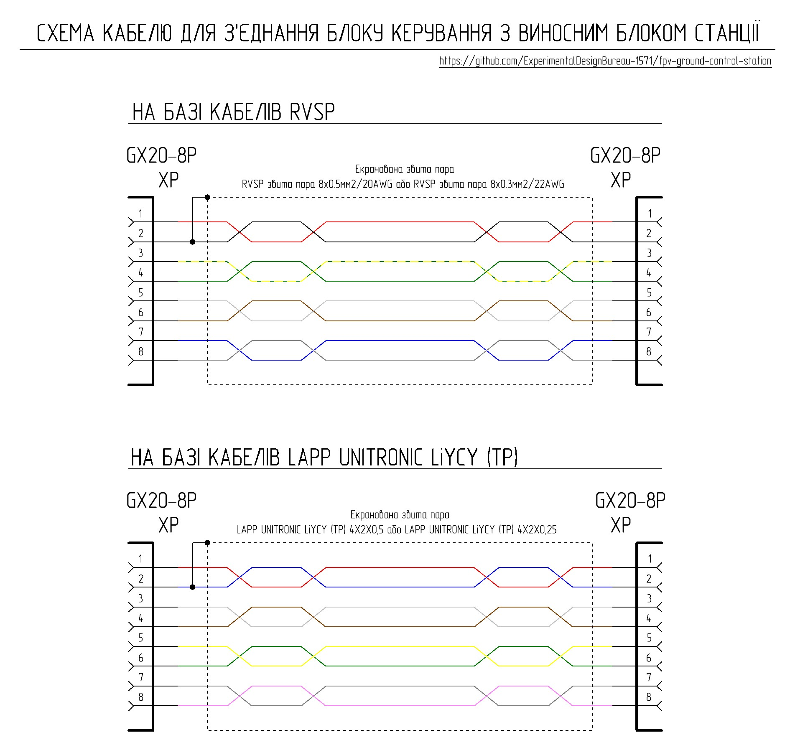
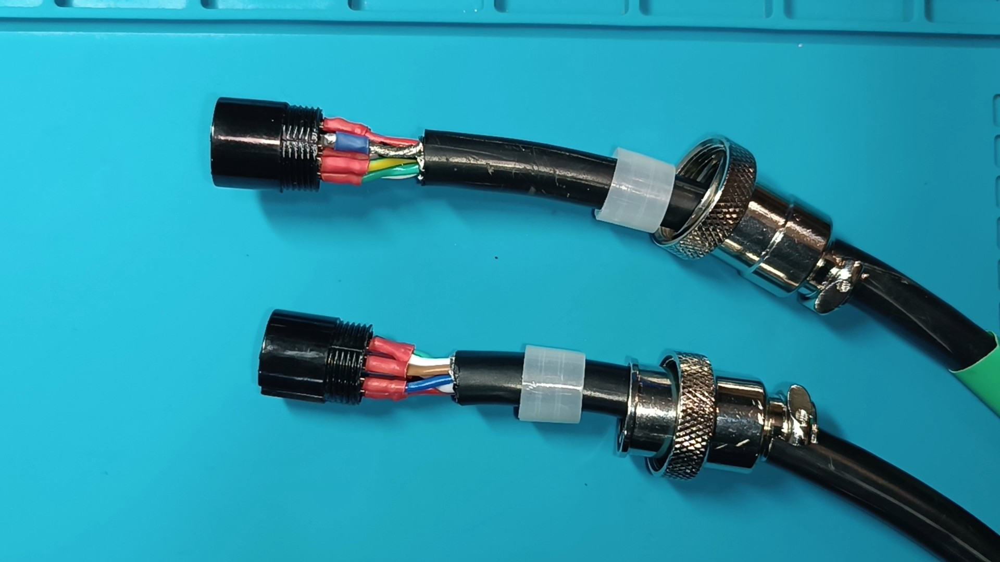
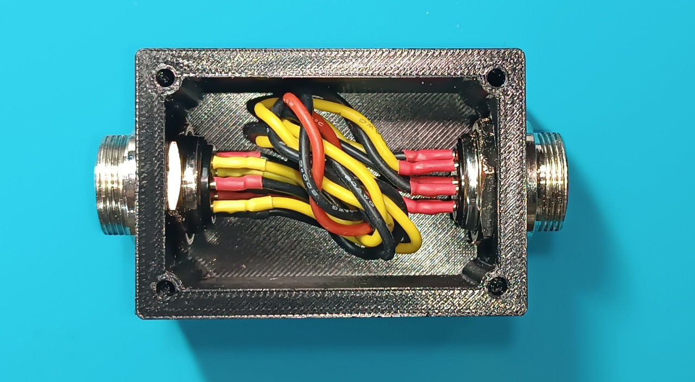
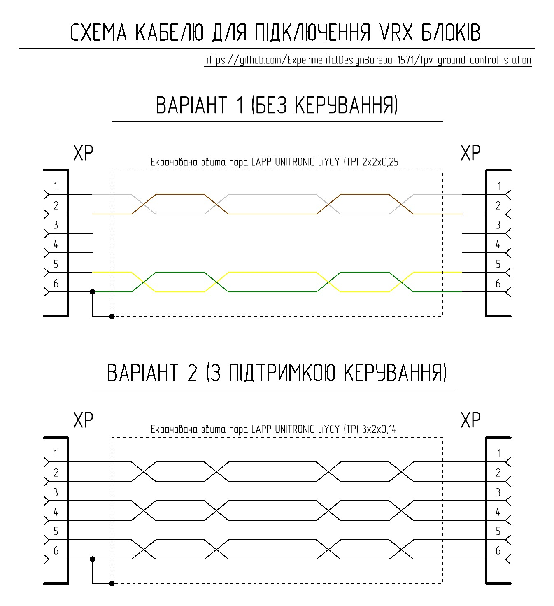
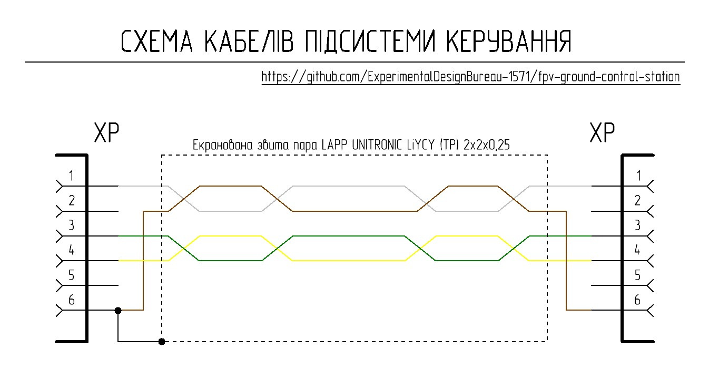

# Загальний опис 

Для з’єднання блоку керування з виносним блоком станції, а також підключення до них периферійних пристроїв використовуються кабелі, що виготовленні з екранованої багатожильної мідної звитої пари.

## Комплект 1

Цей комплект призначений для з’єднання між собою блоку керування та виносного блоку станції. Штатний кабель має довжину 2 метри та в транспортному положенні розміщується в корпусі станції. В залежності від поставлених задач, комплект може бути доповнений додатковими кабелями, наприклад кабелем 5-8 метрів для роботи з ретранслятором з укриття, та 25-50 метрів при стаціонарному режимі роботи з укриття. 

Початок штатного кабелю підключається до блоку керування, а його кінець до концентратора виносного блоку станції.

Для з’єднання штатного кабелю з додатковим, використовується з’єднувач кабелів, при цьому кінець штатного кабелю підключається до одного роз’єму з’єднувача,  а початок додаткового кабелю до другого роз’єму з’єднувача, кінець додаткового кабелю підключається до концентратора виносного блоку станції відповідно.

В разі відсутності з’єднувача, додатковий кабель підключається до блоку керування напряму замість штатного кабелю. 

При виготовлені кабелів можна застосовувати наступні типи кабелів:
<ul>
<li>RVSP звита пара 8х0.5мм2/20AWG</li>
<li>RVSP звита пара 8х0.3мм2/22AWG</li>
<li>LAPP UNITRONIC LiYCY (TP) 4X2X0,5</li>
<li>LAPP UNITRONIC LiYCY (TP) 4X2X0,25</li>
</ul>
Довжина кабельної лінії залежить від типу кабелю, для кабелів з  перерізом 0,5 мм2 максимальна довжина кабельної лінії не більше 50 метрів, для кабелів з перерізом 0,25-0,3 мм2 максимальна довжина кабельної лінії не більше 25 метрів. 

### Зверніть увагу! 
<ul>
<li>При виготовленні кабелів, з’єднання екрану кабелю з загальним проводом на роз’ємі здійснюється тільки з однієї сторони для запобігання виникненню земляної петлі. </li>
<li>Початок кабелю позначається термозбіжною стрічкою.</li>
<li>При використанні кабелів з перерізом 0,5 мм2 вхідний отвір корпусів роз’ємів необхідно розточити надфілем до діаметру використаного кабелю.</li>
</ul>

### Перелік необхідних комплектуючих для виготовлення одного штатного кабелю

| Найменування | Кількість| Примітка |
| :--- | :--- | :---: |
| RVSP звита пара 8х0.5мм2/20AWG або RVSP звита пара 8х0.3мм2/22AWG або LAPP UNITRONIC LiYCY (TP) 4X2X0,5 або LAPP UNITRONIC LiYCY (TP) 4X2X0,25 | 2 метри |  |
| Розетка кабельна GX20-8 pin (female) | 2 штуки |  |

## З’єднувач кабелів комплекту 1

Конструктивно з’єднувач виконано в невеликому корпусі, в якому розміщено роз’єми що з’єднані між собою за відповідною електричною схемою.

### Перелік необхідних комплектуючих для виготовлення одного з'єднувача

| Найменування | Кількість| Примітка |
| :--- | :--- | :---: |
| Вилка блочна GX20-8 pin (male) | 2 штуки |  |
| Провід мідний 20 AWG з силіконовою ізоляцією червоний | 110 мм  |  |
| Провід мідний 20 AWG з силіконовою ізоляцією чорний | 440 мм  |  |
| Провід мідний 20 AWG з силіконовою ізоляцією жовтий | 330 мм  |  |
| Гвинт M3x40 DIN 965 | 4 штуки |  |
| Гайка M3 DIN 934 | 4 штуки  |  |
| Деталь 1 - 3D друк | 1 штука  |  |
| Деталь 2 - 3D друк | 1 штука   |  |

## Комплект 2

Цей комплект призначений для підключення периферійних пристроїв до блоку керування та виносного блоку станції. До його складу входять:
<ul>
<li>кабелі для підключення VRX блоків (жовта термозбіжна стрічка)</li>
<li>кабелі підсистеми керування (синя термозбіжна стрічка)</li>
</ul>

## Кабелі для підключення VRX блоків

В залежності від конфігурації станції можуть застосовуватися два варіанти кабелів, що відрізняються можливістю передачі сигналів керування до VRX блоку. В разі якщо керування VRX блоком здійснюється в ручному режимі, або через ELRS Backpack, то використовується кабель першого варіанту. В разі якщо керування здійснюється через комутаційні лінії наземної станції, то використовується кабель другого варіанту. Початок кабелю підключається до концентратора виносного блоку, кінець кабелю до VRX блоку.

### Зверніть увагу! 
<ul>
<li>При виготовлені кабелів, з’єднання екрану кабелю з загальним проводом на роз’ємі здійснюється тільки з однієї сторони для запобігання виникненню земляної петлі.</li>
<li>Початок кабелю позначається термозбіжною стрічкою, при цьому колір термозбіжної стрічки також вказує на тип кабелю (жовтий колір – для підключення  VRX блоків).</li>
<li>При виготовленні кабелів, вхідний отвір корпусів роз’ємів необхідно розточити надфілем до діаметру використаного кабелю.</li>
</ul>

### Перелік необхідних комплектуючих для виготовлення одного кабелю для підключення VRX блоку

| Найменування | Кількість| Примітка |
| :--- | :--- | :---: |
| LAPP UNITRONIC LiYCY (TP) 2x2x0,25 або LAPP UNITRONIC LiYCY (TP) 3x2x0,14 | 120 мм |  |
| Розетка кабельна GX12-6 pin (female) | 2 штуки |  |

## Кабелі підсистеми керування

Цей тип кабелів використовується для підключення JR-модуля для пульта керування (довгий кабель) та блоку TX (короткий кабель).  Початок кабелю що з’єднує JR-модуль для пульта керування з блоком керування станцією підключається до блоку керування, а кінець до JR-модуля. Початок кабелю що з’єднує блок TX з концентратором виносного блоку підключається до концентратора, а кінець до блоку TX.

### Зверніть увагу! 
<ul>
<li>При виготовлені кабелів, з’єднання екрану кабелю з загальним проводом на роз’ємі здійснюється тільки з однієї сторони для запобігання виникненню земляної петлі.</li> 
<li>Початок кабелю позначається термозбіжною стрічкою, при цьому колір термозбіжної стрічки також вказує на тип кабелю (синій колір - кабелі підсистеми керування).</li>
<li>При виготовленні кабелів, вхідний отвір корпусів роз’ємів необхідно розточити надфілем до діаметру використаного кабелю.</li>
</ul>

### Перелік необхідних комплектуючих для виготовлення одного комплекту кабелів підсистеми керування

| Найменування | Кількість| Примітка |
| :--- | :--- | :---: |
| LAPP UNITRONIC LiYCY (TP) 2x2x0,25 | 1120 мм | 1000 мм - довгий кабель, 120 мм - короткий кабель |
| Розетка кабельна GX12-6 pin (female) | 4 штуки |  |
