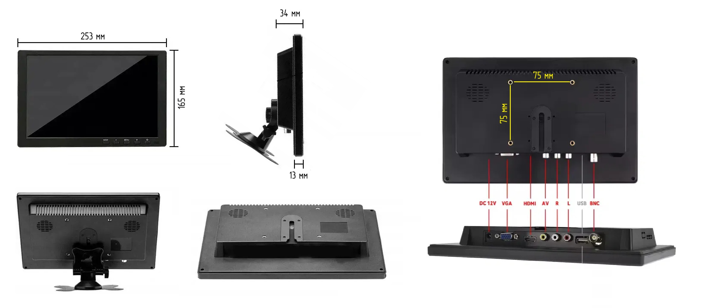
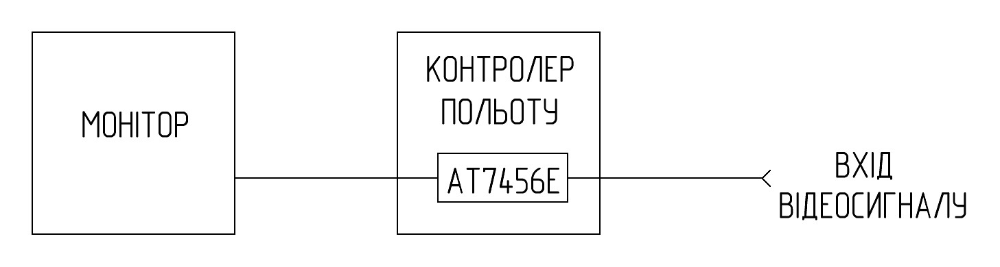

# Загальний опис

В якості штатного пристрою відображення інформації в наземній станції використано універсальний монітор з діагоналлю екрану 10,2 дюйми. Використання такого типу монітора аргументовано його широкою доступністю як за наявністю так і за ціною, а також сукупністю його технічних характеристик. Доступні моделі як з аналоговим відеовходом, так і з додатковими входами, серед яких є цифровий HDMI вхід. Використання в наземній станції монітора з додатковим цифровим відеовходом HDMI розширює можливості використання, наприклад можливо підключати напряму до монітора модулі на кшталт Walksnail Avatar VRX та Walksnail Ascent VRX, або одноплатні ЕОМ на кшталт Raspberry Pi.

Цей монітор має режим «синього екрану» який вмикається якщо на активному відеовході відсутній відеосигнал або має значні спотворення. При використанні цифрового відеовходу HDMI це не відіграє ніякої ролі, але при використанні аналогового відеовходу можливість бачити картинку крізь шуми критично важлива. 

## Модернізація монітору – теоретична інформація

Вирішити проблему «синього екрану» можливо незначною модернізацією монітору, яка полягає в додатковій обробці відеосигналу мікросхемою AT7456E. Щоб максимально спростити процес модернізації використовується контролер польоту де вона вже встановлена зі всією обв’язкою. Доцільність використання саме контролеру польоту аргументується їх широкою доступністю в будь-якій польовій майстерні. 

Як це працює:
Мікросхема AT7456E  постійно генерує власний відеосигнал із еталонною амплітудою синхроімпульсів. Вихідний сигнал відеоприймача проходить обробку мікросхемою AT7456E. 

Для монітора такий сигнал завжди виглядає «правильним». Навіть якщо картинка з дрона забита шумами або майже чи повністю зникла, монітор не переходить в режим «синього екрану»

Результат: бачимо картинку до останнього без переходу монітора в «синій екран», що критично важливо при сильних завадах.

## Модернізація монітору – практична реалізація

Практична реалізація полягає в монтажі наступної схеми

Конструктивно контролер польоту розміщується всередені корпусу монітора та кріпиться за допомогою гвинтів та гайок М3. 

Враховуючи роботу в замкненому просторі, бажано для стабілізації температурних режимів мікросхеми AT7456E та мікроконтролера контролера польоту використати мідний радіатор, відведення тепла на який відбувається через силіконовий термоінтерфейс. 

Мідний радіатор з’єднується з загальним проводом, та утворює додаткове екранування мікросхеми AT7456E. З’єднання екрану кабелю UL2547 4х0.3мм2 (22AWG) з загальним проводом виконується лише зі сторони роз’єму для запобіганню виникнення земляної петлі. 

  

### Додаткова важлива інформація: обов’язково встановіть стандарт PAL в налаштуваннях монітора, OSD меню контролеру польоту та в налаштуваннях вихідного сигналу камери. Для додаткового контролю напруги шини +12В по якій живиться монітор, в налаштуваннях OSD меню контролера польоту можна налаштувати відображення цієї напруги. Враховуючи умови експулатації, екран бажано захистити гідрогелевою плівкою, що зручно зробити коли монітор розібраний.

## Перелік необхідних комплектуючих для модернізації одного монітору

| Найменування | Кількість | Примітка |
|:---: | :---: | :---: |
| Контролер польоту з AT7456E | 1 штука |  | 
| Демпферна стійка для контролеру польоту М3*8 мм | 4 штуки |  | 
| Демпферна стійка для контролеру польоту М3*4 мм | 4 штуки |  | 
| Гвинт M3x18 DIN 7985 A2 | 4 штуки | Кріплення контролеру польоту та радіатора охолодження до корпусу монітора | 
| Гайка M3 DIN 934 | 4 штуки | Кріплення контролеру польоту та радіатора охолодження до корпусу монітора | 
| Силіконова термопрокладка 4 мм 3.5W\m.k | 25 мм х 20 мм | Відведеня тепла від мікросхем AT7456E та STM32 на мідний радіатор | 
| Листова мідь товщиною 0.8 мм | 37.5 мм х 37.5 мм | Радіатор охолодження | 
| Провід мідний 26 AWG з силіконовою ізоляцією чорний | 310 мм | кабель  UL2547 -> FC = 120 мм ; FC -> монітор = 210 мм | 
| Провід мідний 26 AWG з силіконовою ізоляцією жовтий | 330 мм | FC -> монітор = 210 мм ; FC -> мідний радіатор = 100 мм |
| Провід мідний 26 AWG з силіконовою ізоляцією червоний | 100 мм | монітор -> FC |
| Кабель мідний екранований UL2547 4х0.3мм2 (22AWG)  | 365 мм |  |
| Розетка кабельна GX12-6 pin (female)  | 1 штука |  |
| Гідрогелева плівка для захисту монітору  | 225 мм х 128 мм |  |
