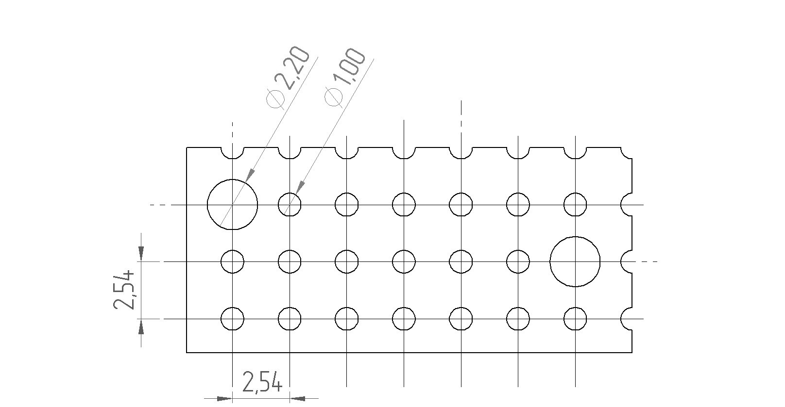

### Інструкція з виготовлення контактної плати

Для монтажу роз'єму PCE-C-05 (XS1) та дротів використовується заготовка, виготовлена зі стандартної двосторонньої макетної плати (крок сітки **2,54 мм**, базовий розмір **30х70 мм**).

**Процес підготовки:**

* **Розмітка та відрізання:** необхідно відрізати фрагмент макетної плати розміром **3 х 7 монтажних отворів**
* **Підготовка кріплень:** два монтажні отвори (згідно з кресленням) необхідно розсвердлити до діаметру **2,20 мм**
* **Призначення:** збільшені отвори дозволяють надійно закріпити плату до основи модуля за допомогою гвинтів **М2**
