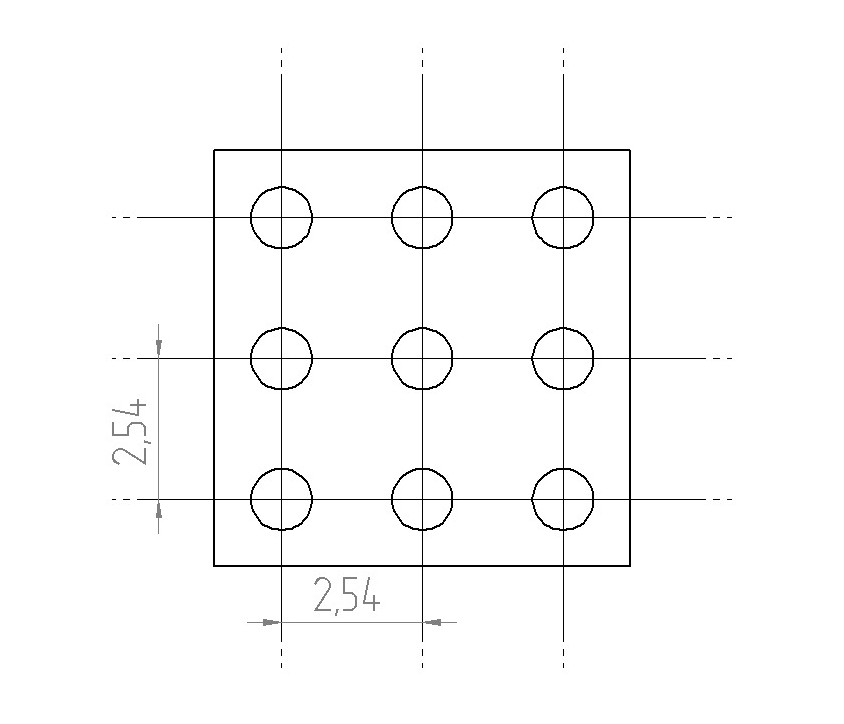

### Інструкція з виготовлення плати адаптера

Для монтажу довгих та коротких пінів, що утворюють роз'єм XS1 використовується заготовка, виготовлена зі стандартної двосторонньої макетної плати (крок сітки **2,54 мм**, базовий розмір **30х70 мм**).

**Процес підготовки:**

* **Розмітка та відрізання:** необхідно відрізати фрагмент макетної плати розміром **3 х 3 монтажних отворів**
* **Підгонка під розмір:** за допомогою надфілю необхідно підігнати розмір плати адаптера таким чином, щоб вона входила в передбачений для неї технологіний отвір основи блоку
