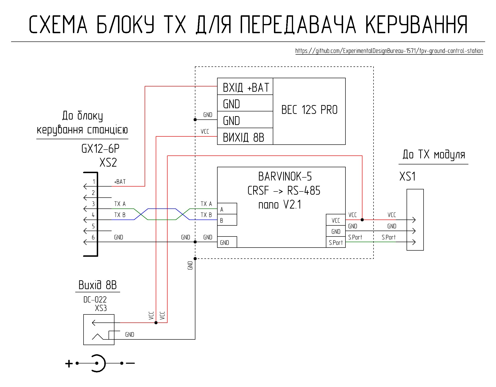

# Загальний опис

Блок ТХ забезпечує можливість підключення JR-сумісного модуля передавача керування до концентратора виносного блоку для подальшого двостороннього обміну інформацією з пультом керування що підключено до блоку керування станцією. Загальний вигляд блоку ТХ з встановленним передавачем керування показано на картинці.

## Схемотехніка та функціонал блоку ТХ для передавача керування

Живлення блоку ТХ здійснюється від концентратора виносного блоку. Напруга з роз’єму XS2 надходить на шину загального проводу, в якості якої використано мідний радіатор охолодження та на перетворювач наруги, який формує напругу 8В для живлення конвертора інтерфейсів та передавача керування (переконайтеся, що ваш ТХ-модуль підтримує живлення 8В). Напруга 8В додатково виведена на роз’єм XS3 для можливості подачі живлення на потужні передавачі керування які потребують зовнішнього живлення. Зверніть увагу, потужний передавач керування в разі живлення від роз’єму XS3 не повинен мати електричного контакту з піном GND роз’єму XS1 для унеможливлення виникнення земляної петлі.

Двосторонній обмін інформацією між передавачем керування та пультом керування здійснюється за стандартом RS-485 через комутаційні лінії наземної станції. Сигнали керування через роз’єм XS2 надходять на конвертер інтерфейсів (модуль BARVINOK-5 RS-485 nano V2) який перетворює диференційний сигнал стандарту RS-485 в високошвидкісний сигнал протоколу CRSF та через пін S.Port роз’єму XS1 подає його на передавач керування. 

Стабілізацію температурних режимів пристрою забезпечує пасивна система охолодження, що складається з вентиляційних отворів у корпусі, силіконової термопрокладки та мідного радіатора. Мідний радіатор використано в якості шини загального проводу (GND), що дозволяє йому виконувати функцію додаткового екрана для захисту від електромагнітних завад.

## Перелік необхідних комплектуючих для виготовлення одного блоку ТХ

| Найменування | Кількість| Примітка |
| :--- | :--- | :---: |
| Модуль конвертора інтерфейсів BARVINOK-5 RS-485 nano V2 | 1 штука | Модуль Українського виробництва |
| Перетворювач напруги GUTI ELECTRONICS BEC12S-PRO | 1 штука | Український аналог Matek BEC 12S PRO |
| Вилка блочна GX12-6 pin (male) | 1 штука | XS2 |
| Роз'єм живлення DC-022 | 1 штука | XS3 |
| Штирьова лінійка 1х40 крок 2.54мм L=25мм | 3 піни | |
| Штирьова лінійка 1х40 крок 2.54мм L=15мм | 3 піни | |
| Макетна плата під пайку двостороння з кроком 2,54 мм | 30 мм х 70 мм |  |
| Самоклеючий електроізоляційний папір 0,2 мм | 30 мм х 30 мм |  |
| Листова мідь товщиною 0.8 мм | 26 мм х 57 мм |  |
| Силіконова термопрокладка 2 мм 6W\m.k | 26 мм х 57 мм |  |
| Провід мідний 20 AWG з силіконовою ізоляцією червоний | 200 мм |  |
| Провід мідний 20 AWG з силіконовою ізоляцією чорний | 250 мм |  |
| Провід мідний 26 AWG з силіконовою ізоляцією червоний | 100 мм |  |
| Провід мідний 26 AWG з силіконовою ізоляцією чорний | 50 мм |  |
| Провід мідний 26 AWG з силіконовою ізоляцією зелений | 80 мм |  |
| Провід мідний 26 AWG з силіконовою ізоляцією синій | 80 мм |  |
| Гвинт M3x8 DIN 965 | 2 штуки |  |
| Гайка M3 DIN 934 | 2 штуки |  |
| Гвинт M2x10 DIN 7985 | 12 штук |  |
| Шайба M2 DIN 125 | 12 штук |  |
| Гайка M2 DIN 934 | 12 штук |  |
| Деталь 1 - 3D друк | 1 штука |  |
| Деталь 2 - 3D друк | 1 штука |  |

## Налаштування 3Д-друку та використаний матеріал

| Параметр | Значення |
| :---: | :---: |
| Кількість периметрів | 4 |
| Суцільних шарів зверху і знизу | 5 |
| Щільність заповнення | 40% |
| Малюнок заповнення | Гіроїд |
| Підтримка | Деревоподібна |

Матеріал coPET black MonoFilament

## Процес виготовлення роз’єму XS1

Роз’єм XS1 утворюється шляхом монтажу довгих та коротких пінів на платі адаптера, що виготовлена з двосторонньої макетної плати під пайку. Довгі піни (L=25мм) паяються таким чином, щоб вони не виходили за межі плати адаптера зі сторони коротких пінів. В якості перемичок між монтажними отворами макетної плати використано тонкий мідний дріт. 

 

Короткі піни (L=15мм) паяються в зворотному напрямку відносно довгих пінів.

Зі сторони коротких пінів на плату адаптера накладено три шари самоклеючого електроізоляційного паперу для забезпечення замикань виводів роз’єму XS1 на полігон загального проводу конвертора інтерфейсів.

Короткі піни паяються до конвертора інтерфейсів, зайва довжина центрального (GND) та правого (S.Port) піна зрізається, лівий (VCC) пін підрізається приблизно на половину, таким чином формується точка до якої від перетворювача напруги буде підведено 8В для живлення конвертора інтерфейсу та передавача керування. Довгі піни вставляються у відповідні отвори основи блоку при монтажу конвертора інтерфейсів.

 

## Деталізація по витраті метизів

| Найменування | Тип/Розмір | Кількість | Примітка |
| :--- | :--- | :---: | :---: |
| Гвинт | M3x8 DIN 965 | 2 штуки | Кріплення модуля BARVINOK-5 RS-485 nano V2 |
| Гайка | M3 DIN 934 | 2 штуки | Кріплення модуля BARVINOK-5 RS-485 nano V2 |
| Гвинт | M2x10 DIN 7985 | 6 штук | Кріплення радіатора |
| Шайба | M2 DIN 125 | 6 штук | Кріплення радіатора |
| Гайка | M2 DIN 934 | 6 штук | Кріплення радіатора |
| Гвинт | M2x10 DIN 7985 | 6 штук | Кріплення кришки |
| Шайба | M2 DIN 125 | 6 штук | Кріплення кришки |
| Гайка | M2 DIN 934 | 6 штук | Кріплення кришки |

## Деталізація по витраті проводу

| Тип | Довжина | Примітка |
| :--- | :--- | :---: |
| 20 AWG чорний	 | 100 мм | Шина GND (радіатор охолодження) - XS2 |
| 20 AWG чорний	 | 50 мм | Шина GND (радіатор охолодження) - перетворювач напруги 12S PRO |
| 26 AWG чорний	 | 50 мм | Шина GND (радіатор охолодження) - конвертор інтерфейсів |
| 20 AWG чорний	 | 100 мм | Шина GND (радіатор охолодження) - XS3 |
| 26 AWG зелений | 80 мм | Конвертор інтерфейсів - XS2 |
| 26 AWG синій | 80 мм | Конвертор інтерфейсів - XS2 |
| 20 AWG червоний	| 100 мм | Перетворювач напруги 12S PRO - XS2 |
| 20 AWG червоний	| 100 мм | Перетворювач напруги 12S PRO - XS3 |
| 26 AWG червоний	| 100 мм | Конвертор інтерфейсів - XS3 |
