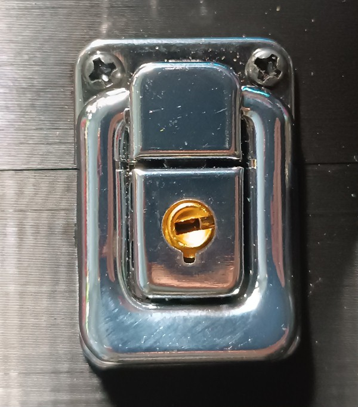
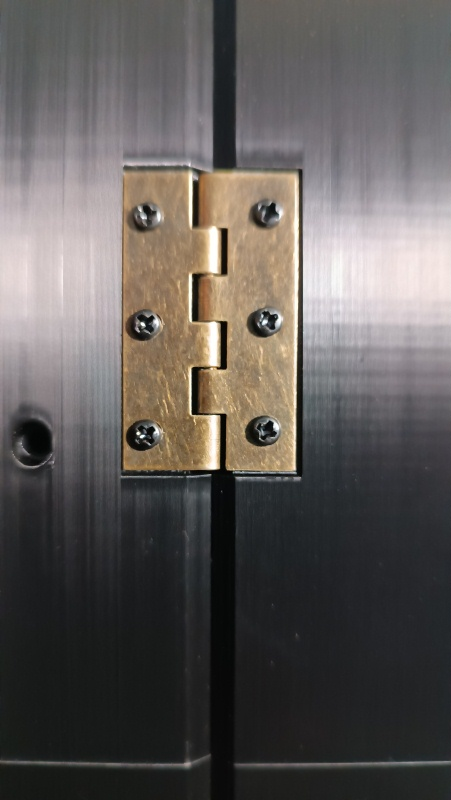

# Технічні особливості конструкції
Конструкція універсального кейса розроблена як збалансоване рішення для транспортування та розгортання наземної станції керування FPV-дронами в польових умовах. Основний акцент при проектуванні зроблено на поєднанні надійності, мобільності та доступності виробництва.

## Ключові характеристики конструкції:
<ul>
<li><b>Компактність та мобільність:</b> Габарити корпусу оптимізовані для забезпечення максимальної мобільності оператора. Компактний форм-фактор кейса дозволяє зручно транспортувати станцію в рюкзаку або як окрему малогабаритну одиницю спорядження.</li>

<li><b>Оптимізація під адитивне виробництво:</b> Геометрія деталей розрахована на 3D-друк на більшості поширених FDM-принтерів. Максимальні габарити окремих елементів не перевищують 250 × 250 × 250 мм, що робить проект доступним для реалізації на бюджетному обладнанні.</li>

<li><b>Економічна ефективність:</b> При розробці закладено принцип максимального здешевлення виробництва. Використання доступних матеріалів (пластики типу PETG/ABS) та стандартної метизної продукції дозволяє значно знизити собівартість готового виробу без втрати функціональності.</li>

<li><b>Експлуатаційна стійкість та повторюваність:</b> Конструкція має достатній запас міцності для інтенсивного використання. Технічні рішення дозволяють легко відтворити корпус у локальних або польових майстернях.</li>

<li><b>Модульна архітектура та ремонтопридатність:</b></li>
<ul>
<li>Корпус складається з окремих взаємозамінних модулів.</li>

<li>Висока ремонтопридатність: у разі механічного пошкодження достатньо замінити лише конкретний елемент.</li>

<li>Уніфікація кріплень: Більшість з’єднань реалізовані на базі стандартного метричного кріплення (гвинти та гайки M3), що спрощує збірку та логістику комплектуючих </li>
</ul>
</ul>

## Необхідна кількість комплектуючих для виготовлення одного універсального кейсу - корпусу станції

| Найменування | Тип/Розмір | Кількість | Примітка |
|:---: | :---: | :---: |:---: |
| Шуруп | 2х8 DIN 7982 | 12 штук | В разі використання кейсу як корпусу станції |
| Гвинт | M3x14 DIN 7985 | 48 штук | |
| Гвинт | M3x20 DIN 7985 A2 | 10 штук | В разі використання кейсу як корпусу станції |
| Гвинт | M3x25 DIN 912 | 7 штук | |
| Гвинт | M4x12 DIN 7985 | 4 штуки | В разі використання кейсу як корпусу станції |
| Гайка | M3 DIN 934 | 65 штук | |
| Шайба | M3 DIN 125 | 18 штук | |
| Замок з ключем | А-014/2 | 2 штуки | |
| Навіси | В-114 | 2 штуки | |
| Деталь 1 |  | 1 штука | |
| Деталь 2 |  | 1 штука | |
| Деталь 3 |  | 1 штука | В разі використання кейсу як корпусу станції |
| Деталь 4 |  | 1 штука | В разі використання кейсу як корпусу станції |
| Деталь 5 |  | 1 штука | |
| Деталь 6 |  | 1 штука | |
| Деталь 7 |  | 2 штуки | |
| Деталь 8 |  | 1 штука | |
| Деталь 9 |  | 1 штука | |

## Налаштування 3Д-друку та використаний матеріал

| Параметр | Значення |
| :---: | :---: |
| Кількість периметрів | 5 |
| Суцільних шарів зверху і знизу | 5 |
| Щільність заповнення | 40% |
| Малюнок заповнення | Гіроїд |
| Підтримка | Деревоподібна |

Матеріал coPET black MonoFilament

## Деталізація по витраті метизів

| Найменування | Тип/Розмір | Кількість | Примітка |
| :---: | :---: | :---: | :---: |
| Гвинт | M3x14 DIN 7985 | 11 штук | З'єднання між собою Деталь 1 та Деталь 2 |
| Гайка | M3 DIN 934 | 11 штук | З'єднання між собою Деталь 1 та Деталь 2 |

| Найменування | Тип/Розмір | Кількість | Примітка |
| :---: | :---: | :---: | :---: |
| Гвинт | M3x14 DIN 7985 | 17 штук | З'єднання між собою Деталь 5 та Деталь 6 |
| Гайка | M3 DIN 934 | 17 штук | З'єднання між собою Деталь 5 та Деталь 6 |

| Найменування | Тип/Розмір | Кількість | Примітка |
| :---: | :---: | :---: | :---: |
| Гвинт | M3x14 DIN 7985 | 8 штук | Кріплення замків до верхньої кришки та основи універсального кейсу та корпусу станції |
| Гайка | M3 DIN 934 | 8 штук | Кріплення замків до верхньої кришки та основи універсального кейсу та корпусу станції |

| Найменування | Тип/Розмір | Кількість | Примітка |
| :---: | :---: | :---: | :---: |
| Гвинт | M3x14 DIN 7985 | 12 штук | Кріплення навісів до верхньої кришки та основи універсального кейсу та корпусу станції |
| Гайка | M3 DIN 934 | 12 штук | Кріплення навісів до верхньої кришки та основи універсального кейсу та корпусу станції |
| Шайба | M3 DIN 125 | 12 штук | Кріплення навісів до верхньої кришки та основи універсального кейсу та корпусу станції |

 

| Найменування | Тип/Розмір | Кількість | Примітка |
| :---: | :---: | :---: | :---: |
| Гвинт | M3x25 DIN 912 | 3 штуки | З'єднання між собою Деталь 8 та Деталь 9 |
| Гайка | M3 DIN 934 | 3 штуки | З'єднання між собою Деталь 8 та Деталь 9 |
| Шайба | M3 DIN 125 | 6 штук | З'єднання між собою Деталь 8 та Деталь 9 |

| Найменування | Тип/Розмір | Кількість | Примітка |
| :---: | :---: | :---: | :---: |
| Гвинт | M3x25 DIN 912 | 4 штуки | З'єднання між собою Деталь 7 та основи універсального кейсу та корпусу станції |
| Гайка | M3 DIN 934 | 4 штуки | З'єднання між собою Деталь 7 та основи універсального кейсу та корпусу станції |

| Найменування | Тип/Розмір | Кількість | Примітка |
| :---: | :---: | :---: | :---: |
| Гвинт | M3x20 DIN 7985 A2 | 10 штук | Кріплення блоку керування до основи універсального кейсу та корпусу станції |
| Гайка | M3 DIN 934 | 10 штуки | Кріплення блоку керування до основи універсального кейсу та корпусу станції |

| Найменування | Тип/Розмір | Кількість | Примітка |
| :---: | :---: | :---: | :---: |
| Гвинт | M4x12 DIN 7985 | 4 штуки | Кріплення монітору до верхньої кришки універсального кейсу та корпусу станції |

| Найменування | Тип/Розмір | Кількість | Примітка |
| :---: | :---: | :---: | :---: |
| Шуруп | 2х8 DIN 7982 | 6 штук | Кріплення Деталь 3 до Деталь 1 |
| Шуруп | 2х8 DIN 7982 | 6 штук | Кріплення Деталь 4 до Деталь 2 |

